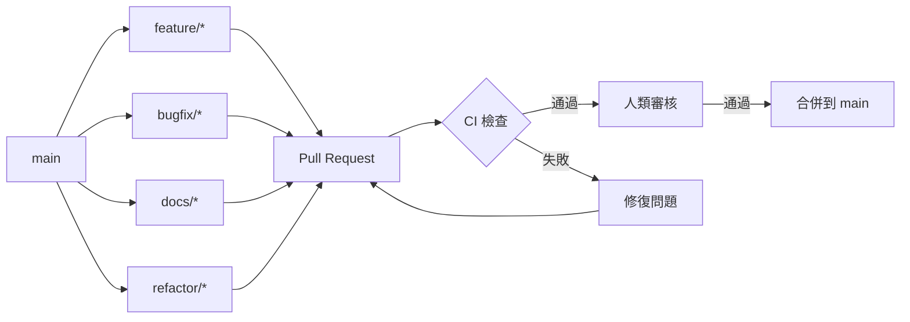
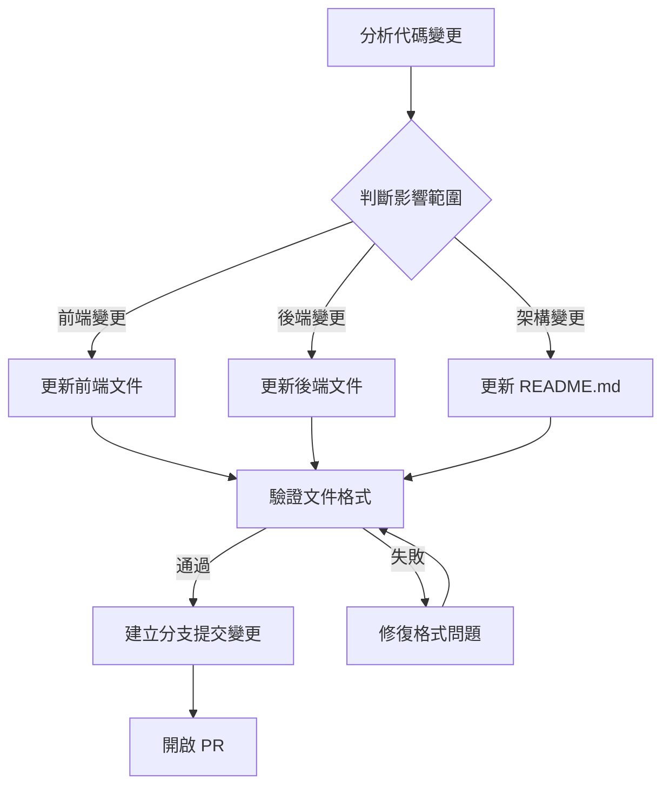

# AI 代理協作指南

本文檔提供給 AI 代理（如 Codex、Cursor、TaskMaster 等）使用的協作指南，說明如何安全、自動化、持續維護本專案。

## 分支 & PR 流程

### 分支策略

- **main**: 主分支，受保護，不允許直接推送
- **feature/\***: 功能分支，用於開發新功能
- **bugfix/\***: 錯誤修復分支
- **docs/\***: 文檔更新分支
- **refactor/\***: 重構分支

### Pull Request 流程

1. 從 `main` 分支建立新的功能分支
2. 在功能分支上進行開發
3. 提交 PR 到 `main` 分支
4. CI 自動運行測試與檢查
5. 等待人類審核者審核
6. 通過審核後合併到 `main` 分支



## Conventional Commits 規範

所有提交訊息必須遵循 [Conventional Commits](https://www.conventionalcommits.org/) 規範：

```plaintext
<type>[optional scope]: <description>

[optional body]

[optional footer(s)]
```

### 提交類型

- **feat**: 新功能
- **fix**: 錯誤修復
- **docs**: 文檔更新
- **style**: 不影響代碼邏輯的格式變更
- **refactor**: 重構代碼
- **perf**: 性能優化
- **test**: 添加或修改測試
- **build**: 影響構建系統或外部依賴的變更
- **ci**: CI 配置或腳本的變更
- **chore**: 其他不修改 src 或測試文件的變更

### 範例

```plaintext
feat(frontend): 添加虛擬太空人表情動畫系統

實現基於 Morph Target 的表情控制系統，支援 8 種基本表情與混合。

Closes #123
```

## 自動化工作

### 單元/整合測試

- 前端測試使用 Jest 與 React Testing Library
- 後端測試使用 pytest
- 測試自動運行於每個 PR 與 main 分支的推送

```bash
# 前端測試
cd prototype/frontend
npm test

# 後端測試
cd prototype/backend
pytest
```

## markdownlint

文檔使用 markdownlint 進行檢查，確保格式一致性：

```bash
npx markdownlint "**/*.md" --ignore node_modules
```

### docs 重產條件

在以下情況需要重新產生文檔：

1. 前端或後端架構發生重大變更
2. 新增或移除主要功能模組
3. API 路由或資料模型變更
4. 依賴套件或技術棧更新

## 代碼風格

### 前端

- **ESLint**: 使用專案根目錄的 `.eslintrc.js` 配置
- **Prettier**: 使用專案根目錄的 `.prettierrc` 配置
- **TypeScript**: 遵循 `tsconfig.json` 配置

```bash
# 檢查代碼風格
npm run lint

# 自動修復代碼風格問題
npm run lint:fix

# 格式化代碼
npm run format
```

### 後端

- **Black**: Python 代碼格式化
- **isort**: 導入語句排序
- **mypy**: 靜態類型檢查

```bash
# 格式化 Python 代碼
black prototype/backend

# 排序導入語句
isort prototype/backend

# 靜態類型檢查
mypy prototype/backend
```

## 禁區

AI 代理在協作過程中，必須遵守以下限制：

1. **不可編輯設計稿**：`designs/` 目錄下的設計稿文件不可修改
2. **不可直接 push 到 main 分支**：必須通過 PR 流程
3. **不可修改 CI 配置**：除非明確指示
4. **不可更改授權文件**：LICENSE 文件不可修改
5. **不可提交敏感資訊**：API 金鑰、密碼等敏感資訊不可提交到代碼庫

## 範例 prompt：如何讓代理根據程式變動更新文件

以下是讓 AI 代理根據程式變動自動更新文件的範例 prompt：

```plaintext
你是 OpenAI Codex，運行在 eggyy1224/space_live_project 儲存庫的根目錄。

請根據最近的程式碼變動，更新相關文件：

1. 掃描 git diff 查看最近變更
2. 分析變更是否影響架構或 API
3. 如果是前端變更，更新 docs/前端相關/前端架構概述.md
4. 如果是後端變更，更新 docs/後端相關/後端架構概述.md
5. 如果是重大架構變更，同時更新 README.md

請遵循以下規則：
- 保持文件格式一致
- 使用 Markdown 語法
- 確保文件通過 markdownlint 檢查
- 建立新的 docs/update-$(date +%Y%m%d) 分支
- 提交變更並開啟 PR
```

## 自動化文件更新流程

AI 代理可以按照以下流程自動更新文件：

1. **分析變更**：使用 git diff 或 AST 分析代碼變更
2. **確定影響**：判斷變更影響的系統部分
3. **更新文件**：根據變更更新相應文件
4. **驗證格式**：使用 markdownlint 檢查文件格式
5. **提交變更**：建立分支、提交變更、開啟 PR



## 代理協作最佳實踐

1. **小步提交**：將大型變更拆分為多個小型、獨立的提交
2. **詳細說明**：在 PR 描述中詳細說明變更內容與原因
3. **自測**：提交前在本地運行測試與檢查
4. **文件同步**：代碼變更時同步更新相關文件
5. **引用問題**：在提交訊息中引用相關的 Issue 編號

遵循本指南，AI 代理可以安全、高效地協助維護本專案，確保代碼質量與文件的一致性。
