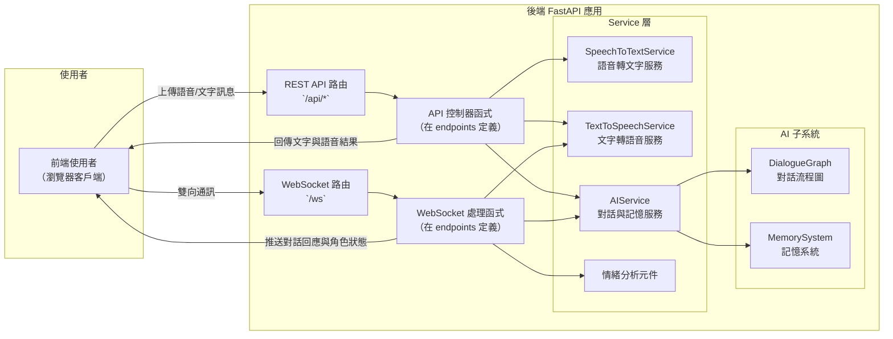
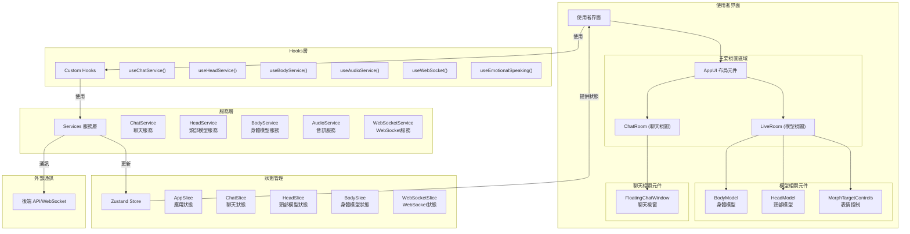

# 🚀 星際小可愛 (Space Live Project) 🚀

**歡迎來到「星際小可愛」的宇宙！這是一個旨在創造一個生動、可互動的 AI 虛擬網紅/主播的開源專案。**


---

## ✨ 專案願景

我們的目標是打造一個不僅能對話，更能展現個性、擁有記憶、並透過 3D 形象與豐富表情和用戶進行**實時、沉浸式互動**的 AI 虛擬形象。

想像一下，你可以：

*   與一位擁有獨特背景和個性的 AI 進行**自然流暢的語音或文字對話**。
*   看到 AI 根據對話內容和情緒，**實時地展現對應的口型、表情和動作**。
*   體驗 AI **記得你們之前的談話**，讓交流更加連貫和深入。

這就是「星際小可愛」希望帶來的全新互動體驗。

---

## 核心功能

*   **實時互動**: 支持通過麥克風進行語音輸入，或通過鍵盤進行文字輸入。
*   **AI 對話**: 後端集成大型語言模型 (LLM) 提供智能對話能力。
*   **3D 形象**: 使用 Three.js 渲染可互動的 3D 虛擬形象。
*   **生動表情與口型同步**: AI 的面部表情和口型會根據對話內容和語音實時變化。
*   **記憶系統**: AI 能夠記憶對話歷史，提供更個性化和連貫的交流。
*   **語音合成 (TTS)**: 將 AI 的回覆轉換為語音輸出。

---

## 🏗️ 系統架構

本專案採用前後端分離架構，結合多種服務提供完整的交互體驗。

### 後端架構

後端採用 **FastAPI** 框架實作，分為路由、控制器、服務和資料模型四層：



* **路由層 (Routes)**: 處理 HTTP 和 WebSocket 請求的入口點
* **控制器層 (Controllers)**: 協調請求處理流程，將任務分配給服務
* **服務層 (Services)**: 封裝核心業務邏輯，如語音轉文字、AI 對話生成、文字轉語音
* **AI 子系統**: 包含對話流程管理與記憶系統，提供角色人格與對話連貫性

後端服務透過 REST API 和 WebSocket 雙管道與前端通訊，確保即時互動體驗。

### 前端架構

前端建構在 React 與 Three.js 之上，採用 Zustand 進行狀態管理：



* **使用者界面層**: 包含主要視圖區域和各功能元件
* **Hooks 層**: 自定義 Hooks 封裝業務邏輯，連接元件與服務
* **服務層**: 處理與後端通訊、3D 模型控制和音訊處理等功能
* **狀態管理層**: 使用 Zustand 以 slice 組織全域狀態
* **外部通訊**: 透過 API 和 WebSocket 與後端交互

前端採用單向資料流，資料從後端進入，透過服務層更新 Zustand 全域狀態，最終由 UI 元件消費並呈現。

### 資料流設計

系統整體資料流如下：

1. **使用者輸入**:
   * 文字輸入透過聊天界面發送到後端
   * 語音輸入透過麥克風錄製，經 WebSocket 或 REST API 上傳到後端

2. **後端處理**:
   * 語音轉文字服務 (STT) 將語音轉為文字
   * AI 服務利用對話流程圖和記憶系統生成回應
   * 情緒分析服務判斷回應的情緒狀態
   * 文字轉語音服務 (TTS) 將回應轉為語音

3. **前端呈現**:
   * WebSocket 接收回應文字、語音和情緒資料
   * 聊天視窗顯示對話文字
   * 3D 模型根據情緒資料顯示相應表情
   * 語音播放與口型同步模組實現自然說話效果

4. **狀態更新**:
   * 全域狀態存儲對話歷史、情緒狀態等
   * 模型狀態根據回應更新表情和動作

這種設計確保了互動的流暢性和一致性，為使用者提供沉浸式體驗。

更詳細的架構文檔可參考 `docs/前端相關/前端架構概述.md` 和 `docs/後端相關/後端架構概述.md`。

---

## 🛠️ 快速上手

你需要準備以下環境：

*   Node.js (推薦 LTS 版本)
*   npm 或 yarn
*   Python 3.10 或更高版本
*   pip
*   Git

**步驟：**

1.  **克隆倉庫:**
    ```bash
    git clone <your-repository-url> # 將 <your-repository-url> 替換為實際的倉庫 URL
    cd space_live_project
    ```

2.  **設置後端:**
    *   進入後端目錄: `cd prototype/backend`
    *   創建並激活 Python 虛擬環境 (推薦):
        ```bash
        python3 -m venv ../../venv  # 在項目根目錄創建 venv
        source ../../venv/bin/activate  # Linux/macOS
        # ..\\..\\venv\\Scripts\\activate   # Windows
        ```
    *   安裝依賴:
        ```bash
        pip install -r requirements.txt
        ```
    *   配置環境變數:
        *   在 `prototype/backend` 目錄下創建 `.env` 文件。
        *   填入必要的 API Keys，例如 OpenAI API Key:
            ```dotenv
            OPENAI_API_KEY="YOUR_OPENAI_API_KEY_HERE"
            # 如果需要，還可以配置其他後端選項，如向量數據庫路徑
            # VECTOR_DB_PATH="./data/chroma_db"
            ```
    *   啟動後端服務:
        ```bash
        uvicorn main:app --host 0.0.0.0 --port 8000 --reload
        ```
        *後端服務將運行在 `http://localhost:8000`*

3.  **設置前端:**
    *   打開 **新的** 終端窗口/標籤頁。
    *   確保你仍處於激活的 Python 虛擬環境中（如果前端依賴需要）。或者，你也可以為前端單獨管理 Node 環境。
    *   進入前端目錄: `cd prototype/frontend` (確保是從項目根目錄 `space_live_project` 進入)
    *   安裝依賴:
        ```bash
        npm install
        # 或者
        # yarn install
        ```
    *   啟動前端開發服務器:
        ```bash
        npm run dev
        # 或者
        # yarn dev
        ```
        *前端通常會運行在 `http://localhost:5173` (Vite 預設) 或 `http://localhost:3000`*

4.  **訪問應用:**
    *   在瀏覽器中打開前端開發服務器提供的地址 (例如 `http://localhost:5173`)。
    *   確保你的瀏覽器允許訪問麥克風。

---

## 📂 專案結構導覽

```
/space_live_project/
├── docs/                 # 設計文檔、研究記錄等
│   ├── 前端相關/          # 前端架構與技術文檔
│   ├── 後端相關/          # 後端架構與API文檔
├── prototype/            # 主要的應用程式代碼
│   ├── backend/          # 後端 FastAPI 應用
│   │   ├── api/          # API 路由與控制器
│   │   ├── core/         # 核心配置與資料模型
│   │   ├── dtos/         # 資料傳輸物件定義
│   │   ├── services/     # 服務層模組
│   │   └── utils/        # 工具與共用功能
│   └── frontend/         # 前端 React + Three.js 應用
│       ├── src/
│       │   ├── components/  # React 元件
│       │   ├── hooks/       # 自定義React Hooks
│       │   ├── services/    # 服務層模組
│       │   ├── store/       # Zustand 狀態管理
│       │   ├── utils/       # 工具函數
│       │   └── config/      # 配置檔案
├── scripts/              # 工具腳本
├── venv/                 # Python 虛擬環境 (建議)
├── .gitignore            # Git 忽略配置
└── README.md             # 就是你正在看的這個文件
```

---

## 🤝 貢獻與支持

我們歡迎各種形式的貢獻！無論是提交 Bug 報告、提出功能建議，還是直接貢獻代碼，都對專案的發展至關重要。

*(可以添加更詳細的貢獻指南鏈接或說明)*

---

**讓我們一起創造更有趣、更生動的 AI 互動體驗吧！**

---

## 🎬 動畫文件更新指南

如果您需要添加新的動畫文件到專案，請按照以下步驟操作：

1. 將 `.glb` 格式的動畫文件放入 `prototype/frontend/public/animations` 目錄中。
2. 運行動畫同步腳本，自動更新動畫配置文件：
   ```bash
   # 在專案根目錄執行
   node scripts/sync_animations.js
   ```
3. 腳本會掃描動畫目錄中的所有 `.glb` 文件，並生成 `prototype/shared/config/animations.json` 配置文件。
4. 每個動畫會根據文件名自動生成友好名稱：
   - 移除 `_animation.glb` 或 `.glb` 後綴
   - 例如：`Idle_animation.glb` 變為 `Idle`

> 注意：如果您需要自定義動畫的描述，可以在腳本執行後手動編輯 `animations.json` 文件。

新增的動畫將自動可用於前端使用，無需額外的配置步驟。 