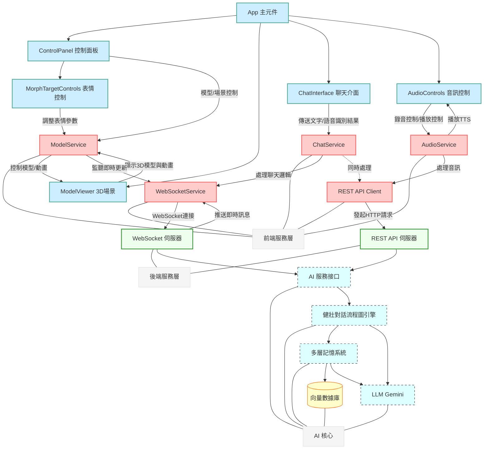

# 🚀 星際小可愛 (Space Live Project) 🚀

**歡迎來到「星際小可愛」的宇宙！這是一個正在開發中的 AI 互動專案，旨在創造一個生活在太空站、擁有記憶、個性與情感的虛擬太空網紅。**


---

## ✨ 專案願景

想像一下，能和一位身處遙遠太空站的 AI 網紅即時聊天，聽她分享太空生活的點滴，感受她的喜怒哀樂，甚至你的話語還能影響她的心情和狀態... 這就是「星際小可愛」想要實現的目標！

本專案不僅僅是一個聊天機器人，我們致力於：

*   **打造有靈魂的角色**: 賦予 AI 獨特的背景故事、鮮明的個性（活潑、好奇、偶爾感性）和專業知識（太空、科技）。
*   **實現有溫度的互動**: 透過即時語音交流、生動的 3D 形象和表情動畫，建立用戶與 AI 之間的情感連結。
*   **模擬有記憶的交流**: 利用先進的記憶系統，讓 AI 記得過去的對話，使交流更連貫、更深入。
*   **探索動態的體驗**: AI 的狀態會隨互動和模擬事件變化，帶來不可預測的趣味性。

**目標應用場景:** 展覽互動、教育娛樂、虛擬陪伴、AI Agent 研究等。

---

## 核心功能與技術亮點

### 前端 (Frontend)
*   ** modernen Web 技術**: 使用 React + TypeScript 構建用戶界面。
*   **🎮 沉浸式 3D 體驗**: 利用 Three.js + React Three Fiber + Drei 渲染高品質、可互動的 3D 虛擬角色和場景。
*   **🎭 即時動畫與表情**: 根據 AI 回應和語音，實時驅動模型的口型同步 (Lipsync) 和面部表情 (Morph Targets)。
*   **🧩 模塊化服務設計**: 採用服務單例模式 (`WebSocketService`, `ModelService`, `AudioService`, `ChatService`) 管理狀態和業務邏輯，實現關注點分離。
*   **⚡ 高效即時通信**: WebSocket 用於接收後端實時推送的動畫指令和對話訊息，並進行防抖/節流優化。
*   **🗣️ 語音交互集成**: 包含音訊錄製、播放控制，與後端 STT/TTS 服務對接。

### 後端 AI 核心 (Backend)
*   **🎙️ 即時語音互動支持**: 後端設計可接收文本輸入（來自 STT），生成文本回應（傳給 TTS），並能生成實時動畫指令。
*   **🧠 增強版多層次記憶系統 (`MemorySystem`)**:
    *   **短期記憶緩存**: 儲存最近的會話輪次，用於即時上下文。
    *   **長期對話記憶 (ChromaDB)**: 持久化儲存**經過篩選**的對話歷史。
    *   **角色核心記憶 (ChromaDB)**: 獨立儲存 AI 的身份、背景和學習到的事實。
    *   **摘要記憶 (ChromaDB)**: 儲存由 LLM 生成的對話摘要，用於長期關鍵信息回憶。
    *   **智能檢索**: 結合上下文、摘要和角色信息進行向量搜索 (MMR 提高多樣性)，提取相關記憶輔助對話。
    *   **記憶過濾與防污染**: 識別並過濾無意義或重複的輸入，防止污染長期記憶。
    *   **異步記憶整合**: 定期使用 LLM 總結對話，生成摘要並存入摘要庫，不阻塞主流程。
*   **🧩 健壯的 LangGraph 對話引擎 (`DialogueGraph`)**:
    *   **流程圖化與狀態管理**: 使用 StateGraph 清晰定義和管理對話流程及狀態 (`DialogueState`)。
    *   **輸入預處理與分類**: 新增節點分析用戶輸入（重複度、情感、類型），為後續處理提供依據。
    *   **動態提示模板**: 根據對話情境（正常、澄清、錯誤）選擇不同的提示模板。
    *   **自適應風格**: 根據角色狀態和輸入分類動態調整回應風格。
    *   **後處理與健壯性**: 改進後處理邏輯，移除不必要的模式和 Emoji，同時避免過度削減回應，並在必要時返回原始 LLM 輸出。
    *   **錯誤處理與重試**: 包含 LLM 調用重試和條件路由機制。
    *   **高擴展性**: 便於未來添加工具使用、反思修正循環等複雜 Agent 行為。
*   **🎭 動態角色狀態**: 影響 AI 的回應風格、記憶檢索策略等。
*   **🤝 向後兼容接口 (`AIService`)**: 提供穩定的適配器層。

---

## 🏗️ 系統架構 (前後端整合)

本專案包含前端 UI/3D 渲染和後端 AI 核心兩大部分。



*   **前端 (React + Three.js)**: 負責用戶界面展示、3D 模型渲染、接收用戶輸入（文字/語音）、播放音頻和動畫。前端通過 **服務單例** (`WebSocketService`, `ChatService`, etc.) 來管理狀態和與後端通信。
*   **後端 (FastAPI)**: 提供 WebSocket 和 REST API 接口。接收前端請求，調用 **AI 核心** 處理對話邏輯、記憶管理和狀態更新，並將結果（文本、動畫指令）返回給前端。
*   **通信**: 主要使用 WebSocket 進行實時雙向通信（對話、動畫指令），REST API 用於輔助操作（如上傳音頻、獲取歷史數據）。

---

## 🛠️ 環境設置與運行

**1. 環境準備:**

*   Node.js (建議 LTS 版本，用於前端)
*   npm 或 yarn (Node.js 包管理器)
*   Python 3.10 或更高版本 (用於後端)
*   pip (Python 包管理器)
*   Git

**2. 獲取程式碼:**

```bash
git clone <your-repository-url>
cd space_live_project
```

**3. 後端設置與運行:**

*   **進入後端目錄** (假設在 `prototype/backend`):
    ```bash
    cd prototype/backend
    ```
*   **創建與激活 Python 虛擬環境:**
    ```bash
    python3 -m venv venv
    source ../../venv/bin/activate  # Linux/macOS (路徑可能需調整)
    # ..\..\venv\Scripts\activate   # Windows (路徑可能需調整)
    ```
*   **安裝後端依賴:**
    ```bash
    pip install -r requirements.txt # 確保 requirements.txt 在此目錄或上層
    # 或手動安裝: pip install fastapi uvicorn langchain langgraph langchain-google-genai chromadb pydantic python-dotenv loguru ...
    ```
*   **配置後端環境變數:**
    *   在 `prototype/backend` 目錄下創建 `.env` 文件。
    *   填入 `GOOGLE_API_KEY`:
        ```dotenv
        GOOGLE_API_KEY="YOUR_GOOGLE_API_KEY_HERE"
        # 可能需要添加 VECTOR_DB_PATH="./chroma_db" (記憶系統將使用此路徑)
        ```
*   **啟動後端服務:**
    ```bash
    uvicorn main:app --host 0.0.0.0 --port 8000 --reload
    ```
    *後端服務現在運行在 `http://localhost:8000`*

**4. 前端設置與運行:**

*   **進入前端目錄** (假設在 `prototype/frontend` 或項目根目錄下的 `src`):
    ```bash
    # 根據你的項目結構調整 cd 命令
    cd prototype/frontend
    # 或者如果前端源碼在根目錄 src 下
    # cd ../../ (回到項目根目錄)
    ```
*   **安裝前端依賴:**
    ```bash
    npm install
    # 或者 yarn install
    ```
*   **啟動前端開發服務器:**
    ```bash
    npm run dev
    # 或者 yarn dev
    ```
    *前端開發服務通常會運行在 `http://localhost:3000` 或 `http://localhost:5173` (Vite 預設)*

**5. 訪問應用:**

*   打開瀏覽器，訪問前端開發服務器提供的地址。

---

## 📂 專案結構導覽

```
/space_live_project/
├── docs/                             # 技術文檔與設計方案
│   ├── 前端相關/                     # 前端技術規格與架構圖
│   │   └── 0402前端架構.md           # 前端架構詳解，含元件與服務設計
│   └── 後端相關/                     # 後端技術規格與設計圖
│       └── 0402記憶系統方案.md       # AI 記憶系統與對話管理設計方案
│
├── prototype/                        # 主要程式碼目錄
│   ├── backend/                      # 後端 FastAPI 應用
│   │   ├── api/                      # API 端點定義
│   │   │   └── ...                   # (省略 api 內部結構)
│   │   ├── core/                     # 核心配置與基礎設施
│   │   │   └── ...
│   │   ├── services/                 # 業務邏輯服務
│   │   │   └── ...
│   │   └── main.py                   # FastAPI 應用主入口
│   │
│   └── frontend/                     # 前端 React+Three.js 應用 <--- 移除這一層級
│       ├── public/                   # 靜態資源
│       │   ├── assets/               # 模型、紋理和其他素材
│       │   │   ├── models/           # 3D 模型文件 (.glb, .gltf)
│       │   │   └── textures/         # 紋理圖片
│       │   └── ...                   # 其他公共資源 (favicon.ico, etc.)
│       │
│       └── src/                      # 前端原始碼
│           ├── App.tsx               # 應用主入口組件
│           ├── main.tsx              # React 渲染入口
│           ├── index.css             # 全局樣式
│           │
│           ├── components/           # 可重用 UI 組件
│           │   ├── ControlPanel.tsx  # 控制面板
│           │   ├── ModelViewer.tsx   # 3D 視覺
│           │   ├── ChatInterface.tsx # 聊天介面
│           │   ├── AudioControls.tsx # 音訊控制
│           │   └── ...               # 其他組件
│           │
│           ├── services/             # 應用服務 (狀態管理與後端通信)
│           │   ├── WebSocketService.ts
│           │   ├── ChatService.ts
│           │   ├── AudioService.ts
│           │   ├── ModelService.ts
│           │   └── APIService.ts     # (可選) 封裝 REST API 調用
│           │
│           ├── hooks/                # 自定義 React Hooks
│           │   └── useSpeechRecognition.ts # (示例) 語音識別 Hook
│           │
│           ├── contexts/             # React Context (共享狀態)
│           │   └── AppContext.tsx    # (示例) 全局應用狀態 Context
│           │
│           └── utils/                # 工具函數
│               └── audioUtils.ts     # 音訊處理相關工具
│
├── public/                           # 靜態資源 (移至根目錄)
│   ├── assets/                       # 模型、紋理和其他素材
│   │   ├── models/                   # 3D 模型文件 (.glb, .gltf)
│   │   └── textures/                 # 紋理圖片
│   └── ...                           # 其他公共資源 (favicon.ico, etc.)
│
├── src/                              # 前端原始碼 (移至根目錄)
│   ├── App.tsx                       # 應用主入口組件
│   ├── main.tsx                      # React 渲染入口
│   ├── index.css                     # 全局樣式
│   │
│   ├── components/                   # 可重用 UI 組件
│   │   ├── ControlPanel.tsx          # 控制面板
│   │   ├── ModelViewer.tsx           # 3D 視覺
│   │   ├── ChatInterface.tsx         # 聊天介面
│   │   ├── AudioControls.tsx         # 音訊控制
│   │   └── ...                       # 其他組件
│   │
│   ├── services/                     # 應用服務 (狀態管理與後端通信)
│   │   ├── WebSocketService.ts
│   │   ├── ChatService.ts
│   │   ├── AudioService.ts
│   │   ├── ModelService.ts
│   │   └── APIService.ts             # (可選) 封裝 REST API 調用
│   │
│   ├── hooks/                        # 自定義 React Hooks
│   │   └── useSpeechRecognition.ts     # (示例) 語音識別 Hook
│   │
│   ├── contexts/                     # React Context (共享狀態)
│   │   └── AppContext.tsx            # (示例) 全局應用狀態 Context
│   │
│   └── utils/                        # 工具函數
│       └── audioUtils.ts             # 音訊處理相關工具
│
├── venv/                             # Python 虛擬環境 (建議在 .gitignore 中忽略)
├── chroma_db/                        # ChromaDB 持久化數據目錄 (建議在 .gitignore 中忽略)
├── .env.example                      # 環境變數示例文件
├── .gitignore                        # Git 忽略配置文件
├── requirements.txt                  # 後端 Python 依賴列表
└── README.md                         # 本文件
```

---

## 🔮 未來展望與可擴展點

*   **更精細的情緒模擬**: 引入更複雜的情感計算模型。
*   **主動對話能力**: 讓 AI 能基於記憶和狀態，主動發起話題或提問。
*   **工具使用 (Tool Use)**: 集成外部 API 或工具 (如查詢天氣、知識庫) 擴展能力。
*   **長期目標與任務**: 賦予 AI 更長期的目標，並能在對話中推進。
*   **多模態互動**: 結合圖像理解等能力。
*   **用戶畫像**: 根據與特定用戶的互動歷史，建立用戶模型，實現個性化交流。
*   **模型優化與評估**: 持續進行模型微調和效果評估。

---

## 🤝 貢獻

歡迎對此專案感興趣的開發者一同參與貢獻！您可以透過以下方式：

*   提出 Issue 反饋問題或建議。
*   提交 Pull Request 貢獻程式碼。
*   參與討論區的技術探討。

---

## 📄 授權

本專案採用 [MIT License](LICENSE)。

---

**感謝你的關注，讓我們一起見證「星際小可愛」的成長！** 