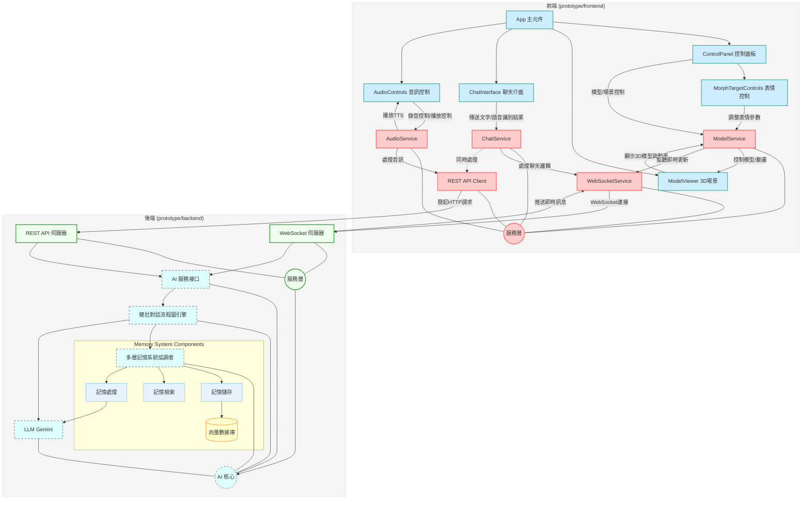

# 🚀 星際小可愛 (Space Live Project) 🚀

**歡迎來到「星際小可愛」的宇宙！這是一個正在開發中的 AI 互動專案，旨在創造一個生活在太空站、擁有記憶、個性與情感的虛擬太空網紅。**


---

## ✨ 專案願景

想像一下，能和一位身處遙遠太空站的 AI 網紅即時聊天，聽她分享太空生活的點滴，感受她的喜怒哀樂，甚至你的話語還能影響她的心情和狀態... 這就是「星際小可愛」想要實現的目標！

本專案不僅僅是一個聊天機器人，我們致力於：

*   **打造有靈魂的角色**: 賦予 AI 獨特的背景故事、鮮明的個性（活潑、好奇、偶爾感性）和專業知識（太空、科技）。
*   **實現有溫度的互動**: 透過即時語音交流、生動的 3D 形象和表情動畫，建立用戶與 AI 之間的情感連結。
*   **模擬有記憶的交流**: 利用先進的記憶系統，讓 AI 記得過去的對話，使交流更連貫、更深入。
*   **探索動態的體驗**: AI 的狀態會隨互動和模擬事件變化，帶來不可預測的趣味性。

**目標應用場景:** 展覽互動、教育娛樂、虛擬陪伴、AI Agent 研究等。

---

## 核心功能與技術亮點

### 前端 (Frontend)
*   ** modernen Web 技術**: 使用 React + TypeScript 構建用戶界面。
*   **🎮 沉浸式 3D 體驗**: 利用 Three.js + React Three Fiber + Drei 渲染高品質、可互動的 3D 虛擬角色和場景。
*   **🎭 即時動畫與表情**: 根據 AI 回應和語音，實時驅動模型的口型同步 (Lipsync) 和面部表情 (Morph Targets)。
*   **🧩 模塊化服務設計**: 採用服務單例模式 (`WebSocketService`, `ModelService`, `AudioService`, `ChatService`) 管理狀態和業務邏輯，實現關注點分離。
*   **⚡ 高效即時通信**: WebSocket 用於接收後端實時推送的動畫指令和對話訊息，並進行防抖/節流優化。
*   **🗣️ 語音交互集成**: 包含音訊錄製、播放控制，與後端 STT/TTS 服務對接。

### 後端 AI 核心 (Backend)
*   **🎙️ 即時語音互動支持**: 後端設計可接收文本輸入（來自 STT），生成文本回應（傳給 TTS），並能生成實時動畫指令。
*   **🧠 模組化多層次記憶系統 (`MemorySystem`)**:
    *   **協調者模式**: 整合多個專門的記憶組件，實現關注點分離和可擴展性。
    *   **儲存層 (stores)**: 提供不同類型的記憶儲存:
        * **短期記憶緩存 (`ShortTermMemoryStore`)**: 儲存最近的會話輪次，用於即時上下文。
        * **對話記憶儲存 (`ChromaMemoryStore`)**: 持久化儲存對話歷史。
        * **角色記憶儲存 (`ChromaMemoryStore`)**: 獨立儲存 AI 的身份和背景信息。
        * **摘要記憶儲存 (`ChromaMemoryStore`)**: 儲存由 LLM 生成的對話摘要。
    *   **檢索層 (retrieval)**: 負責構建查詢和格式化記憶:
        * **查詢構建 (`QueryBuilder`)**: 生成增強查詢，結合用戶意圖和歷史上下文。
        * **記憶格式化 (`MemoryFormatter`)**: 格式化檢索到的記憶，提高可讀性。
        * **記憶檢索器 (`MemoryRetriever`)**: 協調各種記憶儲存的檢索策略，如 MMR 算法。
    *   **處理層 (processing)**: 提供高級記憶處理能力:
        * **輸入過濾 (`InputFilter`)**: 識別並過濾無意義或重複的輸入。
        * **角色記憶更新 (`PersonaUpdater`)**: 分析對話並更新 AI 角色的關鍵信息。
        * **會話摘要 (`ConversationSummarizer`)**: 定期生成對話摘要，提取關鍵點並儲存。
*   **🧩 健壯的 LangGraph 對話引擎 (`DialogueGraph`)**:
    *   **流程圖化與狀態管理**: 使用 StateGraph 清晰定義和管理對話流程及狀態 (`DialogueState`)。
    *   **輸入預處理與分類**: 新增節點分析用戶輸入（重複度、情感、類型），為後續處理提供依據。
    *   **動態提示模板**: 根據對話情境（正常、澄清、錯誤）選擇不同的提示模板。
    *   **自適應風格**: 根據角色狀態和輸入分類動態調整回應風格。
    *   **後處理與健壯性**: 改進後處理邏輯，移除不必要的模式和 Emoji，同時避免過度削減回應，並在必要時返回原始 LLM 輸出。
    *   **錯誤處理與重試**: 包含 LLM 調用重試和條件路由機制。
    *   **高擴展性**: 便於未來添加工具使用、反思修正循環等複雜 Agent 行為。
*   **🎭 動態角色狀態**: 影響 AI 的回應風格、記憶檢索策略等。
*   **🤝 向後兼容接口 (`AIService`)**: 提供穩定的適配器層。

---

## 🏗️ 系統架構 (前後端整合)

本專案包含前端 UI/3D 渲染和後端 AI 核心兩大部分。



*   **前端 (prototype/frontend)**: 負責用戶界面展示、3D 模型渲染、接收用戶輸入（文字/語音）、播放音頻和動畫。前端通過 **服務單例** (`WebSocketService`, `ChatService`, etc.) 來管理狀態和與後端通信。
*   **後端 (prototype/backend)**: 提供 WebSocket 和 REST API 接口。接收前端請求，調用 **AI 核心** 處理對話邏輯、記憶管理和狀態更新，並將結果（文本、動畫指令）返回給前端。
*   **通信**: 主要使用 WebSocket 進行實時雙向通信（對話、動畫指令），REST API 用於輔助操作（如上傳音頻、獲取歷史數據）。

---

## 🛠️ 環境設置與運行

**1. 環境準備:**

*   Node.js (建議 LTS 版本，用於前端)
*   npm 或 yarn (Node.js 包管理器)
*   Python 3.10 或更高版本 (用於後端)
*   pip (Python 包管理器)
*   Git

**2. 獲取程式碼:**

```bash
git clone <your-repository-url>
cd space_live_project
```

**3. 後端設置與運行:**

*   **進入後端目錄**:
    ```bash
    cd prototype/backend
    ```
*   **創建與激活 Python 虛擬環境:** (假設虛擬環境在項目根目錄的 venv)
    ```bash
    python3 -m venv ../../venv # 如果 venv 不存在
    source ../../venv/bin/activate  # Linux/macOS
    # ..\\..\\venv\\Scripts\\activate   # Windows
    ```
*   **安裝後端依賴:**
    ```bash
    pip install -r requirements.txt
    ```
*   **配置後端環境變數:**
    *   在 `prototype/backend` 目錄下創建 `.env` 文件 (如果不存在)。
    *   填入 `GOOGLE_API_KEY`:
        ```dotenv
        GOOGLE_API_KEY="YOUR_GOOGLE_API_KEY_HERE"
        VECTOR_DB_PATH="./data/chroma_db" # 建議的 ChromaDB 路徑
        ```
*   **啟動後端服務:**
    ```bash
    uvicorn main:app --host 0.0.0.0 --port 8000 --reload
    ```
    *後端服務現在運行在 `http://localhost:8000`*

**4. 前端設置與運行:**

*   **進入前端目錄**:
    ```bash
    cd prototype/frontend
    ```
*   **安裝前端依賴:**
    ```bash
    npm install
    # 或者 yarn install
    ```
*   **啟動前端開發服務器:**
    ```bash
    npm run dev
    # 或者 yarn dev
    ```
    *前端開發服務通常會運行在 `http://localhost:3000` 或 `http://localhost:5173` (Vite 預設)*

**5. 訪問應用:**

*   打開瀏覽器，訪問前端開發服務器提供的地址。

---

## 📂 專案結構導覽

```
/space_live_project/
├── docs/                             # 技術文檔與設計方案
├── glbs/                             # 3D 模型 GLB 文件
├── prototype/                        # 主要項目目錄
│   ├── backend/                      # 後端 FastAPI 應用 (詳見後端 README)
│   │   ├── ... (後端相關文件)
│   │   └── requirements.txt          # 後端 Python 依賴列表
│   │
│   ├── frontend/                     # 前端 React 應用
│   │   ├── public/                   # 前端靜態資源
│   │   ├── src/                      # 前端 React 原始碼
│   │   │   ├── assets/
│   │   │   ├── components/
│   │   │   ├── context/
│   │   │   ├── hooks/
│   │   │   ├── models/
│   │   │   ├── services/
│   │   │   ├── styles/
│   │   │   ├── types/
│   │   │   ├── utils/
│   │   │   ├── App.css
│   │   │   ├── App.tsx
│   │   │   ├── index.css
│   │   │   ├── main.tsx
│   │   │   └── vite-env.d.ts
│   │   ├── node_modules/             # Node.js 依賴
│   │   ├── .gitignore                # (已被合併刪除)
│   │   ├── eslint.config.js
│   │   ├── index.html
│   │   ├── package-lock.json
│   │   ├── package.json
│   │   ├── README.md                 # 前端目錄的說明文件
│   │   ├── tsconfig.app.json
│   │   ├── tsconfig.json
│   │   ├── tsconfig.node.json
│   │   └── vite.config.ts
│   │
│   └── venv/                         # Python 虛擬環境 (現在移到根目錄) -> 應在根目錄
│
├── .gitignore                        # Git 忽略配置文件 (已合併前端規則)
├── README.md                         # 本文件 (已更新)
└── venv/                             # Python 虛擬環境 (建議位置)
```

---

## 🔮 未來展望與可擴展點

*   **更精細的情緒模擬**: 引入更複雜的情感計算模型。
*   **主動對話能力**: 讓 AI 能基於記憶和狀態，主動發起話題或提問。
*   **工具使用 (Tool Use)**: 集成外部 API 或工具 (如查詢天氣、知識庫) 擴展能力。
*   **長期目標與任務**: 賦予 AI 更長期的目標，並能在對話中推進。
*   **多模態互動**: 結合圖像理解等能力。
*   **用戶畫像**: 根據與特定用戶的互動歷史，建立用戶模型，實現個性化交流。
*   **模型優化與評估**: 持續進行模型微調和效果評估。

---

## 🤝 貢獻

歡迎對此專案感興趣的開發者一同參與貢獻！您可以透過以下方式：

*   提出 Issue 反饋問題或建議。
*   提交 Pull Request 貢獻程式碼。
*   參與討論區的技術探討。

---

## 📄 授權

本專案採用 [MIT License](LICENSE)。

---

**感謝你的關注，讓我們一起見證「星際小可愛」的成長！** 