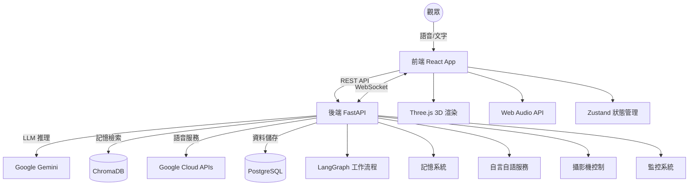

# Space Live Project

虛擬太空人互動藝術裝置專案，結合 3D 模型、AI 對話與情緒表達，打造沉浸式互動體驗。

## 專案簡介

Space Live Project 是一個互動藝術裝置，模擬一名被困於太空艙中一年的虛擬太空人，能與展覽場域中的觀眾進行自然語言互動。專案結合了 3D 模型渲染、骨架動畫、表情控制、語音識別與合成、大型語言模型與長期記憶系統，創造出具有情感連結與存在感的虛擬角色體驗。

### 功能亮點

- **自然語言互動**：透過 Google Gemini 2.0 Flash API 實現流暢的對話體驗
- **情緒表達**：使用 Morph Target 技術實現豐富的表情變化
- **動態動畫**：基於 Three.js 與 GLTFLoader 的骨架動畫系統
- **語音互動**：整合 Speech-to-Text 與 Text-to-Speech 實現雙向語音交流
- **長期記憶**：使用 LangChain 與 ChromaDB 向量資料庫建立角色記憶系統
- **音訊反應**：透過 Web Audio API 實現音訊分析與視覺反饋
- **自言自語**：僅在前端指令下啟動的 murmur 效果
- **語音播放握手機制**：前後端確認每段語音播放完成，避免順序錯亂
- **音頻驅動的3D背景系統**：包含語音反應背景、音樂反應粒子效果和事件觸發特效
- **攝影機控制系統**：支援預設位置、平滑轉換與即時角度調整
- **場景管理**：動態場景切換與 3D 環境控制
- **圖片生成**：整合 Gemini 圖片生成 API，支援位置與大小控制
- **文字顯示面板**：透過 `/api/display_text` 端點取得文字並在前端專用面板呈現

## 快速開始

### 前端開發

```bash
# 進入前端目錄
cd prototype/frontend

# 安裝依賴
npm install

# 啟動開發伺服器
npm run dev

# 建置生產版本
npm run build

# 預覽生產版本
npm run preview
```

### 後端開發

```bash
# 進入後端目錄
cd prototype/backend

# 建立虛擬環境
python -m venv venv
source venv/bin/activate  # Linux/Mac
# 或 venv\Scripts\activate  # Windows

# 安裝依賴
pip install -r requirements.txt

# 啟動開發伺服器
./run.sh
# 或 python -m uvicorn main:app --host 0.0.0.0 --port 8000 --reload
```

### 環境變數設定

後端需要設定以下環境變數（可建立 `.env` 檔案）：

```bash
# API 金鑰
GOOGLE_API_KEY=your_google_api_key
GEMINI_API_KEY=your_gemini_api_key

# 服務配置
PORT=8000
HOST=0.0.0.0
DEBUG=True

# 資料庫配置（可選）
POSTGRES_USER=postgres
POSTGRES_PASSWORD=password
POSTGRES_HOST=localhost
POSTGRES_PORT=5432
POSTGRES_DB=spacelive

# 記憶系統配置
MEMORY_PERSIST_DIR=./memory_data
```

## 技術架構摘要

### 前端技術棧

- **React 19** + **TypeScript** + **Vite**：現代化前端開發框架
- **Three.js** / **React Three Fiber**：3D 渲染引擎與 React 整合
- **Zustand**：輕量級狀態管理庫（12 個狀態切片）
- **Web Audio API**：音訊處理與分析
- **WebSocket**：即時雙向通訊
- **TailwindCSS**：原子化 CSS 框架
- **Framer Motion**：動畫庫

### 後端技術棧

- **FastAPI**：高效能 Python Web 框架
- **LangChain** / **LangGraph**：AI 語言模型整合框架
- **Google Gemini**：大型語言模型與圖片生成
- **ChromaDB**：向量資料庫，用於記憶系統
- **PostgreSQL** + **pgvector**：關聯式資料庫與向量擴展
- **Google Cloud Speech/TTS**：語音服務
- **WebSocket**：即時通訊協定

### 系統架構圖


```mermaid
flowchart TD
    User((觀眾)) -->|語音/文字| Frontend[前端 React App]
    Frontend -->|REST API| Backend[後端 FastAPI]
    Frontend <-->|WebSocket| Backend
    Backend -->|LLM 推理| Gemini[Google Gemini]
    Backend -->|記憶檢索| ChromaDB[(ChromaDB)]
    Backend -->|語音服務| GoogleCloud[Google Cloud APIs]
    Backend -->|資料儲存| PostgreSQL[(PostgreSQL)]

    Frontend --> ThreeJS[Three.js 3D 渲染]
    Frontend --> Audio[Web Audio API]
    Frontend --> State[Zustand 狀態管理]

    Backend --> LangGraph[LangGraph 工作流程]
    Backend --> Memory[記憶系統]
    Backend --> Murmur[自言自語服務]
    Backend --> Camera[攝影機控制]
    Backend --> Monitor[監控系統]
```

## 目錄結構

```plaintext
space_live_project/
├── docs/                      # 專案文件
│   ├── project_structure/     # 架構文件
│   │   ├── 前端架構概述.md    # 前端架構詳細說明
│   │   └── 後端架構概述.md    # 後端架構詳細說明
│   ├── frontend/              # 前端相關文件
│   ├── backend/               # 後端相關文件
│   └── legacy_file/           # 歷史文件
├── prototype/                 # 專案原型程式碼
│   ├── frontend/              # 前端 React 應用（70 個檔案）
│   │   ├── src/               # 源碼目錄
│   │   │   ├── components/    # React 元件（25+ 個元件）
│   │   │   ├── services/      # 服務層（7 個核心服務）
│   │   │   ├── store/         # Zustand 狀態管理（12 個切片）
│   │   │   ├── hooks/         # 自定義 Hooks
│   │   │   ├── config/        # 配置檔案
│   │   │   ├── camera/        # 攝影機管理系統
│   │   │   ├── lighting/      # 燈光系統
│   │   │   ├── director/      # 導演系統
│   │   │   ├── types/         # TypeScript 型別定義
│   │   │   └── utils/         # 工具函數
│   │   └── public/            # 靜態資源
│   │       ├── models/        # 3D 模型檔案
│   │       ├── animations/    # 動畫檔案
│   │       └── audio/         # 音效與背景音樂
│   ├── backend/               # 後端 FastAPI 應用（64 個檔案）
│   │   ├── api/               # API 路由
│   │   │   └── endpoints/     # API 端點（6 個端點模組）
│   │   ├── services/          # 服務層
│   │   │   ├── ai/            # AI 相關服務
│   │   │   ├── memory_system/ # 記憶系統
│   │   │   └── murmur_service/ # 自言自語服務
│   │   ├── core/              # 核心模組
│   │   ├── dtos/              # 資料傳輸物件
│   │   ├── utils/             # 工具函數
│   │   ├── config/            # 配置檔案
│   │   └── admin/             # 管理介面
│   └── shared/                # 共享資源
├── integration_tests/         # 整合測試
├── scripts/                   # 工具腳本
├── .env.example               # 環境變數範例
├── .gitignore                 # Git 忽略檔案
├── README.md                  # 專案說明（本檔案）
└── AGENT.md                   # AI 代理協作指南
```

### 詳細架構文件

- **[前端架構概述](docs/project_structure/前端架構概述.md)**：完整的前端技術架構、元件設計與狀態管理說明
- **[後端架構概述](docs/project_structure/後端架構概述.md)**：詳細的後端服務架構、API 設計與資料流程說明

## API 端點概覽

### 主要 API 分類

| 分類          | 端點數量 | 主要功能                                 |
| ------------- | -------- | ---------------------------------------- |
| **健康檢查**  | 1        | 服務狀態監控                             |
| **語音處理**  | 2        | STT/TTS 語音轉換                         |
| **控制指令**  | 15+      | 訊息發送、攝影機控制、動畫控制、場景管理 |
| **圖片生成**  | 1        | AI 圖片生成與顯示控制                    |
| **監控系統**  | 3        | 系統狀態監控與管理                       |
| **WebSocket** | 1        | 即時雙向通訊                             |
| **靜態檔案**  | 6        | 音訊、圖片、歌曲檔案服務                 |

## Runtime Monitoring

`DirectorMonitorHUD` provides real-time state of BGM, SFX, video, lighting, camera and performance.
Press **d** during runtime to expand the drawer view.

### Murmur Mode

Automated murmurs are disabled in the backend. Use the `murmur-mode` API if you
need to enable or disable manual murmur handling on the frontend.

```bash
curl -X POST http://localhost:8000/api/control/murmur-mode \
  -H 'Content-Type: application/json' \
  -d '{"enabled": false}'
```

Send `true` to re-enable murmurs.

## AI 代理流程

本專案支援使用 AI 代理（如 Codex、Cursor、TaskMaster）進行自動化開發與維護。詳細的代理協作指南、分支策略、提交規範與自動化工作流程，請參考：

[AI 代理協作指南](AGENT.md)

## 貢獻指引

1. Fork 本專案
2. 建立功能分支 (`git checkout -b feature/amazing-feature`)
3. 提交變更 (`git commit -m 'feat: add amazing feature'`)
4. 推送分支 (`git push origin feature/amazing-feature`)
5. 開啟 Pull Request

請確保您的程式碼符合專案的程式碼風格規範，並通過所有測試。

## 授權

本專案採用 MIT 授權 - 詳見 [LICENSE](LICENSE) 檔案
