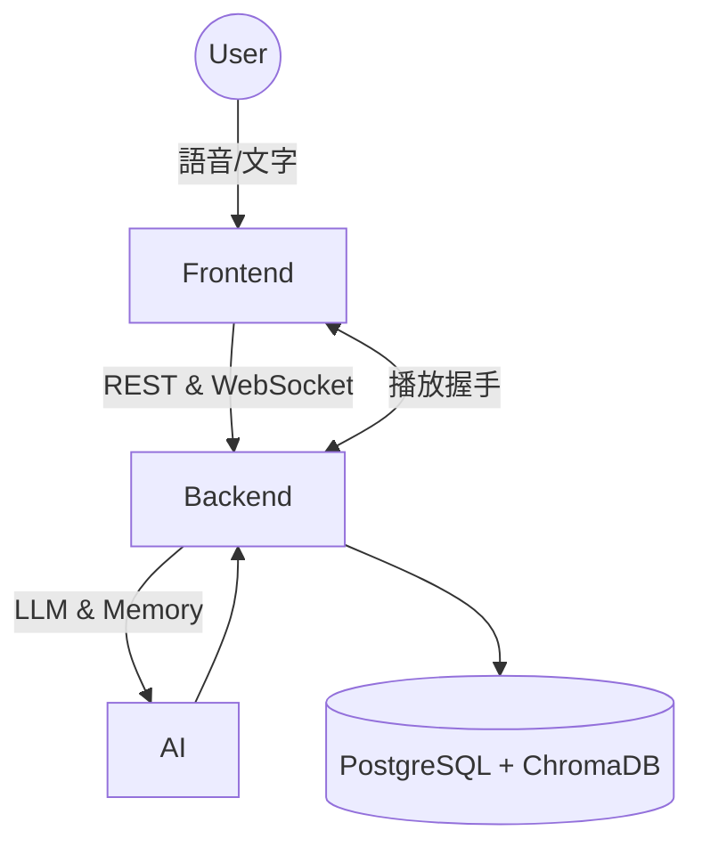

# Space Live Project

虛擬太空人互動藝術裝置專案，結合 3D 模型、AI 對話與情緒表達，打造沉浸式互動體驗。

## 專案簡介

Space Live Project 是一個互動藝術裝置，模擬一名被困於太空艙中一年的虛擬太空人，能與展覽場域中的觀眾進行自然語言互動。專案結合了 3D 模型渲染、骨架動畫、表情控制、語音識別與合成、大型語言模型與長期記憶系統，創造出具有情感連結與存在感的虛擬角色體驗。

## 功能亮點

- **自然語言互動**：透過 Google Gemini 2.0 Flash API 實現流暢的對話體驗
- **情緒表達**：使用 Morph Target 技術實現豐富的表情變化
- **動態動畫**：基於 Three.js 與 GLTFLoader 的骨架動畫系統
- **語音互動**：整合 Speech-to-Text 與 Text-to-Speech 實現雙向語音交流
- **長期記憶**：使用 LangChain 與 ChromaDB 向量資料庫建立角色記憶系統
- **音訊反應**：透過 Web Audio API 實現音訊分析與視覺反饋
- **自發行為**：閒置時的自言自語與情緒變化，增強角色真實感
- **語音播放握手機制**：前後端確認每段語音播放完成，避免順序錯亂
- **音頻驅動的3D背景系統**：包含語音反應背景、音樂反應粒子效果和事件觸發特效，提供沉浸式視覺體驗
  - **SpeechBackground**：對用戶語音輸入做出反應的背景牆
  - **MusicBackground**：漂浮的太空音樂播放器，具有環繞粒子效果
  - **EffectBackground**：對特定事件觸發的粒子效果
  - **P5SpaceEffect**：P5.js風格的粒子系統

## 快速開始

### 前端開發

```bash
# 前端開發
cd prototype/frontend

# 安裝依賴
npm install

# 啟動開發伺服器
npm run dev

# 建置生產版本
npm run build
```
### 後端開發

```bash
# 進入後端目錄
cd prototype/backend

# 建立虛擬環境
python -m venv venv
source venv/bin/activate  # Linux/Mac
# 或 venv\Scripts\activate  # Windows

# 安裝依賴
pip install -r requirements.txt

# 啟動開發伺服器
./run.sh
# 或 python -m uvicorn main:app --host 0.0.0.0 --port 8000 --reload
```

### 環境變數設定

後端需要設定以下環境變數（可建立 `.env` 檔案）：

```
GOOGLE_API_KEY=your_google_api_key
GEMINI_API_KEY=your_gemini_api_key
```

## 技術架構摘要

### 前端技術

- **React 19** + **TypeScript** + **Vite**：現代化前端開發框架
- **Three.js** / **React Three Fiber**：3D 渲染引擎
- **Zustand**：輕量級狀態管理
- **Web Audio API**：音訊處理與分析
- **WebSocket**：即時通訊

[詳細前端架構說明](docs/前端相關/前端架構概述.md)
[音頻驅動的3D背景系統](docs/frontend/audio_driven_background_system.md)
[DanceGroup 元件說明](docs/frontend/dance_group_component.md)
[背景效果概述](docs/display_backgrounds_overview.md)

### 後端技術

- **FastAPI**：高效能 Python Web 框架
- **LangChain** / **LangGraph**：AI 語言模型整合框架
- **Google Gemini**：大型語言模型
- **ChromaDB**：向量資料庫，用於記憶系統
- **PostgreSQL** + **pgvector**：關聯式資料庫與向量擴展

[詳細後端架構說明](docs/後端相關/後端架構概述.md)


```mermaid
flowchart TD
    User((User)) -->|語音/文字| Frontend
    Frontend -->|REST & WebSocket| Backend
    Backend -->|LLM & Memory| AI
    Backend --> Database[(PostgreSQL + ChromaDB)]
    AI --> Backend
    Frontend <-->|播放握手| Backend
```

## 目錄結構

```plaintext
space_live_project/
├── docs/                      # 文件目錄
│   ├── 前端相關/               # 前端文件
│   └── 後端相關/               # 後端文件
├── prototype/                 # 專案原型
│   ├── frontend/              # 前端程式碼
│   └── backend/               # 後端程式碼
├── scripts/                   # 工具腳本
├── .env.example               # 環境變數範例
├── .gitignore                 # Git 忽略檔案
├── README.md                  # 專案說明
└── AGENT.md                   # AI 代理協作指南
```

## Runtime Monitoring

`DirectorMonitorHUD` provides real-time state of BGM, SFX, video, lighting, camera and performance.
Press **d** during runtime to expand the drawer view.

### Murmur Mode

Use the `murmur-mode` API to temporarily disable the self-talk feature when testing other functions.

```bash
curl -X POST http://localhost:8000/api/control/murmur-mode \
  -H 'Content-Type: application/json' \
  -d '{"enabled": false}'
```

Send `true` to re-enable murmurs.

## AI 代理流程

本專案支援使用 AI 代理（如 Codex、Cursor、TaskMaster）進行自動化開發與維護。詳細的代理協作指南、分支策略、提交規範與自動化工作流程，請參考：

[AI 代理協作指南](AGENT.md)

## 貢獻指引

1. Fork 本專案
2. 建立功能分支 (`git checkout -b feature/amazing-feature`)
3. 提交變更 (`git commit -m 'feat: add amazing feature'`)
4. 推送分支 (`git push origin feature/amazing-feature`)
5. 開啟 Pull Request

請確保您的程式碼符合專案的程式碼風格規範，並通過所有測試。

## 授權

本專案採用 MIT 授權 - 詳見 [LICENSE](LICENSE) 檔案
