# 🚀 星際小可愛 (Space Live Project) 🚀

**歡迎來到「星際小可愛」的宇宙！這是一個正在開發中的 AI 互動專案，旨在創造一個生活在太空站、擁有記憶、個性與情感的虛擬太空網紅。**


---

## ✨ 專案願景

想像一下，能和一位身處遙遠太空站的 AI 網紅即時聊天，聽她分享太空生活的點滴，感受她的喜怒哀樂，甚至你的話語還能影響她的心情和狀態... 這就是「星際小可愛」想要實現的目標！

本專案不僅僅是一個聊天機器人，我們致力於：

*   **打造有靈魂的角色**: 賦予 AI 獨特的背景故事、鮮明的個性（活潑、好奇、偶爾感性）和專業知識（太空、科技）。
*   **實現有溫度的互動**: 透過即時語音交流、生動的 3D 形象和表情動畫，建立用戶與 AI 之間的情感連結。
*   **模擬有記憶的交流**: 利用先進的記憶系統，讓 AI 記得過去的對話，使交流更連貫、更深入。
*   **探索動態的體驗**: AI 的狀態會隨互動和模擬事件變化，帶來不可預測的趣味性。

**目標應用場景:** 展覽互動、教育娛樂、虛擬陪伴、AI Agent 研究等。

---

## 核心功能與技術亮點

### 前端 (Frontend)
*   ** modernen Web 技術**: 使用 React + TypeScript 構建用戶界面。
*   **🎮 沉浸式 3D 體驗**: 利用 Three.js + React Three Fiber + Drei 渲染高品質、可互動的 3D 虛擬角色和場景。
*   **🎭 即時動畫與表情**: 根據 AI 回應和語音，實時驅動模型的口型同步 (Lipsync) 和面部表情 (Morph Targets)。
*   **🧩 模塊化服務設計**: 採用服務單例模式 (`WebSocketService`, `ModelService`, `AudioService`, `ChatService`) 管理狀態和業務邏輯，實現關注點分離。
*   **⚡ 高效即時通信**: WebSocket 用於接收後端實時推送的動畫指令和對話訊息，並進行防抖/節流優化。
*   **🗣️ 語音交互集成**: 包含音訊錄製、播放控制，與後端 STT/TTS 服務對接。

### 後端 AI 核心 (Backend)
*   **🎙️ 即時語音互動支持**: 後端設計可接收文本輸入（來自 STT），生成文本回應（傳給 TTS），並能生成實時動畫指令。
*   **🧠 多層次記憶系統 (`MemorySystem`)**:
    *   **長期對話記憶**: 使用 ChromaDB 持久化儲存對話歷史。
    *   **角色核心記憶**: 獨立儲存 AI 的身份、背景和學習到的事實。
    *   **智能檢索**: 結合上下文進行向量搜索 (MMR 提高多樣性)，提取相關記憶輔助對話。
*   **🧩 LangGraph 驅動的對話引擎 (`DialogueGraph`)**:
    *   **流程圖化**: 將複雜的對話邏輯拆解為清晰的狀態圖 (StateGraph)。
    *   **狀態管理**: 在圖中顯式管理和傳遞對話狀態 (`DialogueState`)。
    *   **高擴展性**: 便於未來添加工具使用、反思修正循環等複雜 Agent 行為。
*   **🎭 動態角色狀態**: 影響 AI 的回應風格。
*   **🤝 向後兼容接口 (`AIService`)**: 提供穩定的適配器層。

---

## 🏗️ 系統架構 (前後端整合)

本專案包含前端 UI/3D 渲染和後端 AI 核心兩大部分。

```mermaid
graph TD
    %% 前端 UI 元件
    A[App 主元件] --> B[ControlPanel 控制面板]
    A --> C[ModelViewer 3D場景]
    A --> D[ChatInterface 聊天介面]
    A --> E[AudioControls 音訊控制]
    B --> F[MorphTargetControls 表情控制]
    
    %% 前端服務層
    WS_Client[WebSocketService] --- Frontend_Services[前端服務層]
    CS[ChatService] --- Frontend_Services
    AS[AudioService] --- Frontend_Services
    MS[ModelService] --- Frontend_Services
    API_Client["REST API Client"] --- Frontend_Services
    
    %% 後端服務與AI核心
    API_Server[REST API 伺服器] --- Backend[後端服務層]
    WS_Server[WebSocket 伺服器] --- Backend
    
    AIService[AI 服務接口] --- AI_Core[AI 核心]
    DialogueGraph[對話流程圖引擎] --- AI_Core
    MemorySystem[記憶系統] --- AI_Core
    LLM_Service["LLM Gemini"] --- AI_Core
    ChromaDB[(向量數據庫)] --- AI_Core

    %% 核心關係
    AIService --> DialogueGraph
    DialogueGraph --> MemorySystem
    DialogueGraph --> LLM_Service
    MemorySystem --> ChromaDB
    WS_Server --> AIService
    API_Server --> AIService

    %% 前端元件與服務交互
    D -- 傳送文字/語音識別結果 --> CS
    E -- 錄音控制/播放控制 --> AS
    F -- 調整表情參數 --> MS
    B -- 模型/場景控制 --> MS
    C -- 顯示3D模型與動畫 --> MS

    %% 前端服務與後端交互
    CS -- 處理聊天邏輯 --> WS_Client
    CS -. 同時處理 .-> API_Client
    AS -- 處理音訊 --> API_Client
    AS -- 播放TTS --> E
    MS -- 控制模型/動畫 --> C
    MS -- 監聽即時更新 --> WS_Client
    API_Client -- 發起HTTP請求 --> API_Server
    WS_Client -- WebSocket連接 --> WS_Server

    %% 後端推送前端
    WS_Server -- 推送即時訊息 --> WS_Client

    %% 樣式定義
    classDef ui fill:#cef,stroke:#5a9,stroke-width:2px
    classDef service fill:#fcc,stroke:#f66,stroke-width:2px
    classDef backend fill:#efe,stroke:#393,stroke-width:2px
    classDef ai fill:#dff,stroke:#333,stroke-width:1px,stroke-dasharray: 5 5
    classDef db fill:#ffc,stroke:#f60,stroke-width:1px
    classDef group fill:#f5f5f5,stroke:#ddd,stroke-width:1px

    %% 套用樣式
    class A,B,C,D,E,F ui
    class WS_Client,CS,AS,MS,API_Client service
    class API_Server,WS_Server backend
    class AIService,DialogueGraph,MemorySystem,LLM_Service ai
    class ChromaDB db
    class Frontend_Services,Backend,AI_Core group
```



*   **前端 (React + Three.js)**: 負責用戶界面展示、3D 模型渲染、接收用戶輸入（文字/語音）、播放音頻和動畫。前端通過 **服務單例** (`WebSocketService`, `ChatService`, etc.) 來管理狀態和與後端通信。
*   **後端 (FastAPI)**: 提供 WebSocket 和 REST API 接口。接收前端請求，調用 **AI 核心** 處理對話邏輯、記憶管理和狀態更新，並將結果（文本、動畫指令）返回給前端。
*   **通信**: 主要使用 WebSocket 進行實時雙向通信（對話、動畫指令），REST API 用於輔助操作（如上傳音頻、獲取歷史數據）。

---

## 🛠️ 環境設置與運行

**1. 環境準備:**

*   Node.js (建議 LTS 版本，用於前端)
*   npm 或 yarn (Node.js 包管理器)
*   Python 3.10 或更高版本 (用於後端)
*   pip (Python 包管理器)
*   Git

**2. 獲取程式碼:**

```bash
git clone <your-repository-url>
cd space_live_project
```

**3. 後端設置與運行:**

*   **進入後端目錄** (假設在 `prototype/backend`):
    ```bash
    cd prototype/backend
    ```
*   **創建與激活 Python 虛擬環境:**
    ```bash
    python3 -m venv venv
    source ../../venv/bin/activate  # Linux/macOS (路徑可能需調整)
    # ..\..\venv\Scripts\activate   # Windows (路徑可能需調整)
    ```
*   **安裝後端依賴:**
    ```bash
    pip install -r requirements.txt # 確保 requirements.txt 在此目錄或上層
    # 或手動安裝: pip install fastapi uvicorn langchain langgraph langchain-google-genai chromadb pydantic python-dotenv loguru ...
    ```
*   **配置後端環境變數:**
    *   在 `prototype/backend` 目錄下創建 `.env` 文件。
    *   填入 `GOOGLE_API_KEY`:
        ```dotenv
        GOOGLE_API_KEY="YOUR_GOOGLE_API_KEY_HERE"
        # 可能需要添加 VECTOR_DB_PATH="./chroma_db"
        ```
*   **啟動後端服務:**
    ```bash
    uvicorn main:app --host 0.0.0.0 --port 8000 --reload
    ```
    *後端服務現在運行在 `http://localhost:8000`*

**4. 前端設置與運行:**

*   **進入前端目錄** (假設在 `prototype/frontend` 或項目根目錄下的 `src`):
    ```bash
    # 根據你的項目結構調整 cd 命令
    cd prototype/frontend
    # 或者如果前端源碼在根目錄 src 下
    # cd ../../ (回到項目根目錄)
    ```
*   **安裝前端依賴:**
    ```bash
    npm install
    # 或者 yarn install
    ```
*   **啟動前端開發服務器:**
    ```bash
    npm run dev
    # 或者 yarn dev
    ```
    *前端開發服務通常會運行在 `http://localhost:3000` 或 `http://localhost:5173` (Vite 預設)*

**5. 訪問應用:**

*   打開瀏覽器，訪問前端開發服務器提供的地址。

---

## 📂 專案結構導覽 (示例)

```
/space_live_project/
├── docs/                    # 文檔
│   ├── 前端相關/
│   └── 後端相關/
├── prototype/               # 主要程式碼目錄 (或者前端在根目錄 src)
│   ├── backend/             # 後端 FastAPI 服務
│   │   ├── api/
│   │   ├── core/
│   │   ├── services/
│   │   │   └── ai/
│   │   └── main.py
│   └── frontend/            # 前端 React 應用 (或者在根目錄的 src)
│       ├── public/
│       ├── src/
│       │   ├── components/
│       │   ├── services/
│       │   ├── utils/
│       │   ├── App.tsx
│       │   └── main.tsx
│       ├── package.json
│       └── ...
├── venv/                    # (Git忽略) Python 虛擬環境
├── .env                     # (Git忽略) 後端環境變數
├── .gitignore
├── README.md                # 本文件
└── requirements.txt         # (推薦) Python 依賴列表
```
*注意：實際目錄結構可能有所不同，請以上述為參考。*

---

## 🚀 未來展望與擴展

結合前後端能力，未來可以探索：

*   **更豐富的互動**: 增加手勢識別、物體交互等。
*   **場景與任務**: 引入更多太空站場景和互動式任務。
*   **AI 能力增強**: 讓 AI 理解圖像、使用外部工具、進行更複雜推理。
*   **性能優化**: WebAssembly (WASM) 用於密集計算、前端渲染優化。

詳細的後端 AI 擴展方向請參考 [設計方案文檔](docs/後端相關/0402記憶系統方案.md)。

---

## 🙏 貢獻

(如果你希望開源或接受貢獻，可以在此處添加貢獻指南，例如：)

我們歡迎各種形式的貢獻！無論是發現 Bug、提出功能建議還是直接提交程式碼，請通過 Issue 與我們聯繫或提交 Pull Request。

---

## 📄 授權協議

(請根據你的選擇填寫授權協議，例如：)

本專案採用 [MIT License](LICENSE) 授權。

---

**感謝你的關注，讓我們一起見證「星際小可愛」的成長！** 