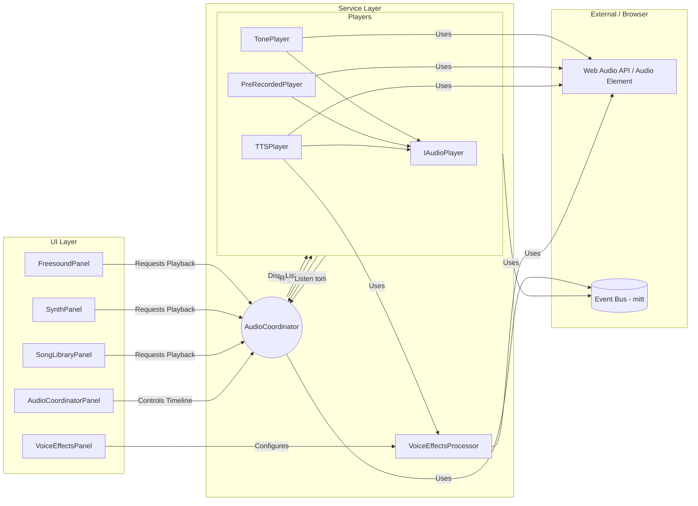

# 🎧 SoundEffectPanel 重構 ＆ AudioCoordinator 設計藍圖（更新版 v2）

## 0. 專案語境與現況回顧

| 重構動機                       | 目前問題                           | 目標                                 |
| ------------------------------ | ---------------------------------- | ------------------------------------ |
| 單一 `SoundEffectPanel` 功能龐雜 | UI 渾沌、維護困難、測試不易        | 「多面板 + 一協調器」模組化              |
| 聲音播放無統一排程               | 背景音、TTS、SFX 容易衝突            | 引入 `AudioCoordinator` 統一**協調**       |
| 無 ducking / 優先級            | 角色說話被背景音蓋過                 | 語音播放時自動壓低其他軌道音量（Ducking） |

**現況分析**：現有的音效控制面板 (`prototype/frontend/src/components/SoundEffectPanel.tsx`) 是一個龐大的單一元件，集成了播放音樂、合成音效以及 Freesound 音效搜尋等多項功能。在當前實作中，各種聲音來源（後端 TTS 語音、前端歌曲、音效）缺乏統一的管控，導致**維護困難**且**擴充性受限**。例如，當前若同時播放語音和背景音樂，兩者可能互相衝突，沒有機制協調音量或順序。為解決這些問題，我們將進行模組化拆分並引入**音訊協調器 (`AudioCoordinator`)**來統一管理所有聲音來源。

**重要架構決策：協調器僅負責協調，播放邏輯由獨立播放器實現**
- `AudioCoordinator`：負責解析指令、排程、處理優先級/Ducking、**分發播放命令**。
- 各 `Player`（如 `PreRecordedPlayer`, `TonePlayer`）：負責**實際播放**音頻、處理特定格式、回報狀態。

---

## 1. 面板拆分（UI Layer）

重構策略是將原先的 `SoundEffectPanel` 拆分為三個子元件，並由一個頂層容器 `SoundEffectPanelLayout` 負責選項卡切換與共享狀態分發。

| 子模組             | 功能摘要                                                              | 預計檔案位置                                     |
| ------------------ | --------------------------------------------------------------------- | ------------------------------------------------ |
| SongLibraryPanel   | • 歌曲清單呈現<br>• 播放 / 暫停 / 進度顯示<br>• 未來：分類、搜尋、波形視覺化 | `src/components/SongLibraryPanel.tsx` （新建）       |
| SynthPanel         | • Tone.js 合成器測試<br>• JSON 音符序列編輯<br>• 快速模板插入             | `src/components/SynthPanel.tsx` （新建）         |
| FreesoundPanel     | • Freesound API 搜尋 / 分頁<br>• 在線預覽、收藏 (IndexedDB)<br>• 標籤 / 授權濾鏡 | `src/components/FreesoundPanel.tsx` （新建）       |
| SoundEffectPanelLayout | • Tab 切換與狀態共享容器                                             | `src/components/SoundEffectPanelLayout.tsx` （新建） |

> **參考現有巨型元件**：
> `prototype/frontend/src/components/SoundEffectPanel.tsx`
> （其邏輯將被拆分到上表四個新檔案中）

### 1.1 SongLibraryPanel（歌曲庫面板）

**功能與規格：**
- 顯示可選歌曲清單（縮圖及標題）。
- 播放/暫停控制。
- 與角色頭部服務 (`HeadService`) 整合，觸發動畫提示。
- **(未來)** 支援分類篩選、搜尋、波形視覺化、進度條、跳轉播放。

**UI 驗證方式：**
- 驗證列表顯示、播放/暫停功能。
- 確認播放時觸發 `HeadService` （或模擬效果）。
- **(未來)** 測試搜尋、篩選、進度條跳轉。

### 1.2 SynthPanel（合成音效面板）

**功能與規格：**
- 利用 Tone.js 播放合成音效。
- 保留測試按鈕和 JSON 序列編輯器。
- **(未來)** 提供「快速模板」下拉選單、動態調整合成參數、整合語音效果處理。

**UI 驗證方式：**
- 驗證基本播放、JSON 編輯後聲音變化。
- **(未來)** 測試模板插入、參數調整響應、穩定性。

### 1.3 FreesoundPanel（音效搜尋面板）

**功能與規格：**
- 整合 `useFreesoundAPI` hook 進行搜尋、分頁。
- 線上預覽、收藏（使用 IndexedDB）。
- 顯示「我的收藏」子頁籤。
- **(未來)** 優化搜尋篩選、預覽控制、顯示更多元數據。

**UI 驗證方式：**
- 驗證搜尋功能、分頁載入。
- 測試音效預覽播放/停止。
- 驗證收藏功能及 IndexedDB 持久化。

---

## 2. AudioCoordinator 與播放器（Service Layer）

作為前端統一的**聲音協調中心**，負責接收指令、排程事件、管理衝突，並**委派給具體的播放器執行**。

| 組件                       | 職責                                  | 預計檔案位置                             |
| -------------------------- | ------------------------------------- | ---------------------------------------- |
| AudioCoordinator（協調器）     | • 解析 JSON/事件指令<br>• 排程 / 優先權 / Ducking<br>• **分發播放/停止命令**<br>• 監聽 Player 回報 | `src/services/AudioCoordinator.ts` （重構） |
| IAudioPlayer（播放器接口）   | • 定義播放器通用方法 (load, play, stop, on) | `src/services/players/IAudioPlayer.ts` （新建） |
| TonePlayer（具體播放器）     | • **實現 Tone.js 播放邏輯**<br>• 響應播放命令<br>• 回報播放狀態 | `src/services/players/TonePlayer.ts` （新建） |
| PreRecordedPlayer（具體播放器） | • **實現 HTMLAudio/Howler 播放邏輯**<br>• 響應播放命令<br>• 回報播放狀態 | `src/services/players/PreRecordedPlayer.ts` （新建） |
| TTSPlayer（具體播放器）      | • **實現 TTS 播放邏輯**<br>• 響應播放命令<br>• 回報播放狀態 | `src/services/players/TTSPlayer.ts` （新建/整合） |
| EventBus（事件總線）        | • 協調器與播放器間通信<br>• 解耦組件依賴 | 使用 mitt 或其他事件庫 |

### 2.1 統一播放器介面

```typescript
// src/services/players/IAudioPlayer.ts
export interface IAudioPlayer {
  load(src: string, options?: any): Promise<void>;
  play(at?: number): void;
  stop(): void;
  pause(): void;
  on(event: "progress" | "ended" | "error", callback: Function): void;
  // 可能需要添加獲取當前狀態的方法
  // isPlaying(): boolean;
  // getCurrentTime(): number;
}
```

### 2.2 事件流通信機制 (協調器 <-> 播放器)

```typescript
// 協調器發出播放請求
eventBus.emit('play_requested', { playerId: 'preRecordedPlayer1', kind: 'sfx', url: '/audio/sfx/boom.mp3' });

// 特定播放器監聽事件
preRecordedPlayer1.eventBus.on('play_requested', (data) => {
  if (data.playerId === this.id) {
    this.play(data.url); // 執行播放
  }
});

// 播放器回報狀態給協調器
preRecordedPlayer1.eventBus.emit('playback_ended', { playerId: 'preRecordedPlayer1', kind: 'sfx' });

// 協調器監聽所有播放器狀態
eventBus.on('playback_ended', (data) => {
  logger.debug(`Player ${data.playerId} finished playing ${data.kind}`);
  // 處理後續排程或狀態更新
});
```

**核心機制：**
- **Ducking**: 由 `AudioCoordinator` 判斷觸發時機，透過事件/命令通知相關 `Player` 降低音量，或直接操作 Web Audio API 的 GainNode。
- **優先級系統**: 由 `AudioCoordinator` 根據事件類型或元數據決定哪個事件可以播放，以及是否打斷其他低優先級事件。
- **事件調度**: `AudioCoordinator` 作為中心樞紐，接收請求，處理邏輯，並將具體操作**分派**給對應的 `Player` 執行。

---

## 3. VoiceEffectsProcessor（FX Layer）

負責為 TTS 語音添加實時效果。

| 功能                 | 主要 API                             | 預計檔案位置                                  |
| -------------------- | ------------------------------------ | --------------------------------------------- |
| 初始化 Tone.js 效果鏈 | `initialize()`                       | `src/services/VoiceEffectsProcessor.ts` （新建） |
| 套用預設效果         | `applyPreset(id)`                    | 同上                                          |
| 重置效果             | `resetEffects()`                     | 同上                                          |
| 動態調參             | `setEffectParameter(type, param, value)` | 同上                                          |
| 載入 / 播放 TTS      | `loadTTSAudio(url) + playTTS()`      | 同上                                          |

**對應 UI 面板**：
`src/components/VoiceEffectsPanel.tsx` （新建，用於控制語音效果）

---

## 4. AudioTimeline JSON 格式（Data Layer）

作為後端輸出、前端輸入的標準化時間軸描述。

```jsonc
// 範例結構
{
  "timeline": [
    {
      "track": "sfx",         // 'voice', 'music', 'sfx'
      "startTime": 0.0,       // 秒
      "type": "music",        // 'tts', 'singing', 'music', 'sfx', 'combo'
      "resource": "bgm_forest01", // 資源 ID 或 URL
      "loop": true,
      "volume": 0.8,
      "duration": 120.5     // 可選
    },
    {
      "track": "voice",
      "startTime": 3.8,
      "type": "tts",
      "resource": "line_001",
      "voiceEffect": { "preset": "robot" }, // 可選語音效果
      "animationCues": [ ... ], // 可選動畫提示
      "duration": 2.2
    },
    // ... 更多事件
  ]
}
```

**Schema 定義位置建議**：
`shared/schemas/audioTimeline.schema.json`

---

## 5. 開發節奏與 Commit 切分建議 (調整)

採用**小步驟、反覆測試**的方式推進。

| Stage | 主要內容                                     | 主要修改路徑                                                              |
| ----- | -------------------------------------------- | ------------------------------------------------------------------------- |
| 1     | **定義接口 & 播放器**：定義 `IAudioPlayer`，實現 `PreRecordedPlayer` (封裝現有邏輯) | `src/services/players/`                                                    |
| 2     | **重構 Coordinator (Stub)**：移除播放邏輯，改為**事件分發**模式 | `src/services/AudioCoordinator.ts`                                     |
| 3     | **事件總線集成**：建立 Coordinator 與 Player 基礎通信 | `src/services/eventBus.ts` (或使用 mitt) + 相關整合                  |
| 4     | **面板整合測試**：將一個面板 (如 Freesound) 切換到新流程測試 | `FreesoundPanel.tsx` + `AudioCoordinator.ts` + `PreRecordedPlayer.ts`      |
| 5     | **實現其他 Player**：`TonePlayer`, `TTSPlayer`  | `src/services/players/`                                                    |
| 6     | **實現核心協調邏輯**：Ducking 與優先級管理     | `AudioCoordinator.ts`                                                    |
| 7     | **完善時間軸與面板**：`scheduleFromJson` 實現，`AudioCoordinatorPanel` 功能 | `AudioCoordinator.ts` + `AudioCoordinatorPanel.tsx`                      |
| 8     | **修復標籤切換問題** & 整合語音效果         | `SoundEffectPanel.tsx`, `VoiceEffectsProcessor.ts`, `TTSPlayer.ts`       |

---

## 6. 對應現有檔案速查表 (更新)

| 現有檔案                                             | 用途             | 與新架構關係                                                        |
| ---------------------------------------------------- | ---------------- | ------------------------------------------------------------------- |
| `prototype/frontend/src/components/SoundEffectPanel.tsx` | 舊版巨型面板     | **將被更新**，修復標籤切換問題                                        |
| `prototype/frontend/src/components/soundEffects/AudioCoordinatorPanel.tsx` | 音頻協調器面板  | **不變**，但其交互對象 `AudioCoordinator` 已重構                       |
| `prototype/frontend/src/services/AudioCoordinator.ts`  | 音頻協調器       | **重構**，移除直接播放邏輯，改為事件分發給 Player                       |
| `prototype/frontend/src/services/players/IAudioPlayer.ts` | 播放器介面     | **新建**                                                           |
| `prototype/frontend/src/services/players/TonePlayer.ts` | Tone.js 播放器  | **新建**                                                           |
| `prototype/frontend/src/services/players/PreRecordedPlayer.ts` | 預錄音頻播放器 | **新建** (或整合現有 `AudioPlayerService`)                         |
| `prototype/frontend/src/services/players/TTSPlayer.ts` | TTS 播放器      | **新建** (或整合現有 `AudioService` 的 TTS 部分)                   |
| `docs/Soundeffect_related/refactor_todo.md`          | 詳細待辦清單     | **將被更新**，反映新的架構和步驟                                   |

---

## 7. 系統架構圖 (更新)



## 8. 完成後的預期效果與使用者體驗 (更新)

1.  **更清晰的職責分離**: 協調器專注於「何時播放什麼」，播放器專注於「如何播放」，代碼更易維護，測試更獨立。
2.  **無縫標籤切換**: 解決標籤切換導致音頻停止的問題，因播放狀態由獨立的 Player 或 Coordinator 管理，不再受 UI 組件生命週期影響。
3.  **直觀的時間軸編輯**: AudioCoordinatorPanel 提供視覺化時間軸編輯，讓用戶可以方便地排程和預覽複雜音頻序列。
4.  **智能混音與 Ducking**: AudioCoordinator 根據規則協調各 Player，確保聲音不衝突，語音清晰。
5.  **靈活的 JSON 控制**: 支持通過 JSON 指令控制複雜音頻行為，方便內容創建和自動化。
6.  **強大的擴展性**: 添加新音頻源（如 Suno）只需實現新的 `IAudioPlayer` 並在協調器中註冊即可，無需修改核心協調邏輯。

---

*（此文件基於 2025/04/24 的討論，強調協調器與播放器分離的架構進行更新）*


flowchart LR
    %% ===== UI Panels =====
    SL[SongLibraryPanel]
    SY[SynthPanel]
    FS[FreesoundPanel]

    %% ===== Backend / Timeline =====
    BWS[Backend_WS\nAudioTimeline_JSON]

    %% ===== Coordinator =====
    AC((AudioCoordinator))

    %% ===== Outputs =====
    VO[Voice_Output]
    MU[Music_Output]
    SX[SFX_Output]

    %% ===== Future Viseme / Emotion =====
    VE[Viseme_Emotion]

    %% ---- Main control flow ----
    SL -->|play_request| AC
    SY -->|play_request| AC
    FS -->|play_request| AC
    BWS -->|timeline| AC

    AC -->|voice_track| VO
    AC -->|music_track| MU
    AC -->|sfx_track| SX
    AC -.->|expressions| VE

    VO -.->|ducking| MU
    VO -.->|ducking| SX

    %% ===== Song flow =====
    subgraph SongFlow
        direction LR
        U1[User] -->|select_song| SL
        SL -->|play_song| MU
        U1 -->|pause_stop| SL
        MU -.-> HA[Head_Animation]
    end

    %% ===== Synth flow =====
    subgraph SynthFlow
        direction LR
        U2[User] -->|edit_sequence| SY
        SY --> TZ[ToneJS_Synth]
        TZ --> SX
    end

    %% ===== Freesound flow =====
    subgraph FreesoundFlow
        direction LR
        U3[User] -->|search| FS
        FS --> FAPI[Freesound_API]
        FAPI --> FS
        FS --> SX
    end
