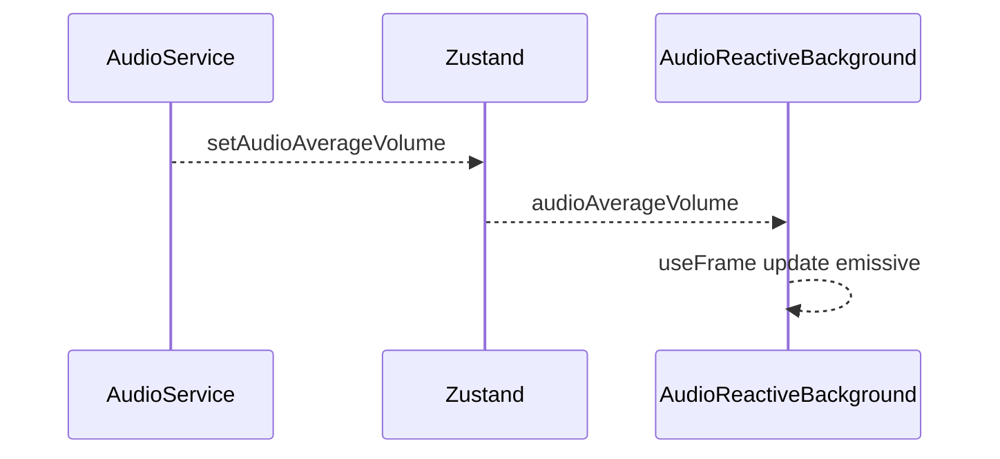
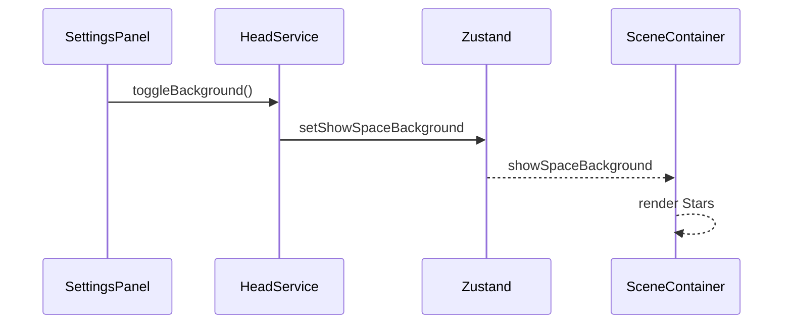

## 1. Display Background Inventory

| ID | Name | Entry File | Tech | Update Driver | Key Inputs |
|----|------|-----------|------|---------------|------------|
| 01 | SceneContainer Stars | ./prototype/frontend/src/components/SceneContainer.tsx | R3F/Three.js | None | `showSpaceBackground` |
| 02 | AudioReactiveBackground | ./prototype/frontend/src/components/AudioReactiveBackground.tsx | R3F/Three.js | `useFrame` | `audioAverageVolume` |
| 03 | ModelViewer SpaceBackground | ./prototype/frontend/src/components/ModelViewer.tsx | R3F/Three.js | None | `showSpaceBackground` |
| 04 | layout/SceneContainer Stars | ./prototype/frontend/src/components/layout/SceneContainer.tsx | R3F/Three.js | None | `showSpaceBackground` |

## 2. Event ↔ Background Matrix

| Event | SceneContainer Stars | AudioReactiveBackground | ModelViewer SpaceBackground | layout/SceneContainer Stars |
|-------|---------------------|-------------------------|----------------------------|----------------------------|
| `toggleBackground` | ✅ | ❌ | ✅ | ✅ |
| `audioAverageVolume` | ❌ | ✅ | ❌ | ❌ |
| `emotionalTrajectory` | ❌ | ❌ | ❌ | ❌ |

## 3. Integration Notes
- `showSpaceBackground` is stored with other head model state, coupling scene toggling to model logic.
- Background components rely on React Three Fiber but have minimal cleanup when unmounted.
- `AudioReactiveBackground` reads raw volume from store without throttling beyond `useFrame` loop.
- Replacing with a sound-reactive 3D background will require injecting new Three.js elements into the existing `SceneContainer` canvas and wiring audio metrics through Zustand.
