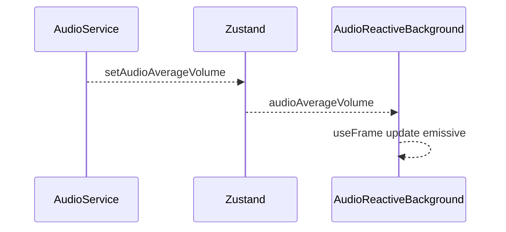
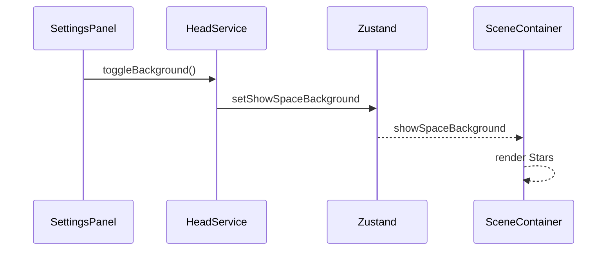
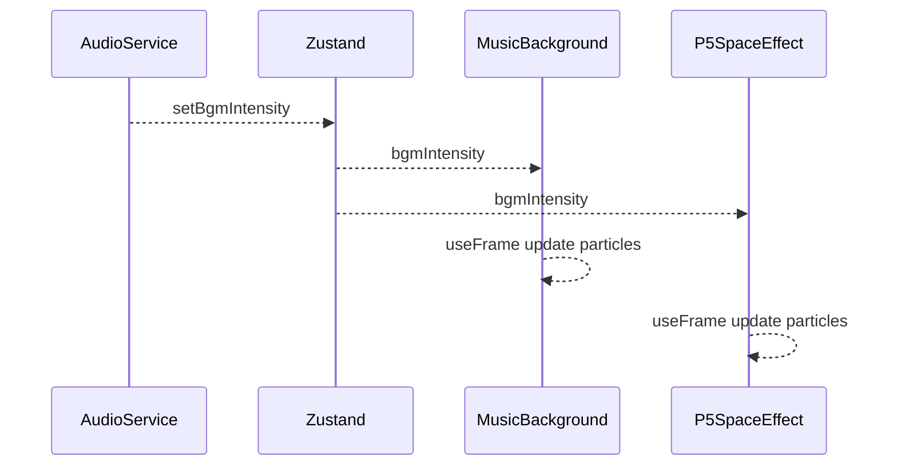

## 1. Display Background Inventory

| ID | Name | Entry File | Tech | Update Driver | Key Inputs |
|----|------|-----------|------|---------------|------------|
| 01 | SceneContainer Stars | ./prototype/frontend/src/components/SceneContainer.tsx | R3F/Three.js | None | `showSpaceBackground` |
| 02 | AudioReactiveBackground | ./prototype/frontend/src/components/AudioReactiveBackground.tsx | R3F/Three.js | `useFrame` | `audioAverageVolume` |
| 03 | ModelViewer SpaceBackground | ./prototype/frontend/src/components/ModelViewer.tsx | R3F/Three.js | None | `showSpaceBackground` |
| 04 | layout/SceneContainer Stars | ./prototype/frontend/src/components/layout/SceneContainer.tsx | R3F/Three.js | None | `showSpaceBackground` |
| 05 | SpeechBackground | ./prototype/frontend/src/components/SpeechBackground.tsx | R3F/Three.js | `useFrame` | `audioAverageVolume` |
| 06 | MusicBackground | ./prototype/frontend/src/components/MusicBackground.tsx | R3F/Three.js | `useFrame` | `bgmIntensity`, `crazyMode` |
| 07 | EffectBackground | ./prototype/frontend/src/components/EffectBackground.tsx | R3F/Three.js | `useFrame` | `effectTrigger` |
| 08 | DynamicAudioBackgrounds | ./prototype/frontend/src/components/DynamicAudioBackgrounds.tsx | R3F/Three.js | None | composite |
| 09 | P5SpaceEffect | ./prototype/frontend/src/components/P5SpaceEffect.tsx | R3F/Three.js | `useFrame` | `bgmIntensity` |

## 2. Event ↔ Background Matrix

| Event | SceneContainer Stars | AudioReactiveBackground | ModelViewer SpaceBackground | layout/SceneContainer Stars | SpeechBackground | MusicBackground | EffectBackground | P5SpaceEffect |
|-------|---------------------|-------------------------|----------------------------|----------------------------|----------------|----------------|----------------|--------------|
| `toggleBackground` | ✅ | ❌ | ✅ | ✅ | ❌ | ❌ | ❌ | ❌ |
| `audioAverageVolume` | ❌ | ✅ | ❌ | ❌ | ✅ | ❌ | ❌ | ❌ |
| `bgmIntensity` | ❌ | ❌ | ❌ | ❌ | ❌ | ✅ | ❌ | ✅ |
| `effectTrigger` | ❌ | ❌ | ❌ | ❌ | ❌ | ❌ | ✅ | ❌ |
| `crazyMode` | ❌ | ❌ | ❌ | ❌ | ❌ | ✅ | ❌ | ❌ |

## 3. Integration Notes
- `showSpaceBackground` is stored with other head model state, coupling scene toggling to model logic.
- Background components rely on React Three Fiber but have minimal cleanup when unmounted.
- `AudioReactiveBackground` reads raw volume from store without throttling beyond `useFrame` loop.
- `MusicBackground` 已升級為一個漂浮的太空音樂播放器，具有多種粒子效果和瘋狂模式。
- `SpeechBackground` 的背景牆位置從 z=-5 移動到 z=-15，以避免與前景元素衝突。
- `EffectBackground` 的粒子效果已增強，具有更長的持續時間和更誇張的效果。
- `P5SpaceEffect` 提供 p5.js 風格的粒子系統，創建太空中漂浮的粒子效果。
- 所有音頻驅動的背景系統現在通過 `DynamicAudioBackgrounds` 組件整合在一起，使管理更加集中和模塊化。
