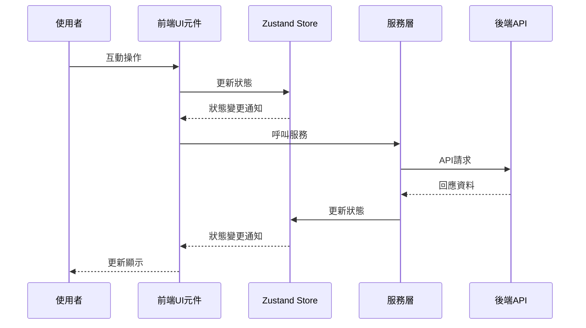

# 前端架構概述

本文檔概述虛擬太空人互動藝術裝置專案的前端架構，包含核心技術、目錄結構、狀態管理、主要模組功能等關鍵資訊。

## 核心技術與打包流程

虛擬太空人前端採用現代化 Web 技術棧，主要包含：

- **React 19**: 使用最新版本的 React 框架構建使用者介面
- **TypeScript**: 強型別 JavaScript 超集，提供更可靠的開發體驗
- **Vite**: 現代化前端打包與開發工具，提供快速的開發與建置體驗
- **Three.js/React Three Fiber**: 3D 渲染引擎與 React 整合層，用於虛擬太空人模型渲染
- **@react-three/drei**: Three.js 的 React 輔助工具庫
- **Zustand**: 輕量級狀態管理庫，用於管理應用狀態
- **Web Audio API**: 處理音訊分析與反應式效果
- **TailwindCSS**: 原子化 CSS 框架，用於快速構建介面
- **WebSocket**: 與後端進行即時雙向通訊

打包流程使用 Vite 進行開發與生產環境建置，支援熱更新、TypeScript 編譯與資源優化。

## 目錄結構樹

```plaintext
prototype/frontend/
├── public/                    # 靜態資源
│   ├── animations/            # 3D 模型動畫檔案 (.glb)
│   ├── audio/                 # 音效與背景音樂
│   │   ├── BGM/               # 背景音樂
│   │   └── effects/           # 音效
│   ├── models/                # 3D 模型檔案 (.glb)
│   └── vite.svg              # Vite 圖標
├── src/                       # 源碼目錄
│   ├── assets/                # 靜態資源
│   ├── components/            # React 元件
│   │   └── layout/            # 佈局相關元件
│   ├── config/                # 配置檔案
│   ├── hooks/                 # 自定義 React Hooks
│   ├── services/              # 服務層
│   ├── store/                 # Zustand 狀態管理
│   │   └── slices/            # 狀態切片
│   ├── styles/                # 全局樣式
│   ├── types/                 # TypeScript 型別定義
│   ├── utils/                 # 工具函數
│   ├── App.css                # App 樣式
│   ├── App.tsx                # 主應用元件
│   ├── index.css              # 全局樣式
│   ├── main.tsx               # 應用入口
│   └── README.md              # 前端說明文件
├── tsconfig.app.json          # TypeScript 配置
├── tsconfig.node.json         # Node TypeScript 配置
└── vite.config.ts             # Vite 配置
```

## 狀態與資料流

前端採用 Zustand 進行狀態管理，將不同功能領域的狀態拆分為多個狀態切片（slices）：

### 主要狀態切片

1. **appSlice**: 應用全局狀態，管理整體應用設置與界面狀態
2. **audioSlice**: 音訊處理相關狀態，管理音量、音效播放等
3. **bodySlice**: 身體模型相關狀態，包含模型位置、縮放、動畫等
4. **chatSlice**: 聊天功能相關狀態，管理對話歷史與當前對話
5. **headSlice**: 頭部模型相關狀態，包含表情控制、口型同步等
6. **mediaSlice**: 媒體控制相關狀態，管理錄音、播放狀態
7. **webSocketSlice**: WebSocket 連接相關狀態，管理連接狀態與消息
8. **audioSettingsSlice**: 調整 TTS/BGM 音量等音訊參數
9. **backgroundAudioSlice**: 音訊驅動背景效果狀態
10. **speechTextSlice**: 用於大螢幕文本顯示的語音文字

### 資料流序列圖



狀態更新流程遵循單向資料流原則，由使用者操作觸發狀態變更，再由狀態變更驅動界面更新。WebSocket 連接則提供後端主動推送訊息的能力，實現即時互動體驗。

## 主要模組摘要

### 元件 (Components)

| 元件名稱 | 用途說明 |
|---------|---------|
| AudioReactiveBackground.tsx | 根據音訊輸入動態變化的背景效果，提升沉浸感 |
| BackgroundSoundSystem.tsx | 管理背景音樂與音效播放，營造太空氛圍 |
| BodyModel.tsx | 處理虛擬太空人身體模型的渲染與動畫控制 |
| ErrorBoundary.tsx | React 錯誤邊界元件，捕獲渲染錯誤並優雅降級 |
| FloatingChatWindow.tsx | 可拖動的聊天視窗界面，顯示對話歷史 |
| HeadModel.tsx | 處理虛擬太空人頭部模型的渲染與表情控制 |
| ModelAnalyzerTool.tsx | 3D模型分析工具，用於開發調試階段 |
| ModelDebugger.tsx | 模型調試界面，顯示模型狀態與控制項 |
| ModelViewer.tsx | 3D模型查看器，整合頭部與身體模型的顯示 |
| MorphTargetBar.tsx | 表情控制滑動條元件，用於調整表情參數 |
| MorphTargetControls.tsx | 表情控制面板，組織多個表情控制項 |
| SceneContainer.tsx | Three.js 場景容器，管理 3D 渲染環境 |
| SettingsPanel.tsx | 應用設置面板，提供各種配置選項 |
| AudioMixer.tsx | 混音控制台，調整各音軌音量 |
| SpeechBackground.tsx | 依語音音量與播放時間顯示字幕，支援打字機同步 |
| MusicBackground.tsx | 漂浮的太空音樂播放器及粒子效果，支援瘋狂模式 |
| EffectBackground.tsx | 事件觸發的擴散粒子特效，持續時間較長 |
| P5SpaceEffect.tsx | P5.js 風格的粒子視覺，隨音樂強度變化 |
| DynamicAudioBackgrounds.tsx | 整合並統一管理所有背景效果 |
| Toast.tsx | 通知提示元件，顯示系統消息 |
| layout/AppUI.tsx | 應用主界面佈局，組織整體 UI 結構 |
| layout/SceneContainer.tsx | 場景容器佈局，管理 3D 場景的顯示區域 |

### 服務 (Services)

| 服務名稱 | 用途說明 |
|---------|---------|
| AudioService.ts | 音訊處理服務，包括錄音、播放與頻譜分析 |
| BodyService.ts | 身體模型管理服務，控制動畫與姿態 |
| ChatService.ts | 聊天服務，處理訊息並管理語音播放隊列與握手機制 |
| HeadService.ts | 頭部模型管理服務，控制表情與口型同步 |
| WebSocketService.ts | WebSocket 連接管理，含重連與高頻消息防抖 |
| api.ts | REST API 請求封裝，統一管理 HTTP 請求 |
| audioPlayer.ts | 音訊播放器實現，處理音效與語音播放 |

### 配置與工具

| 檔案名稱 | 用途說明 |
|---------|---------|
| config/animationConfig.ts | 動畫相關配置，定義可用動畫與參數 |
| config/emotionMappings.ts | 情緒到表情的映射配置，連接語義與視覺表現 |
| config/modelConfig.ts | 3D模型相關配置，設定模型路徑與參數 |
| hooks/useEmotionalSpeaking.ts | 情緒化語音表達 Hook，連接語音與表情變化 |
| utils/LogManager.ts | 日誌管理工具，統一處理日誌輸出 |
| utils/ModelAnalyzer.ts | 3D模型分析工具，提取模型結構與參數 |
| utils/animationUtils.ts | 動畫處理工具函數，輔助動畫控制 |

## Build / Dev 指令

專案提供多種 npm 指令用於開發、測試與建置：

```bash
# 開發模式啟動，支援熱更新
npm run dev

# 建置生產版本
npm run build

# 預覽生產版本
npm run preview

# 代碼檢查
npm run lint

# 自動修復代碼問題
npm run lint:fix

# 格式化代碼
npm run format

# 同步動畫資源（從共享目錄同步到專案）
npm run sync-animations

# 執行測試
npm run test
```

開發流程通常從 `npm run dev` 開始，進行本地開發與測試，完成後使用 `npm run build` 產生生產版本。

## 測試策略

目前專案已設置基本測試框架，但尚未實現完整測試覆蓋。

### TODO

- 實現元件單元測試，特別是複雜互動元件如 ChatUI、AnimationManager
- 為 3D 模型渲染與動畫功能建立整合測試
- 建立狀態管理測試，確保 Zustand store 正確運作
- 實現服務層的單元測試，模擬 API 與 WebSocket 通訊
- 建立端到端測試，確保完整用戶流程正常運作

測試策略將優先覆蓋核心功能模組，包括 3D 模型渲染、動畫控制、語音互動與狀態管理，確保系統穩定性與可靠性。
