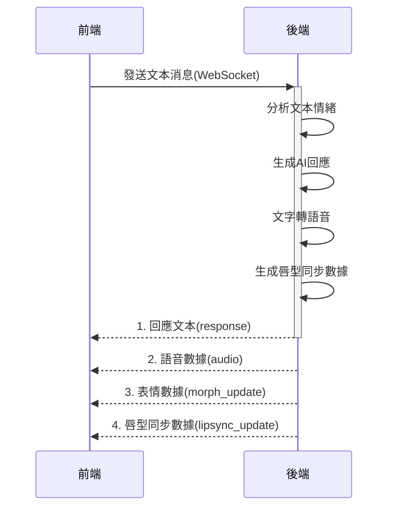
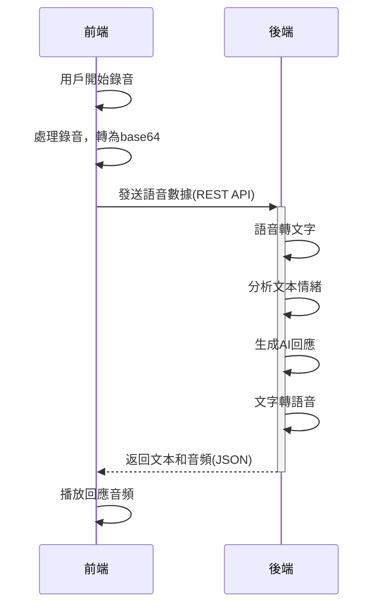
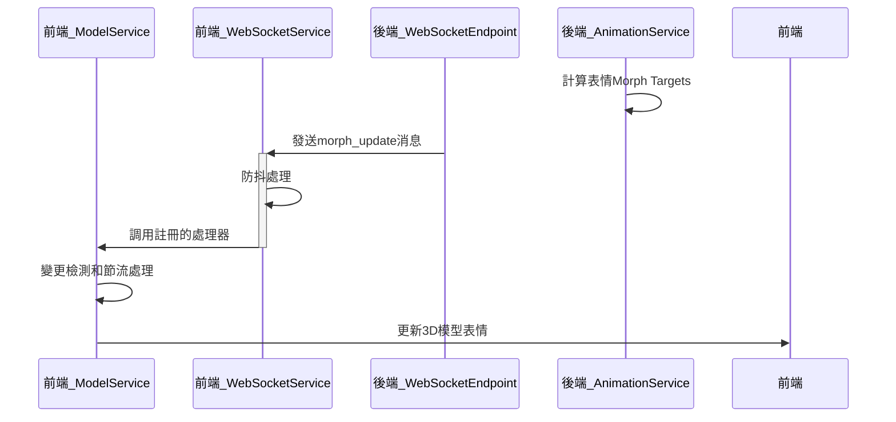
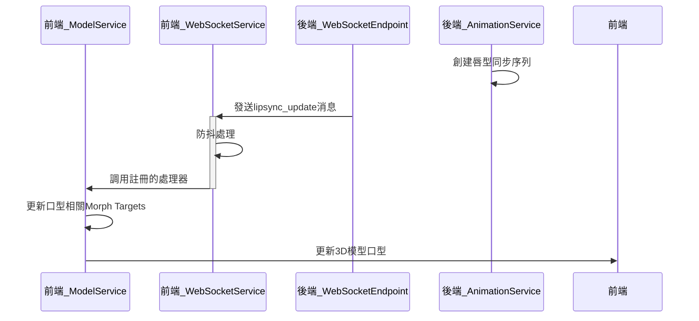

# 虛擬宇航員互動系統 - 重構後狀態報告

## 目錄

1. [摘要](#摘要)
2. [系統架構概述](#系統架構概述)
3. [前後端互動機制](#前後端互動機制)
4. [主要服務模組分析](#主要服務模組分析)
5. [效能優化措施](#效能優化措施)
6. [問題診斷與解決方案](#問題診斷與解決方案)
7. [建議與未來改進](#建議與未來改進)

## 摘要

本報告詳細分析了虛擬宇航員互動系統在重構後的程式碼狀態，特別關注前端架構與後端的互動機制。重構工作主要聚焦於將混合邏輯拆分為獨立服務、改善程式碼結構、優化性能以及增強系統穩定性。系統現已實現模塊化設計，大幅提升了代碼可維護性和擴展性，並解決了之前存在的效能瓶頸。

## 系統架構概述

### 整體架構

重構後的系統採用了模塊化的服務導向架構，將原本混合在組件中的邏輯抽離為獨立的服務類，實現了關注點分離和狀態管理的集中化。主要架構組成如下：

```
虛擬宇航員互動系統
├── 前端 (React + TypeScript)
│   ├── 服務層 (Services)
│   │   ├── WebSocketService（處理與後端的實時通信）
│   │   ├── ModelService（3D模型管理）
│   │   ├── AudioService（音頻處理）
│   │   └── ChatService（聊天邏輯）
│   ├── 組件層 (Components)
│   │   ├── ModelViewer（3D模型顯示）
│   │   ├── ChatInterface（聊天界面）
│   │   ├── ControlPanel（控制面板）
│   │   └── AudioControls（音頻控制）
│   └── 工具層 (Utils)
│       └── LogManager（日誌管理）
└── 後端
    ├── WebSocket服務
    ├── 語音處理服務
    ├── AI對話服務
    └── 動畫服務
```

### 核心技術棧

- **前端框架**：React + TypeScript
- **3D渲染**：Three.js + React Three Fiber + Drei
- **狀態管理**：React Hooks + 服務單例模式
- **通信協議**：WebSocket + RESTful API
- **構建工具**：Vite

### 設計模式

重構後的系統廣泛採用了以下設計模式：

1. **單例模式**：所有服務類（WebSocketService, ModelService等）均採用單例設計，確保全局唯一實例
2. **觀察者模式**：使用事件註冊和回調機制處理異步通知
3. **依賴注入**：服務間通過構造函數注入依賴
4. **代理模式**：使用React Hooks包裝服務API，簡化組件中的使用

## 前後端互動機制

### WebSocket通信

系統的核心實時通信基於WebSocket協議，具體實現在`WebSocketService`中：

1. **連接管理**：
   - 自動連接建立與重連機制
   - 連接狀態監控與異常處理
   - 健壯的錯誤處理和重試邏輯

2. **消息處理**：
   - 基於消息類型的處理器註冊系統
   - 消息分發機制
   - 高頻消息的防抖動處理（針對lipsync_update, morph_update等）

3. **主要消息類型**：
   - `message`：用戶與AI的對話內容
   - `lipsync_update`：唇型同步數據，控制角色口型
   - `morph_update`：表情更新，控制角色情緒表達
   - `animation_update`：動畫更新指令

### REST API調用

除WebSocket外，系統還使用REST API進行非實時資源請求：

1. **音頻處理**：
   - `/speech-to-text`：將用戶語音轉換為文本和相應的AI回覆音頻
   - 使用base64編碼傳輸音頻數據

2. **表情預設**：
   - `/api/preset-expressions/{expression}`：獲取預定義的表情配置

### 數據流向圖

```
+----------------+                                   +----------------+
|                |   1. 語音/文本輸入                 |                |
|                | --------------------------->      |                |
|                |                                   |                |
|                |   2. 語音識別/文本處理            |                |
|                | <---------------------------      |                |
|                |                                   |                |
|    前端        |   3. AI回覆（文本+音頻）           |     後端       |
|                | <---------------------------      |                |
|                |                                   |                |
|                |   4. 唇型同步數據                 |                |
|                | <---------------------------      |                |
|                |                                   |                |
|                |   5. 表情/情緒更新                |                |
|                | <---------------------------      |                |
+----------------+                                   +----------------+
```

## 主要服務模組分析

### WebSocketService

WebSocketService實現了與後端的實時通信，負責建立連接、發送消息、接收回應並分發到相應處理器。

**關鍵功能**：
- 連接管理（建立、重連、關閉）
- 消息發送與接收
- 基於類型的消息處理器註冊
- 高頻消息防抖處理

**效能優化**：
- 實現了高頻消息（如lipsync_update）的防抖動機制
- 基於消息類型的批處理
- 異常處理和連接恢復

**代碼示例**：
```typescript
// 高頻消息防抖動處理
private _handleHighFrequencyMessage(type: string, message: any): void {
  const now = Date.now();
  
  // 獲取或創建防抖動信息
  if (!this._debounceMap.has(type)) {
    this._debounceMap.set(type, {
      timeout: null,
      lastData: null,
      lastTime: 0
    });
  }
  
  const debounceInfo = this._debounceMap.get(type)!;
  debounceInfo.lastData = message;
  debounceInfo.lastTime = now;
  
  // 如果已有計時器運行，不做任何事
  if (debounceInfo.timeout !== null) return;
  
  // 設置防抖計時器
  const debounceDelay = type === 'lipsync_update' ? 50 : 100;
  debounceInfo.timeout = window.setTimeout(() => {
    // 處理邏輯...
  }, debounceDelay);
}
```

### ModelService

ModelService負責3D模型的管理，包括載入、屬性設置（縮放、旋轉、位置）、Morph Targets控制和動畫播放。

**關鍵功能**：
- 模型屬性管理（縮放、旋轉、位置）
- Morph Target字典和影響值控制
- 動畫列表和選擇
- 表情和唇型同步處理

**與後端互動**：
- 接收並處理`lipsync_update`消息，更新角色口型
- 接收並處理`morph_update`消息，更新角色表情
- 請求預設表情配置

**關鍵優化**：
- 實現了Morph Target更新的節流機制
- 變更檢測機制，避免不必要的更新
- 平滑過渡算法，使表情變化自然

**代碼示例**：
```typescript
// 處理唇型同步更新
private handleLipsyncUpdate(data: any): void {
  if (data.morphTargets) {
    logger.debug('處理唇型同步更新', LogCategory.MORPH, 'lipsync_update');
    
    const faceKeys = [
      "jawOpen", "mouthOpen", "mouthFunnel", /* ... 更多項目 */
    ];
    
    const newMorphTargets = { ...this.morphTargets };
    
    Object.entries(data.morphTargets).forEach(([key, value]) => {
      if (faceKeys.includes(key)) {
        // 處理嘴部相關的形態目標...
      }
    });
    
    this.setMorphTargets(newMorphTargets);
  }
}
```

### AudioService

AudioService處理所有與音頻相關的功能，包括錄音、播放、語音處理等，並提供基於事件的通知機制。

**關鍵功能**：
- 麥克風權限管理
- 錄音功能（開始、停止、數據處理）
- 音頻播放
- 口型動畫備份機制

**與後端互動**：
- 發送錄音數據到`/speech-to-text`端點
- 播放從後端返回的回應音頻

**口型動畫備份機制**：
為確保角色在說話時嘴巴始終有動作，即使WebSocket消息出現問題，實現了口型動畫備份系統：
```typescript
private startMouthAnimation(): void {
  this.stopMouthAnimation();
  
  // 預計算隨機值，避免頻繁計算
  const mouthValues = Array.from({ length: 10 }, () => ({
    mouthOpen: Math.random() * 0.7,
    jawOpen: Math.random() * 0.6,
    // ... 其他值
  }));
  
  let currentIndex = 0;
  
  this.mouthAnimInterval = window.setInterval(() => {
    // 使用預計算的值更新口型...
  }, 250); // 降低頻率到250ms
}
```

### ChatService

ChatService管理聊天相關功能，包括消息歷史、用戶輸入和情緒狀態。

**關鍵功能**：
- 聊天歷史管理
- 消息處理和發送
- 情緒狀態追踪

**與後端互動**：
- 通過WebSocket發送聊天消息
- 接收並處理AI回覆
- 從emotion_update消息更新情緒狀態

## 效能優化措施

重構過程中實施了多項效能優化措施，主要分為以下幾類：

### 1. 日誌系統優化

識別到大量控制台日誌是導致系統崩潰的主要原因之一，實施了以下改進：

- 創建`LogManager`工具類，取代直接的console.log調用
- 實現基於類別和級別的日誌過濾
- 為高頻事件（如lipsync_update）實現採樣機制，每100條僅輸出1條
- 在生產環境中自動降低日誌級別

```typescript
// 日誌級別定義
export enum LogLevel {
  NONE = 0,   // 不輸出任何日誌
  ERROR = 1,  // 只輸出錯誤
  WARN = 2,   // 輸出警告和錯誤
  INFO = 3,   // 輸出信息、警告和錯誤
  DEBUG = 4,  // 輸出所有級別的日誌
}

// 高頻日誌處理
private shouldLog(category: LogCategory, level: LogLevel, type?: string): boolean {
  // 級別檢查...
  
  // 高頻消息採樣
  if (type && this.disabledHighFrequencyLogs.has(type)) {
    // 計數並決定是否輸出...
    return count % 100 === 1; // 每100條僅輸出1條
  }
  
  return true;
}
```

### 2. 高頻消息處理優化

1. **WebSocket消息防抖處理**：
   - 對高頻消息類型（lipsync_update, morph_update）實施防抖處理
   - 基於消息類型使用不同的防抖延遲
   - 確保只處理最新的數據

2. **Morph Target更新節流**：
   - 限制更新頻率為最多每100ms一次
   - 實現批處理機制，合併短時間內的多次更新
   - 優化了DOM更新和Three.js渲染

3. **口型動畫優化**：
   - 降低更新頻率（從150ms到250ms）
   - 預計算隨機值，避免每次更新時重新生成
   - 實現錯誤處理和自動恢復機制

### 3. 重複計算與渲染優化

1. **變更檢測**：
   - 在setMorphTargets中實現變更檢測，只在值實際發生變化時更新
   - 使用閾值比較，忽略微小變化

```typescript
// 變更檢測示例
public setMorphTargets(morphTargets: Record<string, number>): void {
  let hasChanged = false;
  // 檢查是否有實質性變化...
  
  if (!hasChanged) return;
  
  this.morphTargets = morphTargets;
  this._throttledNotify(morphTargets);
}
```

2. **資源管理**：
   - 確保定時器和事件監聽器在組件卸載時被正確清理
   - 優化了音頻元素的處理方式

## 問題診斷與解決方案

在重構過程中，識別並解決了多個關鍵問題：

### 1. 瀏覽器崩潰問題

**問題**：在聊天過程中，大量的控制台日誌導致瀏覽器內存使用過高，最終崩潰。

**診斷**：分析發現每秒都有大量的console.log輸出，特別是關於Morph Targets和動畫的信息。

**解決方案**：
- 實現了LogManager系統，控制日誌輸出
- 為高頻消息類型實施了採樣機制
- 移除了不必要的日誌輸出，特別是在Model組件中

### 2. 口型動畫同步問題

**問題**：角色在對話時嘴巴不動。

**診斷**：分析WebSocket消息處理邏輯，發現缺少lipsync_update消息的處理機制。

**解決方案**：
- 在ModelService中添加了lipsync_update和morph_update處理器
- 實現了口型動畫後備機制，確保即使WebSocket消息失敗也能有合理的嘴部動畫
- 優化了唇型同步更新的性能

### 3. 編譯錯誤問題

**問題**：重構後出現了一些編譯錯誤，特別是在contexts/index.ts中。

**診斷**：日誌顯示"Unterminated regular expression"錯誤。

**解決方案**：
- 這通常是JSX標籤不匹配導致的問題
- 需要檢查並修復contexts/index.ts中的JSX嵌套結構

## 建議與未來改進

基於當前系統狀態，提出以下改進建議：

### 1. 程式碼優化

- **錯誤處理增強**：實現全局錯誤處理機制，特別是針對WebSocket和音頻處理
- **類型定義完善**：增強TypeScript類型定義，減少any類型的使用
- **代碼復用**：提取更多通用功能到工具類中

### 2. 性能改進

- **渲染優化**：使用React.memo和useMemo減少不必要的重新渲染
- **資源加載**：實現3D模型的漸進式加載和細節層次(LOD)
- **離線支持**：添加基本的離線功能支持，在網絡不穩定時保持基本功能

### 3. 用戶體驗增強

- **加載指示器**：為長時間操作添加加載指示器
- **錯誤反饋**：改進錯誤消息的呈現方式
- **響應式設計**：優化在不同設備上的顯示效果

### 4. 測試與監控

- **單元測試**：為核心服務添加單元測試
- **性能監控**：集成性能監控工具
- **用戶行為分析**：添加使用情況數據收集（在符合隱私法規的前提下）

---

## 結論

重構後的系統採用了模塊化的服務導向架構，大幅提升了代碼的可維護性和可擴展性。通過服務單例模式和React Hooks API，實現了關注點分離和狀態管理的集中化。效能優化措施解決了之前的崩潰問題，使系統能夠穩定運行。

前端與後端的互動主要通過WebSocket和REST API，實現了實時通信和資源請求。系統的主要功能（3D模型控制、語音交互、聊天對話、表情控制）通過專用服務模塊實現，形成了清晰的責任分工。

未來的改進應該著重於錯誤處理、性能優化和用戶體驗增強，確保系統能夠在不同環境下穩定高效運行。

# 後端架構分析

## 整體架構

後端採用了現代化的分層架構設計，基於FastAPI框架實現，主要包含以下層次：

```
虛擬宇航員互動系統後端
├── API層
│   ├── endpoints/
│   │   ├── websocket.py（WebSocket連接處理）
│   │   ├── speech.py（語音處理API）
│   │   ├── expressions.py（表情管理API）
│   │   └── health.py（健康檢查API）
│   └── middleware/（中間件）
├── 服務層
│   ├── ai.py（AI對話服務）
│   ├── animation.py（動畫與表情生成）
│   ├── emotion.py（情緒分析）
│   ├── speech_to_text.py（語音轉文字）
│   └── text_to_speech.py（文字轉語音）
├── 核心層
│   ├── config.py（系統配置）
│   └── exceptions.py（異常處理）
└── 工具層
    ├── constants.py（常量定義）
    └── logger.py（日誌處理）
```

## 核心服務模組

### WebSocket服務

WebSocket服務是後端的核心模組，處理與前端的實時雙向通信。主要功能包括：

1. **連接管理**：
   - 建立/管理WebSocket連接
   - 處理連接斷開和異常

2. **聊天處理流程**：
   - 接收用戶文本輸入
   - 分析情緒
   - 生成AI回應
   - 文字轉語音
   - 生成唇型同步數據
   - 向前端發送回應、音頻和唇型數據

3. **表情過渡處理**：
   - 實現表情的平滑過渡
   - 分批發送更新，確保動畫流暢

### 情緒分析服務

`EmotionAnalyzer`負責分析用戶輸入文本，並返回情緒類型和置信度：

- 支持多種情緒類型：happy, sad, angry, surprised, question, neutral
- 基於關鍵詞和權重的分析算法
- 根據情緒類型生成相應的Morph Target配置

### AI對話服務

`AIService`負責生成對話回應：

- 使用Google Gemini AI模型生成回應
- 根據當前情緒調整回應風格
- 提供太空主題專業知識

### 動畫服務

`AnimationService`負責處理所有與表情和動畫相關的功能：

- 生成情緒表情的Morph Target配置
- 創建平滑的表情過渡效果
- 根據文本生成唇型同步序列
- 支持表情隨機化，增加自然度

### 語音服務

系統集成了兩個關鍵的語音處理服務：

1. **文字轉語音服務**(`TextToSpeechService`)：
   - 使用Google Cloud TTS API
   - 支持中文發音和語音調整
   - 返回MP3格式的音頻數據

2. **語音轉文字服務**(`SpeechToTextService`)：
   - 使用Google Cloud Speech-to-Text API
   - 支持中文語音識別
   - 處理用戶語音輸入

# 前後端資料流動分析

## 主要數據流向

系統的數據流動可以分為以下幾個主要流程：

### 1. 文本對話流程



**處理步驟詳解**：

1. **前端發送消息**：
   - 用戶在ChatInterface輸入文本或使用語音輸入
   - 通過WebSocketService將消息發送到後端

2. **後端處理**：
   - `websocket_endpoint`接收消息
   - `EmotionAnalyzer.analyze()`分析情緒
   - `AIService.generate_response()`生成回應
   - `TextToSpeechService.synthesize_speech()`生成語音
   - `AnimationService.create_lipsync_morph()`生成唇型數據

3. **後端響應**：
   - 首先發送包含回應文本和音頻的消息
   - 異步發送表情過渡更新
   - 異步發送唇型同步數據

4. **前端處理**：
   - `ModelService`處理morph_update和lipsync_update消息
   - `AudioService`播放音頻
   - `ChatService`更新聊天界面

### 2. 語音輸入流程



**處理步驟詳解**：

1. **前端錄音**：
   - `AudioService.startRecording()`開始錄音
   - `AudioService.stopRecording()`停止錄音
   - `AudioService.processRecordedAudio()`處理錄音數據

2. **API請求**：
   - 前端向`/speech-to-text`端點發送POST請求，包含base64編碼的音頻
   - 後端使用`SpeechToTextService`解析語音
   - 處理文本，生成回應和音頻，類似文本對話流程

3. **前端處理**：
   - 接收回應後通過`AudioService.playAudio()`播放音頻
   - `ModelService`處理唇型動畫後備機制

### 3. 表情處理流程



**處理步驟詳解**：

1. **表情生成**：
   - 後端根據情緒分析結果計算Morph Target值
   - 創建平滑過渡的表情更新序列

2. **表情發送**：
   - 通過WebSocket發送`morph_update`消息
   - 按時間序列發送多個更新，實現漸變效果

3. **前端處理**：
   - `WebSocketService`接收並防抖處理高頻消息
   - `ModelService.handleMorphUpdate()`處理表情更新
   - 執行變更檢測，避免不必要的更新
   - 通過Three.js更新3D模型表情

### 4. 唇型同步流程



**處理步驟詳解**：

1. **唇型生成**：
   - `AnimationService.create_lipsync_morph()`根據文本生成唇型序列
   - 考慮語音持續時間，調整幀數和播放速度

2. **唇型發送**：
   - 通過WebSocket分批發送`lipsync_update`消息
   - 控制發送頻率，保持與音頻同步

3. **前端處理**：
   - `WebSocketService`接收消息並進行防抖處理
   - `ModelService.handleLipsyncUpdate()`處理唇型更新
   - 優先處理嘴部相關的Morph Target值
   - 實時更新3D模型口型

4. **後備機制**：
   - 如WebSocket消息丟失，`AudioService.startMouthAnimation()`提供口型動畫後備機制

## 數據交換格式

前後端間的數據交換主要有兩種形式：

### WebSocket消息

1. **用戶發送的消息**:
```json
{
  "type": "message",
  "content": "用戶輸入的文本內容"
}
```

2. **後端的回應消息**:
```json
{
  "type": "response",
  "content": "AI生成的回應文本",
  "morphTargets": {"jawOpen": 0.2, "mouthOpen": 0.3, ...},
  "emotion": "happy",
  "confidence": 0.85,
  "audio": "base64編碼的音頻數據",
  "hasSpeech": true,
  "speechDuration": 3.5
}
```

3. **表情更新消息**:
```json
{
  "type": "morph_update",
  "morphTargets": {"browInnerUp": 0.5, "mouthSmileLeft": 1.0, ...},
  "emotion": "happy",
  "progress": 0.75
}
```

4. **唇型同步消息**:
```json
{
  "type": "lipsync_update",
  "morphTargets": {"jawOpen": 0.4, "mouthOpen": 0.7, ...},
  "frameIndex": 15,
  "totalFrames": 60,
  "hasSpeech": true
}
```

### REST API

1. **語音處理請求**:
```json
{
  "audio_base64": "base64編碼的音頻數據"
}
```

2. **語音處理回應**:
```json
{
  "text": "識別的文本",
  "response": "AI生成的回應",
  "audio": "base64編碼的回應音頻",
  "emotion": "happy",
  "confidence": 0.85
}
```

# 系統擴充與維護計劃

## 優先擴充目標

基於現有系統架構與功能需求，以下是優先擴充目標：

### 1. 強化後端服務的可靠性

**問題**：目前系統對外部服務(Google API)的依賴較強，且缺乏完善的容錯機制。

**解決方案**：
- 實現服務降級策略，在外部服務不可用時提供替代功能
- 添加重試機制，處理暫時性的外部服務故障
- 實現備選服務提供者，例如：
  ```python
  class AIServiceWithFallback:
      def __init__(self):
          self.primary_service = GoogleAIService()
          self.fallback_service = LocalAIService()
          
      async def generate_response(self, text, emotion):
          try:
              return await self.primary_service.generate_response(text, emotion)
          except Exception as e:
              logger.error(f"主要AI服務失敗，使用備選服務: {e}")
              return await self.fallback_service.generate_response(text, emotion)
  ```

### 2. 擴展表情與動畫系統

**問題**：當前的表情系統功能較為基礎，缺乏複雜的情緒和個性表達。

**解決方案**：
- 添加更多預設表情，包括複合情緒
- 實現表情狀態機，支持情緒的漸進變化
- 添加身體動作與手勢同步
- 示例擴展：
  ```typescript
  // 在ModelService中添加複合表情處理
  public applyComplexEmotion(baseEmotion: string, intensity: number, secondary?: string): void {
    // 獲取主要情緒的形態目標
    const primary = this.getEmotionMorphs(baseEmotion);
    
    // 可選的次要情緒混合
    if (secondary) {
      const secondaryMorphs = this.getEmotionMorphs(secondary);
      const mixRatio = 0.3; // 混合比例
      
      // 混合兩種情緒
      const mixedMorphs = this.blendMorphTargets(primary, secondaryMorphs, mixRatio);
      
      // 應用情緒強度
      const scaledMorphs = this.scaleMorphTargets(mixedMorphs, intensity);
      this.setMorphTargets(scaledMorphs);
    } else {
      // 單一情緒，僅調整強度
      const scaledMorphs = this.scaleMorphTargets(primary, intensity);
      this.setMorphTargets(scaledMorphs);
    }
  }
  ```

### 3. 增強對話系統的上下文管理

**問題**：目前的對話系統只關注單次交互，缺乏對話歷史和上下文管理。

**解決方案**：
- 實現對話歷史管理和存儲
- 優化AI提示詞，包含上下文信息
- 添加用戶偏好記憶功能
- 代碼示例：
  ```typescript
  // 在ChatService中添加上下文管理
  class ChatService {
    private conversationHistory: Message[] = [];
    private userPreferences: Map<string, any> = new Map();
    
    // 建立生成提示詞的函數，包含上下文
    private buildPromptWithContext(userInput: string): string {
      // 提取最近的N條對話
      const recentMessages = this.conversationHistory
        .slice(-5)
        .map(m => `${m.sender}: ${m.content}`)
        .join("\n");
        
      // 構建帶上下文的提示詞
      return `
        以下是之前的對話：
        ${recentMessages}
        
        用戶偏好：
        ${Array.from(this.userPreferences.entries())
          .map(([key, value]) => `${key}: ${value}`)
          .join("\n")
        }
        
        新的用戶輸入: ${userInput}
        
        作為虛擬太空人，請回應:
      `;
    }
  }
  ```

### 4. 實現離線與低延遲功能

**問題**：系統對網絡連接的依賴較強，在網絡不穩定環境下體驗較差。

**解決方案**：
- 實現本地模型緩存和預加載
- 添加基本的離線回應能力
- 實現關鍵數據的本地存儲
- 代碼示例：
  ```typescript
  // 在ModelService中添加模型緩存管理
  class ModelCacheManager {
    private cachedModels: Map<string, any> = new Map();
    
    async preloadModels(): Promise<void> {
      // 預加載關鍵模型
      const basicModels = ['/models/base.glb', '/models/expressions.glb'];
      
      for (const model of basicModels) {
        try {
          const cachedModel = await this.loadAndCacheModel(model);
          this.cachedModels.set(model, cachedModel);
        } catch (error) {
          logger.error(`預加載模型失敗 ${model}:`, error);
        }
      }
    }
    
    async getModel(path: string): Promise<any> {
      // 優先使用緩存
      if (this.cachedModels.has(path)) {
        return this.cachedModels.get(path);
      }
      
      // 緩存未命中，嘗試加載
      try {
        const model = await this.loadAndCacheModel(path);
        this.cachedModels.set(path, model);
        return model;
      } catch (error) {
        // 網絡錯誤時使用備用模型
        return this.getFallbackModel();
      }
    }
  }
  ```

## 維護策略

根據現有程式碼，我們制定以下維護策略確保系統穩定性和可擴展性：

### 1. 程式碼重構和優化

目前的代碼基礎結構良好，但仍有以下改進空間：

- **重構TypeScript類型定義**：
  - 為所有服務和模型定義完整的接口
  - 消除any類型使用
  - 示例：
    ```typescript
    // 定義WebSocket消息類型
    interface WebSocketMessage {
      type: 'message' | 'response' | 'morph_update' | 'lipsync_update' | 'error';
      [key: string]: any;
    }
    
    // 細化特定消息類型
    interface ResponseMessage extends WebSocketMessage {
      type: 'response';
      content: string;
      morphTargets?: Record<string, number>;
      emotion?: string;
      confidence?: number;
      audio?: string;
      hasSpeech?: boolean;
      speechDuration?: number;
    }
    ```

- **統一錯誤處理**：
  - 實現全局錯誤處理機制
  - 統一錯誤日誌格式
  - 添加用戶友好的錯誤提示：
    ```typescript
    // 全局錯誤處理器
    class ErrorHandler {
      static handle(error: Error, context: string): void {
        // 記錄錯誤
        logger.error(`[${context}] 錯誤:`, error);
        
        // 用戶友好的錯誤映射
        const userFriendlyMessages: Record<string, string> = {
          'NetworkError': '網絡連接問題，請檢查您的連接',
          'AudioPlaybackError': '音頻播放失敗，請檢查您的設備',
          'WebSocketError': '實時連接中斷，正在嘗試重新連接...'
        };
        
        // 確定錯誤類型並顯示適當消息
        const errorType = error.name || '未知錯誤';
        const message = userFriendlyMessages[errorType] || '發生錯誤，請稍後再試';
        
        // 通知用戶
        NotificationService.show(message, 'error');
      }
    }
    ```

### 2. 監控與診斷系統

為提高系統可維護性，建議添加以下監控與診斷功能：

- **前端性能監控**：
  - 跟踪關鍵操作的响應時間
  - 監控FPS和內存使用
  - 診斷渲染瓶頸
  - 示例：
    ```typescript
    // 性能監控服務
    class PerformanceMonitor {
      private metrics: Map<string, number[]> = new Map();
      private fps: number[] = [];
      private lastFrameTime: number = 0;
      
      startMonitoring(): void {
        // 監控FPS
        const updateFPS = () => {
          const now = performance.now();
          if (this.lastFrameTime) {
            const delta = now - this.lastFrameTime;
            const currentFPS = 1000 / delta;
            this.fps.push(currentFPS);
            
            // 保留最近100個樣本
            if (this.fps.length > 100) this.fps.shift();
            
            // 如果FPS過低，記錄警告
            if (currentFPS < 30) {
              logger.warn('性能警告: FPS低於30', LogCategory.PERFORMANCE);
            }
          }
          this.lastFrameTime = now;
          requestAnimationFrame(updateFPS);
        };
        
        requestAnimationFrame(updateFPS);
      }
      
      // 記錄操作的执行時間
      recordOperation(operation: string, duration: number): void {
        if (!this.metrics.has(operation)) {
          this.metrics.set(operation, []);
        }
        
        const operationMetrics = this.metrics.get(operation)!;
        operationMetrics.push(duration);
        
        // 保留最近50個樣本
        if (operationMetrics.length > 50) operationMetrics.shift();
      }
      
      // 獲取性能報告
      getReport(): Record<string, any> {
        const report: Record<string, any> = {};
        
        // 計算平均FPS
        const avgFPS = this.fps.reduce((sum, fps) => sum + fps, 0) / this.fps.length;
        report.fps = {
          average: avgFPS,
          min: Math.min(...this.fps),
          max: Math.max(...this.fps)
        };
        
        // 計算各操作的平均時間
        report.operations = {};
        this.metrics.forEach((durations, operation) => {
          const avg = durations.reduce((sum, d) => sum + d, 0) / durations.length;
          report.operations[operation] = {
            average: avg,
            max: Math.max(...durations)
          };
        });
        
        return report;
      }
    }
    ```

- **後端服務監控**：
  - 實現健康檢查端點
  - 跟踪API調用頻率和響應時間
  - 監控外部服務可用性

### 3. 文檔與測試

為確保團隊能高效維護和擴展系統，建議：

- **完善系統文檔**：
  - 更新架構圖與數據流程圖
  - 為每個服務模組添加詳細文檔
  - 維護API參考文檔

- **擴展測試覆蓋**：
  - 為核心服務添加單元測試
  - 實現端到端集成測試
  - 添加性能基準測試

## 長期發展路線圖

基於當前系統架構和業務需求，提出以下長期發展路線圖：

### 1. 引入多角色支持

擴展系統以支持多個虛擬角色，每個角色有獨特的個性、外觀和專業知識領域。

**實現策略**：
- 設計角色配置系統，支持角色切換
- 擴展AI提示詞，根據角色調整回應風格
- 添加角色特定的表情和動畫集

### 2. 增強多模態交互

增加更多交互方式，使系統能處理圖像、視頻等多種輸入。

**實現策略**：
- 集成計算機視覺API，允許系統理解用戶顯示的圖像
- 添加手勢識別支持
- 實現場景感知能力

### 3. 打造個性化學習系統

使系統能夠學習用戶偏好，提供越來越個性化的體驗。

**實現策略**：
- 實現偏好學習算法
- 開發用戶興趣模型
- 根據交互歷史調整回應風格與內容

### 4. 探索分布式部署

為支持更多並發用戶和更複雜的功能，研究分布式架構。

**實現策略**：
- 將WebSocket服務與其他服務分離部署
- 實現消息隊列系統
- 設計微服務架構升級方案

---

## 結論

通過上述擴充與維護計劃，系統將持續發展成為一個更加強大、可靠和個性化的虛擬互動平台。計劃中的擴充不僅考慮了功能擴展，也注重性能優化和架構改進，確保系統在未來能夠滿足不斷增長的需求和期望。 