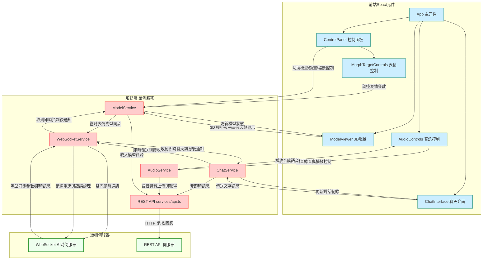

# 虛擬宇航員互動系統 – 前端架構分析

## 專案目錄結構與模組設計

專案採用了清晰的目錄結構，將程式碼和資源依功能劃分，方便維護和擴充。主要目錄如下：

- **src/**：前端主要的**源代碼**目錄，採用React + TypeScript實現。此資料夾內部又按照職能進一步組織：
    
    [github.com](https://github.com/eggyy1224/space_live_project#:~:text=,%E6%A7%8B%E5%BB%BA%E5%B7%A5%E5%85%B7%EF%BC%9AVite)
    
    - **main.tsx**：應用進入點。使用 ReactDOM 創建根節點並掛載 `<App/>` 組件，啟動整個React應用。
    - **App.tsx**：主應用元件（根元件）。負責匯總各子元件並定義應用的主要結構和介面，例如3D場景Canvas與控制面板。`App.tsx` 在應用中充當單頁容器，內部包含Canvas渲染3D宇航員模型、控制面板等UI區塊。
    - **React元件檔案**：專案將不同UI功能拆分成獨立元件，以元件化方式開發。例如：
        - `ChatInterface.tsx`：對話介面元件，提供文字訊息的輸入欄和對話記錄顯示區域，讓使用者與虛擬宇航員進行文字交互。
        - `AudioControls.tsx`：音訊控制元件，包含麥克風錄音開關、音量控制等，用於處理語音輸入/輸出的介面。
        - `ModelViewer.tsx` / `Model.tsx`：3D模型顯示與控制元件。`ModelViewer`負責渲染Three.js場景，內含`Model`子元件載入宇航員3D模型並控制其動作動畫播放。
        - `MorphTargetControls.tsx` / `MorphTargetBar.tsx`：表情控制元件，提供面部 **Morph Target**（表情融合目標）的控制介面，例如滑桿調整宇航員不同表情的幅度，用於情緒表現調整或測試。
        - `ControlPanel.tsx`：控制面板元件，將上述各種控制介面（模型操控、動畫選擇、背景切換等按鈕）整合在一處版面中。實際上，`App.tsx` 中有一個 `
`區域，包含了模型載入狀態、縮放旋轉按鈕、重置模型、切換背景和動畫選擇等 UI 控件，即所謂控制面板。
            
            [github.com](https://github.com/eggyy1224/space_live_project/blob/main/src/App.tsx#:~:text=%3Cdiv%20className%3D%22controls)
            
            [github.com](https://github.com/eggyy1224/space_live_project/blob/main/src/App.tsx#:~:text=%3Cdiv%20className%3D%22button)
            
    - **services/**：服務模組目錄。此處定義了數個**單例服務類**（Service Classes），負責核心業務邏輯和狀態管理，每個服務關注一種功能：
        - `WebSocketService.ts`：與後端進行即時通信的服務，封裝 WebSocket 連線的建立、重連機制和訊息收發等功能。例如，它會建立唯一的WebSocket連線，並提供 `sendMessage`、`disconnect` 等方法。此外，`WebSocketService` 內部會註冊從服務端接收各類訊息事件，並將其轉發給對應的其他服務或UI監聽器（例如收到「嘴型同步」指令時通知模型服務）。
            
            [github.com](https://github.com/eggyy1224/space_live_project#:~:text=,%E6%A7%8B%E5%BB%BA%E5%B7%A5%E5%85%B7%EF%BC%9AVite)
            
            [github.com](https://github.com/eggyy1224/space_live_project#:~:text=,%E5%8F%A3%E5%9E%8B%E5%8B%95%E7%95%AB%E5%82%99%E4%BB%BD%E7%B3%BB%E7%B5%B1)
            
        - `ChatService.ts`：對話服務，負責處理文字聊天的業務邏輯。它會調用後端 AI 對話接口，管理對話訊息的流程。ChatService可能透過 `WebSocketService` 發送使用者訊息給後端AI，並接收AI回覆，再提供給前端對話介面顯示。也可能調用 REST API 獲取對話歷史或上下文。透過將對話相關處理封裝在此服務，可讓UI與後端通訊解耦。
        - `AudioService.ts`：音訊服務，處理語音相關的功能，例如麥克風錄音控制、將錄音資料傳送給後端語音識別服務，以及接收後端返回的語音合成結果。AudioService 也會管理音訊播放，例如透過內部的 `audioPlayer.ts` 工具模組播放TTS語音。該服務確保語音流程在背景執行，提供方法給UI元件（如AudioControls）呼叫。
        - `ModelService.ts`：3D模型服務，管理宇航員3D模型的狀態和動畫。它負責載入與切換模型（例如不同造型或配置的.glb檔），控制模型的表情和嘴型動畫參數（如 Morph Targets 值），並與後端的即時資訊（如語音對話時的嘴型同步資料）對接。啟動時，`ModelService` 會向 `WebSocketService` 註冊相關事件監聽，例如監聽後端發來的嘴型同步(`lipsync_update`)或表情指令，收到後更新模型狀態。由於該服務以單例形式存在，全局唯一，因此模型狀態在不同元件間保持一致。
            
            [github.com](https://github.com/eggyy1224/space_live_project/commit/01a04e24eaf04cbfbe23d39434edaa6fec5fdd1b#:~:text=match%20at%20L623%20,%E4%B8%AD%E5%90%91%20WebSocketService%20%E8%A8%BB%E5%86%8A%E4%BA%86%20lipsync_update%20%E7%AD%89%E8%99%95%E7%90%86%E5%99%A8)
            
        - 這些服務類在應用中各自**模組化**負責不同領域的功能，透過單例模式確保全局只有一個實例。此種結構實現了關注點分離，每個服務各司其職，方便維護。服務間也可以直接協作，例如 `ModelService` 透過 `WebSocketService` 獲取實時資料，`ChatService` 調用 `AudioService` 進行語音播放等。
            
            [github.com](https://github.com/eggyy1224/space_live_project#:~:text=1,%E8%AE%8A%E6%9B%B4%E6%AA%A2%E6%B8%AC%E9%81%BF%E5%85%8D%E4%B8%8D%E5%BF%85%E8%A6%81%E6%9B%B4%E6%96%B0%204.%20%E9%8C%AF%E8%AA%A4%E6%81%A2%E5%BE%A9%E6%A9%9F%E5%88%B6%EF%BC%9A)
            
        - **services/index.ts**：服務匯總檔，可能匯出所有服務單例，方便其他地方引用。例如 `import { WebSocketService, ChatService } from './services'` 可取得所有服務的實例或類定義。
        - **services/api.ts**：API 請求模組。封裝與後端RESTful接口的HTTP請求邏輯。專案使用REST API來執行非即時的操作，可能採用`fetch`或類似的HTTP函式庫發送請求（程式碼中未明確提到 axios，推測可能直接使用瀏覽器內建的 Fetch API）。`api.ts` 裡會定義後端伺服器的基礎URL、常用請求函式（GET/POST），以及如 `sendTextMessage()`、`fetchInitialData()` 之類的高階函式，以集中管理HTTP請求。這種封裝方式使元件不需關心具體請求實作，只需呼叫已定義的API函式。
        - **services/audioPlayer.ts**：音訊播放輔助模組。AudioService可能使用此工具來播放TTS音檔或串流音頻，內部封裝了`<audio>`元素或Web Audio API的使用，以控制播放、停止等。這也是關注點分離的一部分：將底層音訊處理從主要邏輯中抽離。
    - **utils/**：工具函式與輔助類別目錄。包含與UI或核心業務無直接關係的通用模組，例如：
        - `LogManager.ts`：日誌管理器，用於記錄與採樣應用的日誌資訊。根據技術文件，專案實作了日誌採樣機制來減少不必要的輸出。LogManager可能提供方法讓其他部分記錄調試資訊，同時控制日誌的頻率。
            
            [github.com](https://github.com/eggyy1224/space_live_project#:~:text=3.%20%E6%80%A7%E8%83%BD%E5%84%AA%E5%8C%96%EF%BC%9A%20,%E8%AE%8A%E6%9B%B4%E6%AA%A2%E6%B8%AC%E9%81%BF%E5%85%8D%E4%B8%8D%E5%BF%85%E8%A6%81%E6%9B%B4%E6%96%B0)
            
        - `ModelAnalyzer.ts`：模型分析工具，用於解析3D模型數據（例如Morph Target名稱列表、骨骼資訊等）。在載入模型後，該工具類可能協助提取可用動畫列表或模型結構，用於在UI上呈現或進行某些自動化處理。
        - 這些utils並非直接管理狀態或UI，而是供服務或元件調用，讓主要邏輯更精簡。

整體而言，項目遵循**模組化/元件化**設計：前端界面由多個React元件組成，各元件職責單一；核心功能由多個服務模組支撐，各服務透過單例模式全局共享

[github.com](https://github.com/eggyy1224/space_live_project#:~:text=1,%E8%AE%8A%E6%9B%B4%E6%AA%A2%E6%B8%AC%E9%81%BF%E5%85%8D%E4%B8%8D%E5%BF%85%E8%A6%81%E6%9B%B4%E6%96%B0%204.%20%E9%8C%AF%E8%AA%A4%E6%81%A2%E5%BE%A9%E6%A9%9F%E5%88%B6%EF%BC%9A)

。目錄劃分上並非以頁面區分（因為這是一個單頁應用），而是以功能分類（聊天、音訊、模型、通信等）來組織檔案，結構清晰。

## 狀態管理策略

本專案沒有使用Redux或Zustand等第三方全局狀態管理庫，而是結合**React Hooks**與**服務單例**模式來管理狀態

[github.com](https://github.com/eggyy1224/space_live_project#:~:text=,%E6%A7%8B%E5%BB%BA%E5%B7%A5%E5%85%B7%EF%BC%9AVite)

。狀態大致分為兩類：

**UI本地狀態**

和

**全局共享狀態**

，分別採取不同策略處理。

- *元件本地狀態：**採用React內建的Hook（如`useState`、`useEffect`）管理。針對UI呈現的即時狀態，如按鈕切換、表單輸入值、3D模型控制參數等，都在各自元件內部使用`useState`保存。例如，在`App.tsx`中，利用多個`useState`變數控制模型是否載入完成、模型縮放比例、當前播放的動畫名稱等狀態。這些狀態變化會觸發React重新渲染對應部分的UI。使用Hook管理本地狀態使得元件邏輯簡潔明了，每個元件只關心自己的狀態與行為。
    
    [github.com](https://github.com/eggyy1224/space_live_project/blob/main/src/App.tsx#:~:text=function%20App%28%29%20)
    
    [github.com](https://github.com/eggyy1224/space_live_project/blob/main/src/App.tsx#:~:text=const%20%5BavailableAnimations%2C%20setAvailableAnimations%5D%20%3D%20useState)
    
- **全局共享狀態：透過服務單例**進行集中管理。所謂服務單例，即上述`services`資料夾內的各服務模組在整個應用中各只有一個實例（可能透過靜態類別或單例模式實現）。這些服務內部維護需要跨元件共享或長生命周期的狀態。例如：
    - *WebSocket連線狀態與訊息：**由`WebSocketService`維護。它會保存WebSocket的連線狀態（已連線/斷線）、當前連接的Session資訊，以及收到的最新訊息暫存。如果需要知道是否已經連上後端或者需要取得服務端推送的資料，各元件不各自管理，而是查詢或監聽`WebSocketService`提供的狀態。
    - *對話內容狀態：**由`ChatService`管理。當使用者發送一則訊息時，ChatService可以將此文字存入自身的對話記錄結構中，並透過WebSocket或API發送給後端。當後端回復新的訊息時，ChatService接收到後可能更新對話記錄列表。前端的對話介面元件則可以從ChatService取得更新後的對話內容（例如透過事件回呼或直接查詢服務的某個狀態變數）。如此，對話的資料流在服務內部閉合管理，不需依賴React全局狀態。
    - *模型與動畫狀態：**由`ModelService`維護。例如當前載入的是哪個3D模型、可用的動畫列表、當前表情Morph Targets數值等。元件可以呼叫`ModelService`的方法來改變模型（如切換模型URL或設定新的表情），而`ModelService`在背後更新狀態並可能觸發相應的Three.js操作。因為`ModelService`是單例，無論在哪調用，它管理的模型狀態都是一致的。
    - *音訊狀態：**由`AudioService`維護。包括麥克風是否開啟錄製、目前錄製的音訊buffer、TTS語音播放的狀態等。UI元件（AudioControls）在需要時調用`AudioService.startRecording()`或`AudioService.stopPlayback()`，讓服務去處理實際的操作和狀態變更。
- **資料流動方式：採用發佈/訂閱模式**結合React effect機制。在沒有全局store的情況下，各服務會提供事件監聽或回呼接口，供元件在掛載時訂閱，卸載時取消訂閱。舉例來說，`ModelService`提供了如`onMorphTargetsUpdate`這樣的監聽方法，允許元件註冊一個回呼函式來在模型表情更新時被通知。對應地，在元件的`useEffect`中掛載監聽，在清理函式中調用服務的`offMorphTargetsUpdate`取消監聽，避免記憶體洩漏或重複回呼。這種手動管理雖較Redux麻煩，但符合React Hooks的設計，可以精細控制何時訂閱/取消，確保即時狀態同步。文件也指出，目前專案已有適當在`useEffect`中進行清理，防止重複註冊導致的問題。
    
    [github.com](https://github.com/eggyy1224/space_live_project/commit/01a04e24eaf04cbfbe23d39434edaa6fec5fdd1b#:~:text=match%20at%20L649%20ModelService,useEffect%20%E4%B8%AD%E8%BF%94%E5%9B%9E%E6%B8%85%E7%90%86%E5%87%BD%E5%BC%8F%E8%99%95%E7%90%86%E4%BA%86)
    
    [github.com](https://github.com/eggyy1224/space_live_project/commit/01a04e24eaf04cbfbe23d39434edaa6fec5fdd1b#:~:text=%E3%80%82%E5%B9%B8%E5%A5%BD%E9%80%99%E4%BA%9B%E6%9C%8D%E5%8B%99%E5%9C%A8%E6%87%89%E7%94%A8%E5%85%A8%E5%B1%80%E5%8F%AA%E5%BB%BA%E7%AB%8B%E4%B8%80%E6%AC%A1%EF%BC%8C%E4%B8%94%E5%9C%A8%20useModelService%20hook%20%E4%B8%AD%E5%B0%8D%E6%87%89%E4%BD%BF%E7%94%A8%20off)
    
    [github.com](https://github.com/eggyy1224/space_live_project/commit/01a04e24eaf04cbfbe23d39434edaa6fec5fdd1b#:~:text=match%20at%20L649%20ModelService,useEffect%20%E4%B8%AD%E8%BF%94%E5%9B%9E%E6%B8%85%E7%90%86%E5%87%BD%E5%BC%8F%E8%99%95%E7%90%86%E4%BA%86)
    
- *React Context的使用：**從程式碼推測，專案主要依賴上述服務單例傳遞狀態，**未大量使用React Context**。由於單例服務本身可由各模組匯入使用，再加上自訂Hook封裝，已能滿足跨元件狀態共享需求，因此無需額外建立Context。然而，如果需要在UI層傳遞狀態，開發者也可以在服務基礎上再建立Context供深層子元件使用（專案架構未顯示這一點，可能不需要）。

綜上所述，**狀態管理策略**是利用React Hooks處理本地UI狀態，並以**全域單例服務**儲存與驅動關鍵狀態

[github.com](https://github.com/eggyy1224/space_live_project#:~:text=,%E6%A7%8B%E5%BB%BA%E5%B7%A5%E5%85%B7%EF%BC%9AVite)

。這種做法使得元件邏輯與狀態更新解耦：元件透過服務介面讀寫狀態，服務負責與後端交互和維護資料，一旦資料更新再通知元件。整體資料流由UI->服務->後端，再由後端->服務->UI，形成單向循環，維持了狀態的一致性。

## API 與後端的整合方式

前端與後端之間透過**REST API**和**WebSocket**雙管道進行通信

[github.com](https://github.com/eggyy1224/space_live_project#:~:text=,%E6%A7%8B%E5%BB%BA%E5%B7%A5%E5%85%B7%EF%BC%9AVite)

。專案架構將這兩類通信細節封裝在服務模組中，以降低耦合度、提高可維護性。下面分別說明：

- **即時通訊（WebSocket）**：專案採用 WebSocket 作為即時雙向通訊協議。在前端，由`WebSocketService`建立和管理唯一的WebSocket連接。當應用啟動時，`WebSocketService`會初始化一條與後端伺服器的連線（如 `new WebSocket(url)`）。建立連線後，它會監聽來自後端的各類消息事件，並根據消息類型觸發對應處理：
    
    [github.com](https://github.com/eggyy1224/space_live_project#:~:text=,%E6%A7%8B%E5%BB%BA%E5%B7%A5%E5%85%B7%EF%BC%9AVite)
    
    - *對話消息：**如果後端通過WebSocket推送AI生成的對話文字，`WebSocketService`接收到後可能調用`ChatService`的某個回呼，將新消息加入對話記錄。同樣地，當使用者在前端發送訊息時，不論是文字還是語音轉文字的結果，最終也經由ChatService/AudioService傳遞給WebSocketService，再由它透過連線發送至後端。
    - *表情/嘴型更新：**在語音對話時，後端會實時計算宇航員嘴型的動畫數據。這些數據可能以高頻率消息透過WebSocket發給前端。WebSocketService接收後，立即調用`ModelService`更新對應的Morph Target值，從而驅動3D模型的嘴型動畫同步張合。為避免過於頻繁的更新導致性能問題，開發者在WebSocket處理上實現了防抖和節流機制，對高頻消息進行適當的節流處理。這可確保在嘴型更新非常頻繁時（例如高幀率音頻分析），前端不會每毫秒都重繪，提升性能表現。
        
        [github.com](https://github.com/eggyy1224/space_live_project#:~:text=1,%E8%AE%8A%E6%9B%B4%E6%AA%A2%E6%B8%AC%E9%81%BF%E5%85%8D%E4%B8%8D%E5%BF%85%E8%A6%81%E6%9B%B4%E6%96%B0%204.%20%E9%8C%AF%E8%AA%A4%E6%81%A2%E5%BE%A9%E6%A9%9F%E5%88%B6%EF%BC%9A)
        
    - *錯誤處理與重連：**若WebSocket連線中斷，`WebSocketService`實作了自動重連策略。例如當連線意外斷開時，服務可在短暫延遲後嘗試重新連線一定次數，確保應用的即時對話不中斷。同時，在組件卸載或使用者離開應用時，開發者建議呼叫`WebSocketService.disconnect()`來主動關閉連線，釋放資源。
        
        [github.com](https://github.com/eggyy1224/space_live_project#:~:text=,%E5%8F%A3%E5%9E%8B%E5%8B%95%E7%95%AB%E5%82%99%E4%BB%BD%E7%B3%BB%E7%B5%B1)
        
        [github.com](https://github.com/eggyy1224/space_live_project/commit/01a04e24eaf04cbfbe23d39434edaa6fec5fdd1b#:~:text=%E3%80%82%E9%80%99%E5%8F%AF%E8%83%BD%E5%B0%8E%E8%87%B4%E6%87%89%E7%94%A8%E9%96%92%E7%BD%AE%E6%99%82%E9%80%A3%E7%B7%9A%E4%BB%8D%E4%BD%94%E7%94%A8%E8%B3%87%E6%BA%90%E3%80%82%E5%BB%BA%E8%AD%B0%E5%9C%A8%E7%B5%84%E4%BB%B6%E5%8D%B8%E8%BC%89%E6%88%96%E6%87%89%E7%94%A8%E9%80%80%E5%87%BA%E6%99%82%E8%AA%BF%E7%94%A8%20WebSocketService)
        
    - *封裝介面：**元件不直接使用瀏覽器的WebSocket對象，一律透過`WebSocketService`提供的方法來發送消息或監聽事件。例如，ChatService可能呼叫`WebSocketService.send(jsonData)`發送聊天消息；ModelService在初始化時會通過`WebSocketService.on('lipsync_update', callback)`訂閱嘴型更新事件。這種封裝讓未來修改通訊協議（例如改用Socket.IO或修改消息格式）時，只需改動服務內部實現，不影響其他部分。
- **RESTful API 呼叫（HTTP）**：除了即時部分，其他需要與後端交換的資料透過REST API進行。前端使用**`services/api.ts`*集中管理所有HTTP請求：
    - *HTTP函式庫：**專案可能直接使用Fetch API，或封裝一層方便使用。如果使用axios等庫，會在此設置base URL及必要的攔截器。不過從目前資訊看，並無axios明確引用，因此很可能直接使用`fetch`實作。
    - *服務方法調用：**各服務會根據需要調用`api.ts`裡的方法與後端交互。例如，ChatService在初始化時也許會透過API拉取歷史對話或配置（GET 請求）；AudioService在結束錄音後，可能將音訊資料經由API上傳給後端進行語音識別處理；或在使用者請求特殊操作時（如重設系統、獲取某些資料），也走HTTP管道。所有這些請求都通過`api.ts`的函式執行，避免在元件或服務中散落硬編碼的URL和`fetch`調用。
    - **結構與封裝：**`api.ts`可能為每個後端路由提供對應函式。例如，定義 `fetchChatReply(message: string)` 發送使用者文字並返回AI回覆，或 `uploadAudio(blob: Blob)` 上傳音訊取得識別結果。這些函式內部透過`fetch('/api/xxx', {...})`與伺服器通信，並對結果做基本的錯誤處理。如此一來，ChatService只需簡單調用 `const reply = await api.fetchChatReply(userInput)` 即可拿到結果，無需關心細節。
    - **與服務結合：REST API 的結果往往由服務進一步處理後再提供給UI。例如，ChatService收到`fetchChatReply`的結果（AI回覆文本）後，會先將其加入自身的對話狀態，然後可能經由事件讓前端ChatInterface元件更新顯示。這樣，API呼叫 -> 更新服務狀態 -> 觸發UI更新，保持單向資料流的整潔。同時，UI發起某些操作時，也通常透過服務調用API**而非元件直接呼叫`fetch`，這在架構上形成明確的分層。
- *前後端同步與整合：**得益於上述設計，前端大部分元件並不了解資料從何而來，只透過服務提供的介面與資料互動。服務作為前端與後端之間的橋樑，統一了不同通訊方式（WebSocket/HTTP）的整合：
    - *聊天流程整合：**當使用者輸入文字訊息，前端的ChatInterface呼叫ChatService的發送方法。ChatService內部會決定使用WebSocket即時發送還是經由HTTP傳遞給後端（取決於後端對話API提供的介面型態，假設即時對話多半走WebSocket）。同樣地，AI回覆到達前端後，無論是WebSocket消息還是HTTP回傳，最終都經由ChatService統一處理，再通知UI新增一則訊息。對ChatInterface而言，發訊息與收訊息的介面始終如一。
    - *語音流程整合：**使用者按下錄音按鈕，AudioControls元件請求AudioService開始錄音。AudioService啟動麥克風錄音（可能使用瀏覽器MediaStream API），錄製完成後取得音訊資料並上傳（通過API）以取得文字結果，再將文字交由ChatService處理對話邏輯。然後AI回覆的語音合成結果（可能是音訊檔URL或資料流）又由AudioService負責播放。同時，為了視覺同步，後端在語音對話過程中持續通過WebSocket發送嘴型動畫參數給前端，由ModelService更新模型表情。整個過程各模組各司其職，透過事件與資料調用配合，使語音、文字、動畫三者協調一致。
    - *狀態一致性：**前端的服務模組在收到後端更新時會即時更新內部狀態並通知相關元件。由於採用了單例服務，各處取得的是同一份資料來源。例如，控制3D模型的UI和執行嘴型同步的代碼共用一個ModelService實例，所以無論是使用者操作還是後端事件，都更新同一個模型狀態，避免衝突。

總結而言，**API 與後端整合**在架構上體現為「集中管理，分層調用」：通信細節集中在服務層，前端透過服務提供的介面完成與後端的交互

[github.com](https://github.com/eggyy1224/space_live_project#:~:text=,%E6%A7%8B%E5%BB%BA%E5%B7%A5%E5%85%B7%EF%BC%9AVite)

。這種方式使得實時溝通與請求/回應模式各自最佳運作，同時在前端形成一致的調用模型。開發人員清楚地將 WebSocket 即時訊息和 REST API 請求分開處理，又在高層封裝出統一的服務接口，達到模組化、可維護的後端整合設計。各服務還實現了一定的優化措施（如消息防抖、日誌採樣、自動重連等）來提升通信性能和可靠性

[github.com](https://github.com/eggyy1224/space_live_project#:~:text=2.%20%E9%AB%98%E6%95%88WebSocket%E9%80%9A%E4%BF%A1%EF%BC%9A%E5%AF%A6%E7%8F%BE%E6%B6%88%E6%81%AF%E9%98%B2%E6%8A%96%E5%92%8C%E7%AF%80%E6%B5%81%E8%99%95%E7%90%86%203.%20%E6%80%A7%E8%83%BD%E5%84%AA%E5%8C%96%EF%BC%9A%20,%E5%8F%A3%E5%9E%8B%E5%8B%95%E7%95%AB%E5%82%99%E4%BB%BD%E7%B3%BB%E7%B5%B1)

。整體前端架構因此能夠有效支援虛擬宇航員系統的複雜即時互動需求。

