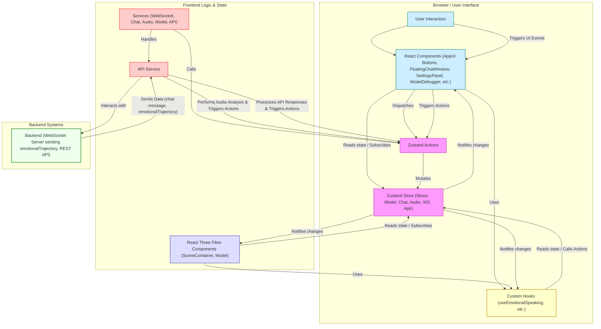

# 虛擬宇航員互動系統 – 前端架構概況 (基於 Zustand 與 Tailwind 重構後)

## 引言

本文檔旨在描述 `space_live_project` 前端應用在經歷 **Zustand 狀態管理重構** 和 **Tailwind CSS UI 重構**後的當前架構。此架構旨在提升應用的可維護性、可擴展性，並解決先前版本中存在的效能瓶頸、狀態管理複雜性以及 UI 佈局僵化問題。核心技術棧包括 React、TypeScript、React Three Fiber (R3F)、Drei、**Zustand** 和 **Tailwind CSS**。**臉部動畫流程也已更新，採用後端生成的 `emotionalTrajectory` 結合前端實時音頻分析實現。**

## 專案目錄結構與模組設計

專案採用了基於功能的模組化目錄結構，主要源代碼位於 `prototype/frontend/src/` 目錄下：

-   **main.tsx**：應用程式的進入點，負責初始化 React 應用並掛載根組件 `<App />`。
-   **App.tsx**：應用的根組件。負責初始化核心服務 Hooks、設定全局上下文（如果需要）、組合主要的 UI 佈局（如 3D 場景和浮動面板）。**不再管理 Tab 切換邏輯。**
-   **components/**：存放可重用的 React UI 組件。
    -   `layout/AppUI.tsx`: **簡化後的 2D UI 容器**，主要負責渲染固定位置的觸發按鈕（如打開聊天視窗、設定面板）。**不再包含主要面板內容或切換邏輯。**
    -   `layout/SceneContainer.tsx`: 負責設定 React Three Fiber 的 `<Canvas>`，並容納 3D 場景相關組件。
    -   `Model.tsx`: 負責載入和渲染 3D 模型，處理基礎動畫循環，並**通過 `useFrame` 結合 `useEmotionalSpeaking` Hook 的輸出和來自 `AudioService` 的實時 `jawOpen` 值來應用 Morph Targets**。
    -   `FloatingChatWindow.tsx`: **新增的核心元件**。一個可拖動、可縮放的浮動視窗，整合了聊天記錄顯示、用戶輸入、發送消息、語音輸入等功能。
    -   `SettingsPanel.tsx`: **新增的核心元件**。一個可拖動的浮動面板，整合了原 `ControlPanel` 的所有模型控制功能（變換、動畫、預設表情、Morph Targets）以及除錯工具按鈕。
    -   `ModelDebugger.tsx`, `ModelAnalyzerTool.tsx`: 條件渲染的調試工具。
    -   `ErrorBoundary.tsx`: 錯誤邊界組件。
    -   `Toast.tsx`: 全局通知組件。
    -   ~~`ControlPanel.tsx`~~: (已移除)
    -   ~~`ChatInterface.tsx`~~: (已移除)
    -   ~~`AudioControls.tsx`~~: (已移除)
-   **hooks/**：存放自定義的 React Hooks，用於封裝可重用的邏輯，特別是與服務或 Zustand 狀態相關的邏輯。
    -   `useWebSocketService.ts`, `useChatService.ts`, `useAudioService.ts`, `useModelService.ts`: 這些 Hooks 通常負責在組件掛載時初始化對應的 Service 實例，並可能返回 Service 實例或與之互動的方法。
    -   `useEmotionalSpeaking.ts`: **新增的核心 Hook**。負責處理從 Zustand 獲取的 `emotionalTrajectory` 數據，計算當前時間點應用的情緒 Morph Target 權重。
-   **services/**：包含核心的業務邏輯和副作用處理。Service 主要負責與後端交互（API, WebSocket）、執行複雜計算或流程，並通過調用 Zustand Actions 來更新全局狀態。
    -   `WebSocketService.ts`: 管理 WebSocket 連接、消息收發和重連邏輯。**主要處理 `chat-message` 和 `emotionalTrajectory` 消息。**
    -   `ChatService.ts`: 處理聊天相關邏輯（例如通過 `sendMessage` 觸發後端交互），狀態主要由 `ChatSlice` 管理。
    -   `AudioService.ts`: 處理麥克風錄音、音頻播放、調用 STT/TTS API，**並使用 Web Audio API 實時分析播放中的音頻，計算 RMS 值更新 `jawOpen` Morph Target 到 Zustand Store**。狀態主要由 `AudioSlice` 管理。
    -   `ModelService.ts`: 負責模型的加載切換邏輯、調用後端 API（如 `getPresetExpression`）、觸發 Zustand 更新模型的狀態（字典、動畫列表、變換等）。**不再直接持有狀態，也不再處理舊的 `lipsync_update` 或 `morph_update` 消息。**
    -   `api.ts`: 封裝所有對後端 RESTful API 的請求。
-   **store/**：**Zustand 全局狀態管理的核心目錄。**
    -   `index.ts`: 創建並導出 Zustand store 實例 (`useStore`)，整合所有 Slices。
    -   `slices/`: 包含各個狀態分片（Slice），每個 Slice 定義一部分相關的 State 和 Actions。
        -   `AppSlice.ts`: 應用級別的狀態，如加載狀態、全局錯誤、**設定面板可見性 (`isSettingsPanelVisible`)** 等。
        -   `WebSocketSlice.ts`: WebSocket 連接狀態。
        -   `ChatSlice.ts`: 聊天記錄、當前輸入、AI 回應狀態、**聊天視窗可見性 (`isChatWindowVisible`)**、**最新的 `emotionalTrajectory` 數據 (`lastJsonMessage`)** 等。
        -   `ModelSlice.ts`: 當前模型 URL、加載狀態、**`morphTargets`** (由 `AudioService` 更新 `jawOpen`，由 `applyPresetExpression` 或其他手動操作更新其他值)、**`morphTargetDictionary`** (可用表情名稱)、當前動畫、模型變換狀態等。
        -   `AudioSlice.ts`: 錄音狀態 (`isRecording`)、播放狀態 (`isPlaying`/`isSpeaking`)、**音頻開始播放時間 (`audioStartTime`)**、識別出的文本等。
-   **types/**：存放 TypeScript 的類型定義和接口。
-   **utils/**：存放通用的輔助函數和工具類，如 `LogManager.ts`。

整體遵循模組化和關注點分離原則，UI 組件負責渲染，Hooks 封裝邏輯，Services 處理副作用和業務流程，Zustand Store 集中管理全局狀態。**Tailwind CSS** 負責樣式，**臉部動畫由 `emotionalTrajectory` (情緒) 和 `AudioService` (口型) 共同驅動。**

## 狀態管理策略 (基於 Zustand)

**Zustand** 是當前架構的核心。

-   **單一全局 Store (`useStore`)**：應用中存在一個由 Zustand 創建的全局 Store。
-   **狀態分片 (Slices)**：全局狀態被劃分到不同的 Slices (`src/store/slices/`) 中。
-   **組件讀取狀態**：React 組件通過 `useStore` Hook **配合 Selector 函數** (`useStore(state => state.someValue)`) 精確訂閱所需的狀態片段，避免不必要的重渲染。
-   **組件/服務更新狀態**：通過調用 `useStore.setState()` 或預定義的 Action (`useStore.getState().someAction()` 或通過 selector 獲取的 `someAction()`) 來更新 Store 中的狀態。
-   **數據流**：遵循單向數據流原則。
    -   **後端數據 -> Zustand**: `WebSocketService` 接收到 `emotionalTrajectory` 後更新 `ChatSlice`；`AudioService` 分析音頻後更新 `ModelSlice` 中的 `jawOpen`；API 調用結果由相應 Service 更新相關 Slice。
    -   **Zustand -> UI/R3F**: 組件 (`FloatingChatWindow`, `Model`) 和 Hooks (`useEmotionalSpeaking`) 訂閱 Store 中的變化並觸發重渲染或計算。
-   **本地狀態**：對於僅限於單個組件內部使用的臨時狀態（如表單輸入、開關狀態，以及目前 `FloatingChatWindow` 的位置/大小），仍然可以使用 React 的 `useState` Hook。
-   **優勢**：集中化、簡潔 API、性能優化、解耦、解決歷史問題。

## API 與後端的整合方式

前端與後端的通信依然通過 **REST API** 和 **WebSocket** 進行，整合方式圍繞 Zustand 進行。

-   **WebSocket (`WebSocketService`)**：接收到 `chat-message` 後更新 `ChatSlice` 的聊天記錄；接收到 `emotionalTrajectory` 後更新 `ChatSlice` 中的 `lastJsonMessage`。
-   **REST API (`services/api.ts`)**：請求成功後，調用方 Service 負責解析數據並觸發 **Zustand Action** 更新狀態（例如 `applyPresetExpression` 直接更新 `ModelSlice` 的 `morphTargets`）。
-   **臉部動畫數據流**：
    1.  `WebSocketService` 接收 `emotionalTrajectory`，存入 `ChatSlice.lastJsonMessage`。
    2.  `useEmotionalSpeaking` Hook 訂閱 `lastJsonMessage` 和 `AudioSlice.audioStartTime`，根據時間計算當前應用的情緒權重。
    3.  `AudioService` 在播放音頻時，通過 Web Audio API 分析音量，計算 `jawOpen` 值，並調用 Action 更新 `ModelSlice.morphTargets.jawOpen`。
    4.  `Model.tsx` 的 `useFrame` 函數從 `useEmotionalSpeaking` 獲取情緒權重，從 Store 獲取（手動/預設）權重（其中包含 `AudioService` 更新的 `jawOpen`），合併兩者（口型優先），並應用到模型上。
-   **整合流程示例 (語音識別)**：（流程不變，但觸發點從舊 `AudioControls` 移至 `FloatingChatWindow`）
    1.  用戶在 `FloatingChatWindow` 中按住麥克風按鈕。
    2.  觸發 `startRecording` Action/回調。
    3.  `AudioService` 開始錄音，更新 `isRecording` 狀態。
    4.  用戶鬆開按鈕。
    5.  觸發 `stopRecording` Action/回調。
    6.  `AudioService` 停止錄音，獲取音頻 Blob，觸發 `handleStopRecording` 回調 (在 `App.tsx` 中定義)。
    7.  `handleStopRecording` 調用 `api.speechToText(blob)`。
    8.  API 請求成功，後端返回識別文本。
    9.  `handleStopRecording` 調用 `sendMessage` (來自 `useChatService`) 將文本發送給後端處理。
    10. 後續聊天流程觸發 `chat-message` 和 `emotionalTrajectory` 的 WebSocket 推送及狀態更新。
-   **優勢**：後端數據順暢流入 Zustand Store，UI 響應式反映狀態變化。**動畫渲染邏輯清晰分離，情緒由後端軌跡驅動，口型由前端實時音頻驅動。**

## 架構圖 (Mermaid)

**圖例說明:** (更新以反映 Hooks 和更詳細的數據流)

1.  **用戶交互 (User Interaction)** 觸發 **React 組件 (UI Elements)** 中的事件。
2.  **UI 組件** 可能使用 **自定義 Hooks (Custom Hooks)** 獲取數據或觸發邏輯，或直接調用 **Zustand Actions**。
3.  **Actions** 修改 **Zustand Store** 中的狀態。
4.  **Zustand Store** 狀態變更後，會通知訂閱了相關狀態的 **UI 組件**、**R3F 組件** 和 **Hooks**。
5.  某些 **Actions**、**UI 事件** 或 **Hooks** 可能會觸發 **Services** 中的邏輯。
6.  **Services** 負責處理 **副作用 (Side Effects)**，例如與 **後端 (Backend)** 進行 API 調用或 WebSocket 通信，以及**音頻分析**。
7.  **Services** 在處理完副作用或收到後端數據後，會調用 **Zustand Actions** 來更新 Store。
8.  **Hooks** (如 `useEmotionalSpeaking`) 會讀取 Store 中的狀態，進行計算，並將結果提供給 UI 或 R3F 組件。

這個架構通過 Zustand 實現了清晰的狀態管理和單向數據流，通過 Tailwind CSS 實現了現代化 UI。新的浮動面板提高了交互靈活性，而臉部動畫流程則結合了後端情緒指導和前端實時口型分析。

## 1. 核心技術棧

- **框架**: React (使用 Vite 作為構建工具)
- **3D 渲染**: React Three Fiber (R3F) 和 Drei (用於簡化 R3F 開發的輔助庫)
- **狀態管理**: Zustand (輕量級的狀態管理庫)
- **樣式**: Tailwind CSS (實用程序優先的 CSS 框架)
- **語言**: TypeScript

## 2. 主要組件與職責

- **`App.tsx` / `AppUI.tsx`**: 應用程式的入口點和主要的 UI 佈局。負責整合各個子組件，管理頂層狀態（如設置面板可見性、除錯模式等），並將必要的狀態和回調函數傳遞給子組件。
- **`ModelViewer.tsx`**: 容納 3D 場景的核心組件，使用 R3F 的 `<Canvas>`。負責設置場景、燈光、相機控制 (`OrbitControls`) 以及模型的加載和定位。
- **`Model.tsx`**: 負責加載 GLB 模型 (`useGLTF`)、處理骨骼動畫 (`useAnimations`) 和 Morph Target 動畫。
    - **核心邏輯在 `useFrame`**: 這個 R3F 的 Hook 在每一幀被調用，執行最關鍵的動畫混合與應用。
        - 它從 `useEmotionalSpeaking` Hook 獲取基於情緒軌跡計算出的**純情緒權重**。
        - 它從 Zustand Store (透過 Ref) 獲取預設表情權重或由 `AudioService` 更新的實時口型權重。
        - 它根據是否有預設表情、`isSpeaking` 狀態，執行最終的混合邏輯，將基礎表情（預設或軌跡）與語音驅動的口型（目前是 `jawOpen`）正確疊加。
        - 使用 Lerp (線性插值) 平滑地將計算出的最終權重應用到模型的 `morphTargetInfluences` 上。
- **`SettingsPanel.tsx`**: 提供用戶界面，用於控制模型變換、動畫、預設表情、Morph Target 細調和除錯選項。
    - **預設表情**: 現在直接從 `emotionMappings.ts` 導入 `availableEmotionTags` 動態生成選項按鈕。點擊按鈕會調用 `ModelService` 的 `applyPresetExpression`。
- **`ChatInterface.tsx` / `InputBar.tsx` / `MessageList.tsx`**: 處理聊天交互的 UI 組件。負責顯示消息、接收用戶輸入並通過 `WebSocketService` 發送。
- **`LogViewer.tsx`**: 用於顯示應用程序日誌，輔助除錯。
- **`LoadingScreen.tsx`**: 在模型加載時顯示的過渡畫面。
- **`ErrorBoundary.tsx`**: 捕獲 React 渲染錯誤，提供後備 UI。

## 3. 服務層 (Services)

- **`ModelService.ts`**: (部分職責轉移到 Zustand Store 和 `Model.tsx`) 管理與模型相關的狀態和操作。
    - 處理預設表情的應用 (`applyPresetExpression`)，現在直接讀取 `emotionMappings.ts`，應用後設置 Zustand 的 `morphTargets` **並清除 `lastJsonMessage`**。
    - 提供方法來控制模型變換、動畫選擇等 (通過更新 Zustand Store)。
    - (舊的唇形同步邏輯已被移除)
- **`WebSocketService.ts`**: 處理與後端 WebSocket 的連接、消息收發和處理器註冊。
    - 接收後端推送的 `chat-message` 和 `emotionalTrajectory`。
    - 接收到 `emotionalTrajectory` 時，更新 Zustand 的 `lastJsonMessage` 狀態 **(不再清空 `morphTargets`)**。
- **`AudioService.ts`**: 負責音頻播放和錄製，以及基於 Web Audio API 的實時口型同步。
    - 播放從後端接收的音頻。
    - 在播放時，使用 `AnalyserNode` 分析音頻數據 (目前是 RMS 值)。
    - 將分析結果映射到特定的 Morph Target (目前是 `jawOpen`)，並通過調用 `useStore.getState().updateMorphTarget()` 更新 Zustand Store 中的 `morphTargets` 狀態。
    - 管理 `isSpeaking` 和 `audioStartTime` 狀態。
- **`api.ts`**: 封裝與後端 HTTP API 的交互 (例如健康檢查，但獲取預設表情的 API 已移除)。

## 4. 狀態管理 (Zustand)

Zustand Store (`store.ts`) 是前端狀態的**單一數據源 (Single Source of Truth)**，集中管理關鍵狀態：

- **模型狀態**: `modelUrl`, `modelLoaded`, `morphTargetDictionary`, `availableAnimations`, `currentAnimation`, 模型變換 (`modelScale`, `modelRotation`, `modelPosition`)。
- **動畫/表情狀態**: 
    - `morphTargets`: **核心狀態**，存儲由**預設表情應用**或**實時口型同步 (`AudioService`)** 更新的目標權重。`Model.tsx` 在 `useFrame` 中讀取此狀態。
    - `lastJsonMessage`: 存儲從 WebSocket 接收到的最新消息，特別是 `emotionalTrajectory`。`useEmotionalSpeaking` Hook 依賴此狀態。
- **音頻/說話狀態**: `isSpeaking`, `audioStartTime`。
- **UI/應用狀態**: `isConnected` (WebSocket 連接狀態), `showSettings`, `debugMode`, `showModelAnalyzer`, `logs`, `chatMessages` 等。

組件通過 `useStore(...)` Hook 訂閱狀態變化，服務通過 `useStore.getState()...` 讀取或更新狀態。

## 5. 核心動畫邏輯 (`useEmotionalSpeaking` + `Model.tsx`)

前端動畫的核心分為兩部分：

1.  **`useEmotionalSpeaking.ts` Hook**: 
    - **職責**: 監聽 `lastJsonMessage` (情緒軌跡) 和 `audioStartTime` 的變化。
    - **計算**: 如果軌跡和開始時間有效，根據當前時間和軌跡數據 (`keyframes`, `duration`)，通過插值計算出當前幀應該對應的**純粹的情緒 Blendshape 權重** (`calculateCurrentTrajectoryWeights`)。
    - **輸出**: 提供 `calculateCurrentTrajectoryWeights` 函數供 `Model.tsx` 調用。
2.  **`Model.tsx` (`useFrame`)**: 
    - **輸入**: 
        - 從 `useEmotionalSpeaking` 獲取 `trajectoryWeights`。
        - 從 Zustand 獲取 `storeTargets` (預設表情或口型)。
        - 從 Zustand 獲取 `isSpeaking` 狀態。
    - **混合邏輯**: 
        - 判斷是否應用了預設表情，以此確定**基礎表情** (`baseEmotion`) 是來自 `storeTargets` 還是 `trajectoryWeights`。
        - 如果 `isSpeaking`，則確定**語音口型** (`audioMouthShapes`)，目前僅包含從 `storeTargets` 讀取的 `jawOpen`。
        - 將 `audioMouthShapes` 疊加到 `baseEmotion` 上，得到 `finalTargetWeights`。
    - **應用**: 使用 Lerp 將 `finalTargetWeights` 平滑應用到模型的 Morph Targets。

這種設計將**軌跡解釋**（`useEmotionalSpeaking`）和**最終混合與渲染**（`Model.tsx`）清晰地分開。

## 6. 數據流與交互

- **用戶輸入 (文字)** -> `ChatInterface` -> `WebSocketService.sendMessage` -> 後端 `DialogueGraph`
- **用戶輸入 (語音)** -> `AudioService.startRecording` -> 停止錄製 -> 音頻 Blob -> `api.ts` (POST `/api/speech-to-text`) -> 後端處理 -> 返回 JSON (文本+語音)
- **後端推送 (聊天)** -> `WebSocketService.handleMessage` -> 更新 `chatMessages` 狀態 -> `MessageList` 渲染
- **後端推送 (音頻 URL)** -> 更新 `chatMessages` -> `MessageList` 中的播放按鈕觸發 `AudioService.playAudio`
- **後端推送 (情緒軌跡)** -> `WebSocketService.handleMessage` -> 更新 `lastJsonMessage` 狀態 -> `useEmotionalSpeaking` Hook 檢測到變化
- **音頻播放 (`AudioService`)** -> 設置 `isSpeaking=true`, `audioStartTime` -> 循環分析音頻 -> `updateMorphTarget('jawOpen', ...)` 更新 `morphTargets` 狀態 -> `Model.tsx` 檢測到變化
- **預設表情按鈕 (`SettingsPanel`)** -> `ModelService.applyPresetExpression` -> 清除 `lastJsonMessage`, 設置 `morphTargets` 狀態 -> `Model.tsx` 檢測到變化
- **`Model.tsx` (`useFrame`)** -> 讀取 `lastJsonMessage`, `audioStartTime`, `morphTargets`, `isSpeaking` -> 調用 `calculateCurrentTrajectoryWeights` -> 執行混合 -> 更新模型 `morphTargetInfluences` -> 視覺更新

## 7. 潛在改進點/待辦事項 (來自 TODO)

- **口型同步增強**: 
    - 微調 `AudioService` 中 RMS 到 `jawOpen` 的映射。
    - 探索分析更多音頻特徵（如頻率）來驅動 `mouthFunnel`, `mouthPucker` 等，並更新 `Model.tsx` 的混合邏輯。
- **平滑度與視覺效果**: 微調 Lerp 因子和 `emotionMappings.ts` 中的基礎權重。
