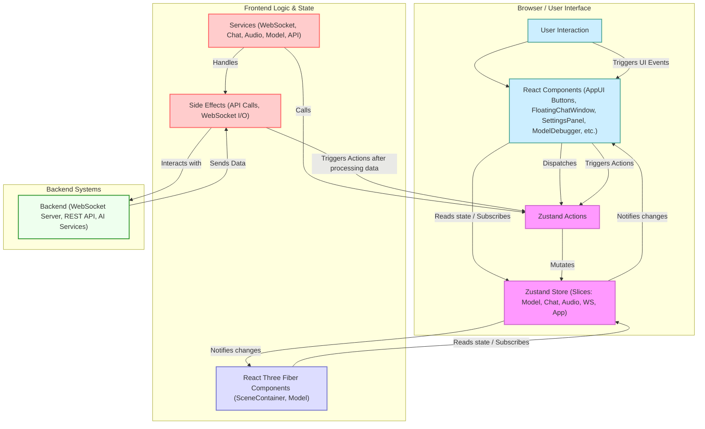

# 虛擬宇航員互動系統 – 前端架構概況 (基於 Zustand 與 Tailwind 重構後)

## 引言

本文檔旨在描述 `space_live_project` 前端應用在經歷 **Zustand 狀態管理重構** 和 **Tailwind CSS UI 重構**後的當前架構。此架構旨在提升應用的可維護性、可擴展性，並解決先前版本中存在的效能瓶頸、狀態管理複雜性以及 UI 佈局僵化問題。核心技術棧包括 React、TypeScript、React Three Fiber (R3F)、Drei、**Zustand** 和 **Tailwind CSS**。

## 專案目錄結構與模組設計

專案採用了基於功能的模組化目錄結構，主要源代碼位於 `prototype/frontend/src/` 目錄下：

-   **main.tsx**：應用程式的進入點，負責初始化 React 應用並掛載根組件 `<App />`。
-   **App.tsx**：應用的根組件。負責初始化核心服務 Hooks、設定全局上下文（如果需要）、組合主要的 UI 佈局（如 3D 場景和浮動面板）。**不再管理 Tab 切換邏輯。**
-   **components/**：存放可重用的 React UI 組件。
    -   `layout/AppUI.tsx`: **簡化後的 2D UI 容器**，主要負責渲染固定位置的觸發按鈕（如打開聊天視窗、設定面板）。**不再包含主要面板內容或切換邏輯。**
    -   `layout/SceneContainer.tsx`: 負責設定 React Three Fiber 的 `<Canvas>`，並容納 3D 場景相關組件。
    -   `Model.tsx`: 負責載入和渲染 3D 模型，處理基礎動畫循環，並**直接從 Zustand 訂閱 `morphTargets` 狀態**。
    -   `FloatingChatWindow.tsx`: **新增的核心元件**。一個可拖動、可縮放的浮動視窗，整合了聊天記錄顯示、用戶輸入、發送消息、語音輸入等功能。
    -   `SettingsPanel.tsx`: **新增的核心元件**。一個可拖動的浮動面板，整合了原 `ControlPanel` 的所有模型控制功能（變換、動畫、預設表情、Morph Targets）以及除錯工具按鈕。
    -   `ModelDebugger.tsx`, `ModelAnalyzerTool.tsx`: 條件渲染的調試工具。
    -   `ErrorBoundary.tsx`: 錯誤邊界組件。
    -   `Toast.tsx`: 全局通知組件。
    -   ~~`ControlPanel.tsx`~~: (已移除)
    -   ~~`ChatInterface.tsx`~~: (已移除)
    -   ~~`AudioControls.tsx`~~: (已移除)
-   **hooks/**：存放自定義的 React Hooks，用於封裝可重用的邏輯，特別是與服務或 Zustand 狀態相關的邏輯。
    -   `useWebSocketService.ts`, `useChatService.ts`, `useAudioService.ts`, `useModelService.ts`: 這些 Hooks 通常負責在組件掛載時初始化對應的 Service 實例，並可能返回 Service 實例或與之互動的方法。
-   **services/**：包含核心的業務邏輯和副作用處理。Service 主要負責與後端交互（API, WebSocket）、執行複雜計算或流程，並通過調用 Zustand Actions 來更新全局狀態。
    -   `WebSocketService.ts`: 管理 WebSocket 連接、消息收發和重連邏輯。
    -   `ChatService.ts`: 處理聊天相關邏輯（例如通過 `sendMessage` 觸發後端交互），狀態主要由 `ChatSlice` 管理。
    -   `AudioService.ts`: 處理麥克風錄音、音頻播放、調用 STT/TTS API，狀態主要由 `AudioSlice` 管理。
    -   `ModelService.ts`: 負責模型的加載切換邏輯、調用後端 API（如 `getPresetExpression`）、觸發 Zustand 更新模型的狀態（字典、動畫列表、變換等）。**不再直接持有狀態。**
    -   `api.ts`: 封裝所有對後端 RESTful API 的請求。
-   **store/**：**Zustand 全局狀態管理的核心目錄。**
    -   `index.ts`: 創建並導出 Zustand store 實例 (`useStore`)，整合所有 Slices。
    -   `slices/`: 包含各個狀態分片（Slice），每個 Slice 定義一部分相關的 State 和 Actions。
        -   `AppSlice.ts`: 應用級別的狀態，如加載狀態、全局錯誤、**設定面板可見性 (`isSettingsPanelVisible`)** 等。
        -   `WebSocketSlice.ts`: WebSocket 連接狀態。
        -   `ChatSlice.ts`: 聊天記錄、當前輸入、AI 回應狀態、**聊天視窗可見性 (`isChatWindowVisible`)** 等。
        -   `ModelSlice.ts`: 當前模型 URL、加載狀態、**`morphTargets`** (表情/嘴型數值)、**`morphTargetDictionary`** (可用表情名稱)、當前動畫、模型變換狀態等。
        -   `AudioSlice.ts`: 錄音狀態 (`isRecording`)、播放狀態 (`isPlaying`)、識別出的文本等。
-   **types/**：存放 TypeScript 的類型定義和接口。
-   **utils/**：存放通用的輔助函數和工具類，如 `LogManager.ts`。

整體遵循模組化和關注點分離原則，UI 組件負責渲染，Hooks 封裝邏輯，Services 處理副作用和業務流程，Zustand Store 集中管理全局狀態。

## 狀態管理策略 (基於 Zustand)

**Zustand** 是當前架構的核心。

-   **單一全局 Store (`useStore`)**：應用中存在一個由 Zustand 創建的全局 Store。
-   **狀態分片 (Slices)**：全局狀態被劃分到不同的 Slices (`src/store/slices/`) 中。
-   **組件讀取狀態**：React 組件通過 `useStore` Hook **配合 Selector 函數** (`useStore(state => state.someValue)`) 精確訂閱所需的狀態片段，避免不必要的重渲染。
-   **組件/服務更新狀態**：通過調用 `useStore.setState()` 或預定義的 Action (`useStore.getState().someAction()` 或通過 selector 獲取的 `someAction()`) 來更新 Store 中的狀態。
-   **數據流**：遵循單向數據流原則。
-   **本地狀態**：對於僅限於單個組件內部使用的臨時狀態（如表單輸入、開關狀態，以及目前 `FloatingChatWindow` 的位置/大小），仍然可以使用 React 的 `useState` Hook。
-   **優勢**：集中化、簡潔 API、性能優化、解耦、解決歷史問題。

## API 與後端的整合方式

前端與後端的通信依然通過 **REST API** 和 **WebSocket** 進行，整合方式圍繞 Zustand 進行。

-   **WebSocket (`WebSocketService`)**：接收消息後調用 **Zustand Action** 更新狀態。
-   **REST API (`services/api.ts`)**：請求成功後，調用方 Service 負責解析數據並觸發 **Zustand Action** 更新狀態。
-   **整合流程示例 (語音識別)**：（流程不變，但觸發點從舊 `AudioControls` 移至 `FloatingChatWindow`）
    1.  用戶在 `FloatingChatWindow` 中按住麥克風按鈕。
    2.  觸發 `startRecording` Action/回調。
    3.  `AudioService` 開始錄音，更新 `isRecording` 狀態。
    4.  用戶鬆開按鈕。
    5.  觸發 `stopRecording` Action/回調。
    6.  `AudioService` 停止錄音，獲取音頻 Blob，觸發 `handleStopRecording` 回調 (在 `App.tsx` 中定義)。
    7.  `handleStopRecording` 調用 `api.speechToText(blob)`。
    8.  API 請求成功，後端返回識別文本。
    9.  `handleStopRecording` 調用 `sendMessage` (來自 `useChatService`) 將文本發送給後端處理。
    10. 後續聊天流程觸發狀態更新。
-   **優勢**：後端數據順暢流入 Zustand Store，UI 響應式反映狀態變化。

## 架構圖 (Mermaid)

**圖例說明:** (基本不變，UI 層級更扁平)

1.  **用戶交互 (User Interaction)** 觸發 **React 組件 (UI Elements)** 中的事件。
2.  **UI 組件** 調用 **Zustand Actions** 來表達意圖或更新請求。
3.  **Actions** 修改 **Zustand Store** 中的狀態。
4.  **Zustand Store** 狀態變更後，會通知訂閱了相關狀態的 **UI 組件** 和 **R3F 組件** 進行重渲染。
5.  某些 **Actions** 或 **UI 事件** 可能會觸發 **Services** 中的邏輯。
6.  **Services** 負責處理 **副作用 (Side Effects)**，例如與 **後端 (Backend)** 進行 API 調用或 WebSocket 通信。
7.  **Services** 在處理完副作用或收到後端數據後，會調用 **Zustand Actions** 來更新 Store。

這個架構通過 Zustand 實現了清晰的狀態管理和單向數據流，並通過 Tailwind CSS 實現了現代化、可維護的 UI 樣式。新的浮動面板設計提高了交互的靈活性。
