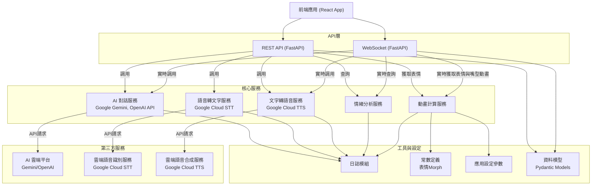

# GitHub 專案 Space Live Project 後端架構分析

## 1. 架構設計

後端採用 **Python FastAPI** 框架開發，提供高效的同步與非同步 API 服務

[github.com](https://github.com/eggyy1224/space_live_project/blob/main/README.md#:~:text=,Text%20%2A%20%E9%80%9A%E4%BF%A1%EF%BC%9AWebSocket%E3%80%81RESTful%20API)

。整體程式碼採用模組化架構，將功能劃分為多個模組以實現關注點分離

[github.com](https://github.com/eggyy1224/space_live_project/blob/main/README.md#:~:text=%E6%8A%80%E8%A1%93%E4%BA%AE%E9%BB%9E)

。主要的後端組成包括：

- **應用主程式**：`main.py` 負責啟動 FastAPI 應用並配置日誌記錄（透過 `utils/logger.py`）。在啟動時載入各項服務並將路由註冊到應用上。
    
    [github.com](https://github.com/eggyy1224/space_live_project/blob/main/prototype/backend/main.py#:~:text=import%20uvicorn)
    
    [github.com](https://github.com/eggyy1224/space_live_project/blob/main/prototype/backend/main.py#:~:text=%E5%BB%BA%E7%AB%8B%E6%87%89%E7%94%A8)
    
- **API 路由模組**：位於 `api/endpoints/` 資料夾，使用 FastAPI 的 `APIRouter` 定義各個 HTTP 路由和 WebSocket 端點（例如 `health.py`, `speech.py`, `expressions.py`, `websocket.py` 等）。這些路由模組各司其職：健康檢查、語音處理、表情查詢，以及即時通訊等。
- **服務層（Services）**：位於 `services/` 資料夾，封裝核心業務邏輯功能。包含 **AI 對話服務**、**語音轉文字服務 (STT)**、**文字轉語音服務 (TTS)**、**情緒分析服務**、**動畫服務**等模組。每個服務通常在應用啟動時以單例模式初始化，可在各路由中共用。例如：
    
    [github.com](https://github.com/eggyy1224/space_live_project/blob/main/README.md#:~:text=%E4%B8%BB%E8%A6%81%E6%9C%8D%E5%8B%99%E6%A8%A1%E7%B5%84%EF%BC%9A)
    
    [github.com](https://github.com/eggyy1224/space_live_project/blob/main/prototype/backend/api/endpoints/websocket.py#:~:text=%E5%BB%BA%E7%AB%8B%E6%9C%8D%E5%8B%99%E5%AF%A6%E4%BE%8B)
    
    - *AIService*（AI 對話服務）：與雲端 AI 平台（如 **Google Gemini AI** 或 OpenAI API）整合，根據使用者輸入產生對話文字回應。
        
        [github.com](https://github.com/eggyy1224/space_live_project/blob/main/README.md#:~:text=,Text%20%2A%20%E9%80%9A%E4%BF%A1%EF%BC%9AWebSocket%E3%80%81RESTful%20API)
        
    - *SpeechToTextService*（語音轉文字服務）：調用 **Google Cloud Speech-to-Text** 將上傳的音訊內容轉換為文字。
        
        [github.com](https://github.com/eggyy1224/space_live_project/blob/main/README.md#:~:text=,Text%20%2A%20%E9%80%9A%E4%BF%A1%EF%BC%9AWebSocket%E3%80%81RESTful%20API)
        
    - *TextToSpeechService*（文字轉語音服務）：使用 **Google Cloud Text-to-Speech** 將 AI 回應文字合成語音並取得音檔及長度。
        
        [github.com](https://github.com/eggyy1224/space_live_project/blob/main/README.md#:~:text=,Text%20%2A%20%E9%80%9A%E4%BF%A1%EF%BC%9AWebSocket%E3%80%81RESTful%20API)
        
        [github.com](https://github.com/eggyy1224/space_live_project/blob/main/prototype/backend/api/endpoints/websocket.py#:~:text=ai_response%20%3D%20await%20ai_service)
        
    - *EmotionAnalyzer*（情緒分析服務）：分析使用者文字中的情緒傾向，推斷表情與意圖。
        
        [github.com](https://github.com/eggyy1224/space_live_project/blob/main/README.md#:~:text=,%E5%8B%95%E7%95%AB%E6%9C%8D%E5%8B%99%EF%BC%9A%E7%94%9F%E6%88%90%E5%94%87%E5%9E%8B%E5%90%8C%E6%AD%A5%E5%92%8C%E8%A1%A8%E6%83%85%E9%81%8E%E6%B8%A1)
        
    - *AnimationService*（動畫服務）：根據情緒產生對應的臉部表情 **Morph Target** 數值，並提供表情過渡和平滑插值計算，用於角色嘴型與表情動畫同步。
        
        [github.com](https://github.com/eggyy1224/space_live_project/blob/main/README.md#:~:text=,%E5%8B%95%E7%95%AB%E6%9C%8D%E5%8B%99%EF%BC%9A%E7%94%9F%E6%88%90%E5%94%87%E5%9E%8B%E5%90%8C%E6%AD%A5%E5%92%8C%E8%A1%A8%E6%83%85%E9%81%8E%E6%B8%A1)
        
        [github.com](https://github.com/eggyy1224/space_live_project/blob/main/prototype/backend/api/endpoints/websocket.py#:~:text=current_emotion%20%3D%20)
        
- **核心設定模組**：`core/` 資料夾內含應用設定與資料模型。例如 `core/config.py` 定義應用參數（如表情過渡速度、步驟等），`core/models.py` 定義 Pydantic 資料模型（如語音請求模型、WebSocket 訊息模型等）供請求與回應時使用。
    
    [github.com](https://github.com/eggyy1224/space_live_project/blob/main/prototype/backend/core/models.py#:~:text=from%20typing%20import%20Dict%2C%20List%2C,Optional%2C%20Any)
    
    [github.com](https://github.com/eggyy1224/space_live_project/blob/main/prototype/backend/core/models.py#:~:text=class%20WebSocketMessage)
    
- **工具模組**：`utils/` 資料夾提供共用的工具函式，例如 `constants.py` 定義預設表情對應的 Morph Target 常數、`logger.py` 封裝日誌設定等。

架構上，後端以 **FastAPI** 提供傳統 REST API 與 WebSocket 即時服務

[github.com](https://github.com/eggyy1224/space_live_project/blob/main/README.md#:~:text=,Text%20%2A%20%E9%80%9A%E4%BF%A1%EF%BC%9AWebSocket%E3%80%81RESTful%20API)

。各服務模組透過明確的介面互相調用，例如 WebSocket 端點會調用 AIService、EmotionAnalyzer 等以完成一個完整互動流程

[github.com](https://github.com/eggyy1224/space_live_project/blob/main/prototype/backend/api/endpoints/websocket.py#:~:text=from%20services)

[github.com](https://github.com/eggyy1224/space_live_project/blob/main/prototype/backend/api/endpoints/websocket.py#:~:text=emotion_analyzer%20%3D%20EmotionAnalyzer)

。這種分層設計讓

**語音處理**

、

**AI 對話**

、

**表情動畫**

等邏輯彼此解耦，利於後續維護與擴充

[github.com](https://github.com/eggyy1224/space_live_project/blob/main/README.md#:~:text=%E6%8A%80%E8%A1%93%E4%BA%AE%E9%BB%9E)

。此外，系統在日誌、錯誤處理方面也有考量：如在語音轉文字過程中發生錯誤時重試最多3次，並記錄警告日誌

[github.com](https://github.com/eggyy1224/space_live_project/blob/main/%E5%BE%8C%E7%AB%AF%E7%9B%B8%E9%97%9C/backend_plan.md#:~:text=%E8%AA%9E%E9%9F%B3%E8%BE%A8%E8%AD%98%EF%BC%88STT%EF%BC%89%E9%8C%AF%E8%AA%A4%E8%99%95%E7%90%86)

；若仍失敗則回傳帶有錯誤碼與友好訊息的 JSON 給前端，以提升可靠性。

## 2. 資料庫設計與資料流動

**資料庫**方面，專案目前並未使用傳統關聯式或NoSQL資料庫來持久儲存大量資料。後端的互動紀錄主要在記憶體中處理，暫無明確的資料庫 Schema 定義。例如，設計文檔中雖規劃了 `/api/memories/{user_id}` 端點來取得用戶歷史互動紀錄

[github.com](https://github.com/eggyy1224/space_live_project/blob/main/%E5%BE%8C%E7%AB%AF%E7%9B%B8%E9%97%9C/backend_plan.md#:~:text=,%7D%60%20%E7%B3%BB%E7%B5%B1%E5%81%A5%E5%BA%B7%E7%8B%80%E6%85%8B%E6%AA%A2%E6%9F%A5)

，這暗示可能需要將對話歷程按時間戳儲存。然而截至目前，程式碼中沒有出現 MongoDB、PostgreSQL 等資料庫驅動的使用，也未定義資料庫模型。因此推測

**用戶對話記憶**

暫時以

**記憶體結構或簡易檔案**

方式存放（例如啟動期間維持於變數，未來可能改為連接真正的資料庫）。專案的環境設定檔

```
.env.example
```

也僅提供了

```
DATABASE_URL
```

佔位符，而未指定具體資料庫類型

[github.com](https://github.com/eggyy1224/space_live_project/blob/main/prototype/backend/.env.example#:~:text=Database%20Configuration)

。這表示團隊預留了資料庫配置的可能性，但當前實作仍以即時處理為主，尚無複雜的資料庫結構。

**資料流動**方面，後端主要充當**中介整合**多種雲端服務與前端之間的資料交換，資料流大致如下：

- **文字對話流程**（透過 WebSocket）：使用者在前端輸入文字（或經語音識別得到文字），前端經由 WebSocket 將此文字發送給後端。後端接收到訊息後，會依序執行：
    
    [github.com](https://github.com/eggyy1224/space_live_project/blob/main/prototype/backend/api/endpoints/websocket.py#:~:text=match%20at%20L751%20data%20%3D,receive_text)
    
    1. **情緒分析**：利用 EmotionAnalyzer 模組分析文字內容，判斷文字所表達的情緒及其置信度。例如可能得到情緒 *“happy”* 以及一定的信心值。
        
        [github.com](https://github.com/eggyy1224/space_live_project/blob/main/prototype/backend/api/endpoints/websocket.py#:~:text=)
        
    2. **表情決策**：比較新情緒的置信度與當前表情狀態，決定是否切換表情。如新情緒更強烈，則選擇新情緒，否則維持原表情。接著使用 AnimationService 計算目標表情對應的 Morph Target 值，並生成當前表情過渡到目標表情的中間值（Transition morph）以實現平滑過渡。
        
        [github.com](https://github.com/eggyy1224/space_live_project/blob/main/prototype/backend/api/endpoints/websocket.py#:~:text=)
        
        [github.com](https://github.com/eggyy1224/space_live_project/blob/main/prototype/backend/api/endpoints/websocket.py#:~:text=)
        
    3. **AI 回應生成**：將使用者文字和當前情緒傳入 AIService，調用雲端大型語言模型（如 Google Gemini 或 OpenAI ChatGPT）生成文字回應。回應內容例如是宇航員的答覆句子。
        
        [github.com](https://github.com/eggyy1224/space_live_project/blob/main/prototype/backend/api/endpoints/websocket.py#:~:text=ai_response%20%3D%20await%20ai_service)
        
    4. **語音合成**：將 AI 回應文字交由 TextToSpeechService，透過 Google Cloud TTS 生成對應的語音音頻。服務返回音頻的 Base64 編碼串以及預估的語音時長（秒數）。若 TTS 失敗，後端會記錄錯誤並僅返回文字結果。
        
        [github.com](https://github.com/eggyy1224/space_live_project/blob/main/prototype/backend/api/endpoints/websocket.py#:~:text=ai_response%20%3D%20await%20ai_service)
        
        [github.com](https://github.com/eggyy1224/space_live_project/blob/main/prototype/backend/api/endpoints/websocket.py#:~:text=tts_result%20%3D%20await%20tts_service)
        
    5. **嘴型同步計算**：動畫服務根據回應文字和語音時長，計算出一系列嘴部動作的關鍵帧（lipsync frames），以驅動3D角色嘴型隨語音開合的動畫。
        
        [github.com](https://github.com/eggyy1224/space_live_project/blob/main/prototype/backend/api/endpoints/websocket.py#:~:text=%23%20%E7%94%9F%E6%88%90%E5%94%87%E5%9E%8B%E5%90%8C%E6%AD%A5%E5%BA%8F%E5%88%97%20)
        
    6. **資料回傳**：後端通過 WebSocket 將整合的結果資料以 JSON 格式傳回前端。首次回傳的訊息包含：AI文字回應、當前情緒、表情Morph數值（transition後的）、語音音頻（Base64）、語音時長等。緊接著，後端會以非阻塞方式持續推送**表情過渡更新**與**嘴型同步**的資料點：
        
        [github.com](https://github.com/eggyy1224/space_live_project/blob/main/prototype/backend/api/endpoints/websocket.py#:~:text=)
        
        [github.com](https://github.com/eggyy1224/space_live_project/blob/main/prototype/backend/api/endpoints/websocket.py#:~:text=await%20websocket.send_json%28)
        
        [github.com](https://github.com/eggyy1224/space_live_project/blob/main/prototype/backend/api/endpoints/websocket.py#:~:text=)
        
        - 表情過渡更新（`morph_update`）：將從初始表情逐步過渡到目標表情的中間Morph數值按設定的步驟和延遲連續傳送，讓前端可以流暢地播放表情變化動畫。
            
            [github.com](https://github.com/eggyy1224/space_live_project/blob/main/prototype/backend/api/endpoints/websocket.py#:~:text=%E7%99%BC%E9%80%81%E8%A1%A8%E6%83%85%E9%81%8E%E6%B8%A1%E6%9B%B4%E6%96%B0)
            
            [github.com](https://github.com/eggyy1224/space_live_project/blob/main/prototype/backend/api/endpoints/websocket.py#:~:text=)
            
        - 嘴型同步更新（`lipsync_update`）：按照語音時長，分多幀傳送嘴型動畫的Morph數據，驅動角色口型與語音對齊。
            
            [github.com](https://github.com/eggyy1224/space_live_project/blob/main/prototype/backend/api/endpoints/websocket.py#:~:text=match%20at%20L859%20send_lipsync_frames,current_emotion)
            
            [github.com](https://github.com/eggyy1224/space_live_project/blob/main/prototype/backend/api/endpoints/websocket.py#:~:text=match%20at%20L936%20async%20def,str%2C%20float%5D%5D%2C%20emotion%3A%20str)
            
    7. **資料存儲**：如需保存對話記錄（memories），則在成功生成回應後，可以將 `user_id`、問題文字、AI回應、情緒等資訊附上時間戳記錄在服務端。當前實作可能暫存於記憶體結構；未來若接入資料庫，則會寫入資料庫中的「對話紀錄」表或集合。
- **語音對話流程**（透過 REST API）：後端也提供傳統 POST 端點來處理一次性的語音輸入請求。前端將錄製的音訊（如 WebM/Opus 格式）以 Base64 字串和 MIME 類型封裝成請求 JSON 發送到 `/api/speech-to-text`。後端接收後的流程是：
    
    [github.com](https://github.com/eggyy1224/space_live_project/blob/main/prototype/backend/api/endpoints/speech.py#:~:text=%40router.post%28%22%2Fspeech)
    
    1. 解碼音訊 Base64 並暫存檔案以供除錯，確認音訊格式。
        
        [github.com](https://github.com/eggyy1224/space_live_project/blob/main/prototype/backend/api/endpoints/speech.py#:~:text=if%20not%20request)
        
        [github.com](https://github.com/eggyy1224/space_live_project/blob/main/prototype/backend/api/endpoints/speech.py#:~:text=)
        
    2. 調用 SpeechToTextService 的 `transcribe_audio` 方法，將音檔送至 Google STT 服務獲得轉錄文字及信心指數。
        
        [github.com](https://github.com/eggyy1224/space_live_project/blob/main/prototype/backend/api/endpoints/speech.py#:~:text=)
        
    3. 若轉錄成功，使用 AIService 產生對應的文字回應；然後用 TTS 服務合成語音。
        
        [github.com](https://github.com/eggyy1224/space_live_project/blob/main/prototype/backend/api/endpoints/speech.py#:~:text=)
        
        [github.com](https://github.com/eggyy1224/space_live_project/blob/main/prototype/backend/api/endpoints/speech.py#:~:text=logger.info%28f)
        
    4. 最後將結果以 JSON 回傳：包含**識別出的文字**、**AI文字回應**、**語音音檔（Base64）**、**音檔長度**，以及 STT 信心指數等。如果在任一環節失敗，則回傳 `success: false` 或 `error` 訊息供前端處理。
        
        [github.com](https://github.com/eggyy1224/space_live_project/blob/main/prototype/backend/api/endpoints/speech.py#:~:text=)
        
        [github.com](https://github.com/eggyy1224/space_live_project/blob/main/prototype/backend/api/endpoints/speech.py#:~:text=return%20)
        
        [github.com](https://github.com/eggyy1224/space_live_project/blob/main/prototype/backend/api/endpoints/speech.py#:~:text=if%20not%20request)
        
        [github.com](https://github.com/eggyy1224/space_live_project/blob/main/prototype/backend/api/endpoints/speech.py#:~:text=)
        

在這些資料流過程中，所有的資料傳遞都是**結構化的 JSON**：無論是 REST 回應或 WebSocket 訊息，都以明確的欄位傳遞內容、狀態和錯誤資訊。例如，錯誤情況下會有 `{"error": {"code": "...", "message": "友善提示"}}` 的結構

[github.com](https://github.com/eggyy1224/space_live_project/blob/main/%E5%BE%8C%E7%AB%AF%E7%9B%B8%E9%97%9C/backend_plan.md#:~:text=%E9%8C%AF%E8%AA%A4%E8%A8%8A%E6%81%AF%E8%A6%8F%E7%AF%84%EF%BC%88%E9%85%8D%E5%90%88%E5%89%8D%E7%AB%AF%20React%20Context%20%E7%8B%80%E6%85%8B%E7%AE%A1%E7%90%86%EF%BC%89)

。由於目前沒有複雜的資料庫操作，資料主要在記憶體中短暫存在，用完即釋放或由週期性程序清理（如計畫中所述對語音檔案建立自動清理機制，每週清理過期檔案

[github.com](https://github.com/eggyy1224/space_live_project/blob/main/%E5%BE%8C%E7%AB%AF%E7%9B%B8%E9%97%9C/backend_plan.md#:~:text=%E8%AA%9E%E9%9F%B3%E5%90%88%E6%88%90%EF%BC%88TTS%EF%BC%89%E8%B3%87%E6%BA%90%E7%AE%A1%E7%90%86)

）。這樣的無狀態設計也方便水平擴展和維護系統狀態的一致性。

## 3. API 設計與串接方式

後端提供的 API 端點遵循 RESTful 風格進行設計，路由命名語意清晰並使用適當的 HTTP 方法來區分動作。根據實際實作，主要的 API 如下：

| API 路徑 | 方法 | 功能說明 |
| --- | --- | --- |
| `/api/speech-to-text` | POST | 處理語音轉文字請求，並生成AI回應。接收包含 audio_base64 和 mime_type (audio/webm;codecs=opus) 的JSON請求體，將用戶語音轉為文字並產生AI回應。 |
| `/api/preset-expressions/{expression}` | GET | 獲取預設表情配置。根據路徑參數expression返回對應的表情參數設置，用於前端設定模型表情。 |
| `/api/health` | GET | 健康檢查端點。用於確認後端服務狀態是否正常運作，前端可透過此端點監控系統可用性。 |
| `/ws/interactions` | WebSocket | 即時雙向通訊端點，前端透過 Socket 連至此路徑進行互動，發送用戶輸入並接收即時回應與動畫更新。 |

以上路由中，`/api/*` 為傳統 RESTful API，`/ws/*` 為 WebSocket 即時服務。命名風格採用了名詞或動賓短語來表達資源或動作，例如「speech-to-text」直觀表示語音轉文字操作。每個端點嚴格區分 GET/POST 方法：查詢操作使用 GET，提交處理請求使用 POST，符合 RESTful 慣例。回應內容皆為 JSON 結構，且在正常與錯誤情況下結構固定，便於前端解析。

在設計上，API 考慮了簡潔與易用性。例如 `/api/speech-to-text` 端點將語音處理、AI對話與回應生成封裝在一個請求中，前端只需提供音訊資料即可獲得完整的處理結果。錯誤處理方面，系統採用統一的錯誤回應格式，特別是驗證錯誤時會返回結構化的 detail 數組，包含具體的錯誤位置（loc）、錯誤訊息（msg）和錯誤類型（type），便於前端精確識別問題所在。

專案未使用 GraphQL 等查詢語言。所有資料提供經由 REST API 或 WebSocket 傳遞，屬於典型的 RESTful 後端架構。這使系統結構清晰、調用簡單，同時透過 WebSocket 滿足了即時性需求。

## 4. 與前端的互動方式

後端與前端透過 **REST API** 及 **WebSocket** 兩種方式互動，各自承擔不同任務，以實現既即時又可靠的用戶體驗。

- **HTTP API 互動**：對於非即時性或啟動階段的請求，前端會呼叫後端的 REST API。例如應用載入時，前端可能透過 GET `/api/preset-expressions/neutral` 等取得默認表情參數，用於初始化3D模型表情。又如使用者選擇語音輸入模式時，前端錄製完語音後會以 POST 請求將音訊上傳至 `/api/speech-to-text`，等待後端返回完整的文字與語音結果。REST API 通常在一次請求中返回完整資料，前端拿到回應後即可更新UI，例如顯示AI文字回覆、播放合成語音等。同時，前端也可定期呼叫 `/api/status` 監控後端狀態，在偵測到服務異常時提示用戶。整體而言，REST接口適合那些**一次性請求/回應**的場景。
    
    [github.com](https://github.com/eggyy1224/space_live_project/blob/main/prototype/backend/api/endpoints/expressions.py#:~:text=%40router.get%28%22%2Fpreset)
    
    [github.com](https://github.com/eggyy1224/space_live_project/blob/main/prototype/backend/api/endpoints/speech.py#:~:text=%40router.post%28%22%2Fspeech)
    
    [github.com](https://github.com/eggyy1224/space_live_project/blob/main/prototype/backend/api/endpoints/speech.py#:~:text=return%20)
    
- **WebSocket 即時互動**：在持續對話與動畫同步方面，前端使用 WebSocket 與後端保持長連線（連線路徑為 `/ws/interactions`）。一旦連線建立，雙方即可進行**全雙工通信**。前端每當用戶提交新問題（文字輸入或經語音識別轉成的文字）時，會透過 WebSocket 發送一則 JSON，例如：`{ "type": "message", "content": "你好嗎？" }`。後端處理後不僅會發回AI的回答文字，還會**陸續推送即時資料**來驅動前端的3D宇航員模型表情與口型動畫。具體而言：
    
    [github.com](https://github.com/eggyy1224/space_live_project/blob/main/%E5%BE%8C%E7%AB%AF%E7%9B%B8%E9%97%9C/backend_plan.md#:~:text=%E9%80%A3%E6%8E%A5%E8%B7%AF%E5%BE%91)
    
    [github.com](https://github.com/eggyy1224/space_live_project/blob/main/prototype/backend/api/endpoints/websocket.py#:~:text=data%20%3D%20await%20websocket)
    
    - 後端首先發送一則 `type: "response"` 的消息，內容包含 AI 回覆的文字、當前情緒狀態、表情Morph數據以及語音的Base64和時長等。前端接收到後，可以立即在聊天視窗顯示文字回覆，並將音頻解碼播放，使虛擬宇航員開始說話。同時根據情緒和 morphTargets 更新模型表情。
        
        [github.com](https://github.com/eggyy1224/space_live_project/blob/main/prototype/backend/api/endpoints/websocket.py#:~:text=await%20websocket.send_json%28)
        
        [github.com](https://github.com/eggyy1224/space_live_project/blob/main/prototype/backend/api/endpoints/websocket.py#:~:text=)
        
    - 接著，後端觸發的異步任務會每隔幾十毫秒推送表情過渡 (`morph_update`) 消息，內含漸變中的 morphTargets 值和對應情緒。前端逐次應用這些更新，讓宇航員的臉部表情從舊狀態平滑過渡到新情緒表情，過程流暢自然。
        
        [github.com](https://github.com/eggyy1224/space_live_project/blob/main/prototype/backend/api/endpoints/websocket.py#:~:text=delay%20%3D%20settings.TRANSITION_DELAY%20)
        
        [github.com](https://github.com/eggyy1224/space_live_project/blob/main/prototype/backend/api/endpoints/websocket.py#:~:text=)
        
    - 同時另一任務按照音節節奏推送嘴型同步 (`lipsync_update`) 消息，每條消息帶有當前口型的 morphTargets 值（如張嘴程度等）。前端在收到這些消息時，驅動模型的口部動畫，使嘴型精確對應正在播放的語音。由於這些更新是實時流式發送的，使用者會看到宇航員一邊說出回應、一邊面部表情逐步改變且口型精確同步，營造出逼真的互動體驗。
        
        [github.com](https://github.com/eggyy1224/space_live_project/blob/main/prototype/backend/api/endpoints/websocket.py#:~:text=send_transition_updates)
        
        [github.com](https://github.com/eggyy1224/space_live_project/blob/main/prototype/backend/api/endpoints/websocket.py#:~:text=match%20at%20L936%20async%20def,str%2C%20float%5D%5D%2C%20emotion%3A%20str)
        
    - 若在交互過程中發生錯誤（例如語音識別服務無響應或AI接口報錯），後端會通過 WebSocket 發送 `type: "error"` 的消息以及錯誤內容。前端已透過 React Context 等機制監聽這類錯誤訊息：收到後會在介面上提示使用者（例如「網路連線不穩，請稍後再試」），同時可以決定是否自動重試或斷線重連。這種錯誤處理策略確保了即時互動時的**狀態一致性**與**使用者體驗**——前端不會因後端默默失敗而陷入無響應，而是得到明確的反饋訊息。
        
        [github.com](https://github.com/eggyy1224/space_live_project/blob/main/prototype/backend/api/endpoints/websocket.py#:~:text=match%20at%20L865%20print%28f)
        
        [github.com](https://github.com/eggyy1224/space_live_project/blob/main/%E5%BE%8C%E7%AB%AF%E7%9B%B8%E9%97%9C/backend_plan.md#:~:text=%E9%8C%AF%E8%AA%A4%E8%A8%8A%E6%81%AF%E8%A6%8F%E7%AF%84%EF%BC%88%E9%85%8D%E5%90%88%E5%89%8D%E7%AB%AF%20React%20Context%20%E7%8B%80%E6%85%8B%E7%AE%A1%E7%90%86%EF%BC%89)
        

前後端在即時通信中還採取了**狀態協調**措施。由於情緒狀態在對話中會持續影響之後的表現（例如宇航員可能保持上一句對話的表情直到新的情緒出現），後端透過每次回應通知前端當前的情緒狀態和表情，使前端模型狀態與後端邏輯同步一致

[github.com](https://github.com/eggyy1224/space_live_project/blob/main/prototype/backend/api/endpoints/websocket.py#:~:text=)

。前端也可以將用戶標識符傳給後端（如通過 WebSocket 連線時的參數或隨每條消息附帶），以便後端在內部將不同用戶的對話狀態隔離管理，未來實現多人對話或查詢歷史記錄時有所依據。

總體而言，**前端透過 REST API 獲取靜態資料或進行單次請求**（如初始化資料、上傳音訊檔等），**透過 WebSocket 實現連續對話與即時更新**。兩者互補：REST確保了交互的可靠性和簡單性，即時通道則帶來了互動的高及時性和沉浸感。這種設計使得虛擬宇航員系統能同時滿足**實時反應**與**狀態可控**的需求。在未來擴充時，還計畫增強這種前後端互動的韌性，例如實現自動重連機制、服務降級備援等，以進一步提升系統在不穩定網路環境下的表現

[github.com](https://github.com/eggyy1224/space_live_project/blob/main/README.md#:~:text=1,%E5%8F%A3%E5%9E%8B%E5%8B%95%E7%95%AB%E5%82%99%E4%BB%BD%E7%B3%BB%E7%B5%B1)

。

**Sources:** 本分析內容引用並根據該 GitHub 專案的 README、後端規劃文檔與部分程式碼進行整理

[github.com](https://github.com/eggyy1224/space_live_project/blob/main/README.md#:~:text=,Text%20%2A%20%E9%80%9A%E4%BF%A1%EF%BC%9AWebSocket%E3%80%81RESTful%20API)

[github.com](https://github.com/eggyy1224/space_live_project/blob/main/README.md#:~:text=%E4%B8%BB%E8%A6%81%E6%9C%8D%E5%8B%99%E6%A8%A1%E7%B5%84%EF%BC%9A)

[github.com](https://github.com/eggyy1224/space_live_project/blob/main/%E5%BE%8C%E7%AB%AF%E7%9B%B8%E9%97%9C/backend_plan.md#:~:text=API%20%E8%B7%AF%E5%BE%91%20%E6%96%B9%E6%B3%95%20%E8%AB%8B%E6%B1%82%E5%8F%83%E6%95%B8%20%E5%9B%9E%E6%87%89%E7%B5%90%E6%A7%8B,%7D%60%20%E7%B3%BB%E7%B5%B1%E5%81%A5%E5%BA%B7%E7%8B%80%E6%85%8B%E6%AA%A2%E6%9F%A5)

[github.com](https://github.com/eggyy1224/space_live_project/blob/main/%E5%BE%8C%E7%AB%AF%E7%9B%B8%E9%97%9C/backend_plan.md#:~:text=%E9%80%A3%E6%8E%A5%E8%B7%AF%E5%BE%91)

等。上述架構與互動設計充分體現了系統模組劃分清晰、即時通訊高效以及對未來擴充的考量，是一個結合 AI 對話與即時3D動畫的後端架構實踐。

