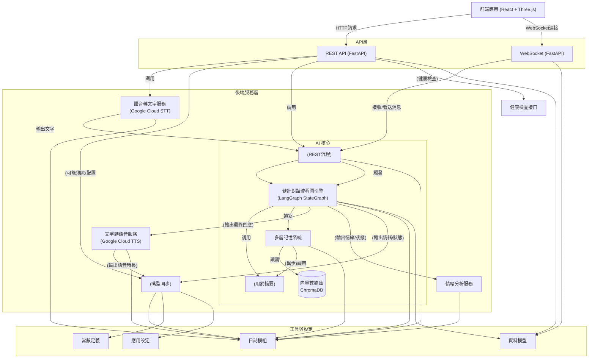

# GitHub 專案 Space Live Project 後端架構分析 (基於最新 README.md 更新)

## 1. 架構設計

後端採用 **Python FastAPI** 框架開發，提供高效的同步與非同步 API 服務。整體程式碼採用模組化架構，將功能劃分為多個模組以實現關注點分離。主要的後端組成包括：

- **應用主程式**：`main.py` 負責啟動 FastAPI 應用並配置日誌記錄（透過 `utils/logger.py`）。在啟動時載入各項服務並將路由註冊到應用上。
- **API 路由模組**：位於 `api/endpoints/` 資料夾，使用 FastAPI 的 `APIRouter` 定義各個 HTTP 路由和 WebSocket 端點（例如 `health.py`, `speech.py`, `expressions.py`, `websocket.py` 等）。這些路由模組各司其職：健康檢查、語音處理、表情查詢，以及即時通訊等。
- **服務層（Services）**：位於 `services/` 資料夾，封裝核心業務邏輯功能。包含 **AI 核心**、**語音轉文字服務 (STT)**、**文字轉語音服務 (TTS)**、**情緒分析服務**、**動畫服務**等模組。其中 **AI 核心** 是重點：
    - **AI 服務接口 (`AIService`)**: 作為一個向後兼容的適配器層，供 API 路由調用。
    - **健壯的 LangGraph 對話引擎 (`DialogueGraph`)**: 位於 `services/ai/dialogue_graph.py`，使用 `LangGraph` 的 `StateGraph` 管理對話流程與狀態 (`DialogueState`)。負責輸入預處理、動態提示選擇、調用 LLM、記憶整合、後處理和錯誤處理。
    - **增強版多層次記憶系統 (`MemorySystem`)**: 位於 `services/ai/memory_system.py`，管理 AI 的記憶。包括：
        - 短期記憶緩存。
        - 長期對話記憶 (使用 **ChromaDB** 持久化)。
        - 角色核心記憶 (使用 **ChromaDB**)。
        - 摘要記憶 (使用 **ChromaDB**，由 LLM 異步生成)。
        - 智能檢索 (向量搜索，如 MMR)。
        - 記憶過濾。
    - *SpeechToTextService*（語音轉文字服務）：調用 **Google Cloud Speech-to-Text** 將上傳的音訊內容轉換為文字。
    - *TextToSpeechService*（文字轉語音服務）：使用 **Google Cloud Text-to-Speech** 將 AI 回應文字合成語音並取得音檔及長度。
    - *EmotionAnalyzer*（情緒分析服務）：分析使用者文字中的情緒傾向，推斷表情與意圖。
    - *AnimationService*（動畫服務）：根據情緒產生對應的臉部表情 **Morph Target** 數值，並提供表情過渡和平滑插值計算，用於角色嘴型與表情動畫同步。
- **核心設定模組**：`core/` 資料夾內含應用設定 (`core/config.py`) 與 Pydantic 資料模型 (`core/models.py`)。
- **工具模組**：`utils/` 資料夾提供共用的工具函式，例如 `constants.py` 定義預設表情對應的 Morph Target 常數、`logger.py` 封裝日誌設定等。

架構上，後端透過 **FastAPI** 提供 REST API 與 WebSocket 服務。各服務模組透過明確的介面互相調用。這種分層設計讓 **語音處理**、**AI 對話**、**表情動畫** 等邏輯彼此解耦，利於後續維護與擴充。**AI 核心** 是新的重點，透過 `LangGraph` 實現了更複雜和可擴展的對話邏輯，並利用 `ChromaDB` 實現了持久化和多層次的記憶管理。其他服務（STT, TTS, Animation）與 AI 核心協同工作，共同完成互動流程。

此外，系統在日誌、錯誤處理方面也有考量：例如在語音轉文字過程中發生錯誤時進行重試，並記錄警告日誌；若仍失敗則回傳帶有錯誤碼與友好訊息的 JSON 給前端，以提升可靠性。

## 2. 記憶系統設計與資料流動

**記憶系統**方面，專案已從先前不明確的記憶體存儲演進為**增強版多層次記憶系統 (`MemorySystem`)**，該系統利用 **ChromaDB** 作為向量數據庫來持久化儲存關鍵記憶：

- **長期對話記憶**: 儲存經過篩選的重要對話歷史。
- **角色核心記憶**: 儲存 AI 的身份、背景設定等。
- **摘要記憶**: 儲存由 LLM 定期異步生成的對話摘要，用於高效回憶長期關鍵信息。

此外，系統還包含**短期記憶緩存**以處理即時上下文。環境設定檔 `.env.example` 中應包含 `VECTOR_DB_PATH` 指向 ChromaDB 的儲存路徑。

**資料流動**方面，後端主要充當**中介整合**多種服務與前端之間的資料交換。後端處理流程，特別是透過 WebSocket 的文字對話，已由 **`DialogueGraph`** 主導：

- **文字對話流程**（透過 WebSocket）：
    1.  **輸入接收與預處理**: 後端 WebSocket 端點接收前端訊息，傳遞給 `DialogueGraph`。`DialogueGraph` 的初始節點可能進行輸入分析（如重複度、情感、意圖分類）。
    2.  **記憶檢索**: `DialogueGraph` 調用 `MemorySystem`，結合當前輸入和對話狀態，從短期緩存、長期對話庫、角色核心庫和摘要庫中檢索相關記憶（使用向量搜索，可能包含 MMR 策略）。
    3.  **動態提示構建**: 根據輸入分析、檢索到的記憶和當前角色狀態，選擇或生成適合的 LLM 提示模板。
    4.  **LLM 調用**: 將構建好的提示發送給大型語言模型（如 Google Gemini），獲取回應。包含錯誤處理和重試機制。
    5.  **回應後處理**: `DialogueGraph` 的節點對 LLM 的原始輸出進行處理，可能包括移除不必要的標記、格式化、風格調整等，以確保回應質量。
    6.  **狀態更新**: 更新 `DialogueState`，包含當前情緒、記憶等。
    7.  **（異步）記憶整合**: `MemorySystem` 可能觸發異步任務，使用 LLM 將近期對話生成摘要，存入摘要記憶庫。
    8.  **觸發下游服務**:
        - *EmotionAnalyzer*: 分析最終回應文本的情緒（或基於 LLM 分析結果）。
        - *AnimationService*: 計算表情 Morph Target（基於情緒）和過渡。
        - *TextToSpeechService*: 將最終回應文本合成語音。
        - *AnimationService*: 根據語音時長計算嘴型同步幀。
    9.  **資料回傳**: 透過 WebSocket 將整合結果（AI 回應文本、情緒、表情 Morph、語音 Base64、時長、嘴型同步幀等）逐步或一次性傳回前端。包括初始回應、表情過渡更新 (`morph_update`) 和嘴型同步更新 (`lipsync_update`)。
    10. **記憶儲存**: `MemorySystem` 將相關的對話輪次（可能經過篩選）存入長期對話記憶庫 (ChromaDB)。

- **語音對話流程**（透過 REST API `/api/speech-to-text`）：
    1.  接收音訊 Base64。
    2.  調用 *SpeechToTextService* 轉錄文字。
    3.  將轉錄後的文字**輸入 `DialogueGraph`** 進行上述類似的處理流程（記憶檢索、LLM調用等）。
    4.  獲取 `DialogueGraph` 處理後的最終回應。
    5.  調用 *TextToSpeechService* 合成語音。
    6.  將識別文字、AI 回應文本、語音 Base64、時長等以 JSON 回傳。

資料傳遞仍以**結構化的 JSON** 進行。無論是 REST 回應或 WebSocket 訊息，都以明確的欄位傳遞內容、狀態和錯誤資訊。錯誤處理遵循統一格式（例如包含 `error` 物件與 `code`、`message` 欄位）。核心變化在於 AI 處理邏輯轉移到了可配置、有狀態的 `DialogueGraph` 中，並且記憶管理變得更加持久化和智能化。

## 3. API 設計與串接方式

後端提供的 API 端點大致保持不變，但內部實現已更新以整合新的 AI 核心：

| API 路徑                                | 方法      | 功能說明                                                                                                                               |
| :-------------------------------------- | :-------- | :------------------------------------------------------------------------------------------------------------------------------------- |
| `/api/speech-to-text`                   | `POST`    | 接收音訊，進行 STT，然後將文字**交由 `DialogueGraph` 處理**以生成 AI 回應和 TTS。                                                        |
| `/api/preset-expressions/{expression}` | `GET`     | 獲取預設表情配置 (此部分邏輯可能不變，用於前端初始化或直接設置)。                                                                       |
| `/api/health`                           | `GET`     | 健康檢查端點 (不變)，用於監控後端服務狀態。                                                                                             |
| `/ws/interactions`                      | WebSocket | 即時雙向通訊端點。前端發送的訊息將**由 `DialogueGraph` 處理**，後端推送的回應和動畫更新也源自 `DialogueGraph` 及相關服務的輸出。 |

API 設計保持了對外的簡潔性，將複雜的內部處理流程（如 STT -> LangGraph -> TTS）封裝起來。核心的 AI 處理能力由 `LangGraph` 驅動，提供了更強大的流程控制和狀態管理能力。

## 4. 與前端的互動方式

後端與前端的互動方式（REST API + WebSocket）基本不變，各自承擔不同任務，但後端處理核心發生了變化：

- **HTTP API 互動**：主要用於一次性請求或獲取靜態數據。例如：
    - **語音輸入**: 前端錄製完語音後，以 `POST` 請求將音訊上傳至 `/api/speech-to-text`。後端完成 STT 後，將文字**輸入 `DialogueGraph`** 進行完整的 AI 對話處理（包含記憶、狀態、LLM），最後返回包含轉錄文字、AI 回應、合成語音等的 JSON 結果。
    - **獲取預設配置**: 前端可能通過 `GET /api/preset-expressions/neutral` 等取得默認表情參數。
    - **健康檢查**: 前端可定期調用 `GET /api/health` 監控後端狀態。
- **WebSocket 即時互動**：用於持續對話和實時動畫同步。前端通過 `/ws/interactions` 與後端建立長連線。
    - **發送用戶輸入**: 前端將用戶的文字輸入（或 STT 結果）通過 WebSocket 發送給後端。
    - **後端處理與推送**: 後端接收後，不再是簡單調用舊服務，而是將輸入**送入 `DialogueGraph`**。`DialogueGraph` 執行其狀態機流程（包含記憶檢索、LLM 調用、狀態更新等），生成最終回應。隨後，觸發 TTS 和 Animation 服務，並將結果（回應文本、情緒、表情動畫指令、語音 Base64、嘴型同步指令等）通過 WebSocket **流式或分批推送**給前端。
    - **錯誤處理**: 若交互過程中發生錯誤（如 LLM 接口異常），後端會通過 WebSocket 發送 `type: "error"` 的消息以及錯誤內容，供前端提示用戶。

狀態協調依然重要。`DialogueGraph` 管理的 `DialogueState` 現在是後端狀態的核心，其變化（如 AI 的情緒）會通過 WebSocket 傳遞給前端，以確保前後端狀態同步。

總體而言，前端看到的接口變化不大，但後端實現了基於 `LangGraph` 和 `ChromaDB` 的更智能、更有記憶的 AI 核心。這種 REST 與 WebSocket 互補的設計，使得系統能同時滿足**一次性請求的可靠性**與**連續互動的即時性、沉浸感**，並且 AI 的表現更加連貫和深入。

**Sources:** 本分析內容是基於對該 GitHub 專案的 README、相關文檔及程式碼結構的理解進行整理。

等。上述架構與互動設計充分體現了系統模組劃分清晰、即時通訊高效以及對未來擴充的考量，是一個結合 AI 對話與即時3D動畫的後端架構實踐。

