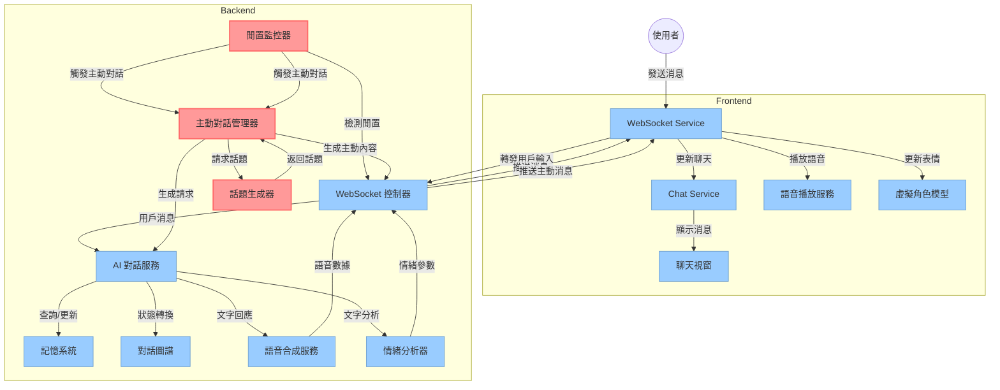
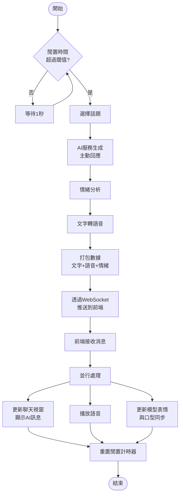

了解，我會根據 Space Live Project 的現有前後端架構，設計一套符合該專案邏輯的「角色主動互動能力」程式原型。

這份原型將包括：
- 主動互動的觸發條件與機制（如閒置時間、狀態變化）
- 後端主動訊息的生成與推送邏輯（例如主動聊天流程）
- 前端如何接收與處理主動互動內容（UI 顯示、語音播放與表情同步）
- 所需新增的模組或調整點（如 IdleMonitor、ProactiveDialogueManager 等）

我會很快整理好給你，包含具體模組劃分與可能的實作建議。

# Space Live Project 角色主動互動功能設計方案

為了讓「星際小可愛」虛擬主播具備**角色主動性**，我們在現有前後端架構上設計一套主動互動機制，使 AI 角色能在適當時機**主動發起對話**或互動。下面將詳細說明各部分設計，包括觸發條件、後端訊息產生與推送、前端接收處理，以及需擴充的模組，並提供對應的模組圖與流程圖協助理解。

## 主動互動的觸發邏輯與條件

主動互動需要明確的**觸發條件**來決定何時由 AI 角色主動說話。常見的觸發邏輯與條件包含：

- **閒置時間觸發**：當偵測到使用者長時間沒有輸入時（例如超過預設閒置閾值，如30秒），AI 判斷對話進入空閒狀態，將主動開口。【註：此為主要觸發條件，透過 IdleMonitor 模組監控實現】  
- **對話上下文觸發**：根據對話內容或上下文，如果出現 AI 可主動延續話題的情境。例如使用者上一句話沒有明確提問，AI 可能在稍後主動分享相關資訊或詢問使用者意見。  
- **內部狀態變化觸發**：AI 內部的情緒、記憶或狀態發生變化時也可觸發主動互動。例如 AI「心情」轉為興奮（也許因背景音樂或其他刺激），可能主動表達情緒；又或 AI 根據時間發現已晚，主動提醒時間。  
- **定時/事件觸發**：預先設定的定時器或特殊事件（如每天首次啟動時的歡迎語）也可引發主動對話。比如使用者剛進入聊天室幾秒後，AI 主動播放開場白問候。  

上述條件中，**使用者閒置時間**是最普遍且易於實現的觸發依據。我們將實作一個閒置監控器 IdleMonitor，在使用者**無輸入達一定時長**時，觸發角色的主動互動行為。內部狀態或事件觸發可作為進一步擴充點，先以簡單規則為主確保功能可行，再逐步增加豐富度。

## 後端如何產生主動互動訊息並推送給前端

後端的處理重點在於**檢測條件並生成適當的對話內容**，通過 WebSocket **主動推送**給前端。流程如下：

1. **閒置偵測**：後端 WebSocket 連線建立後，會啟動 IdleMonitor（閒置監控器）來定期檢查使用者最後一次互動時間。如果超過閒置閾值（例如 30 秒），IdleMonitor 判定需要觸發主動對話事件。  
2. **觸發主動生成**：當 IdleMonitor 條件滿足時，啟動 **ProactiveDialogueManager（主動對話管理器）** 來生成主動互動訊息。ProactiveDialogueManager 的職責是根據情境產生合適的對話內容，例如呼叫 TopicGenerator 取得一個新話題或開場白，並調用 AI 對話服務生成該話題下的具體句子。這裡會利用現有的 AIService（對話服務）以及角色的 DialogueGraph/MemorySystem 確保生成內容符合角色人格且連貫。  
3. **內容生成**：ProactiveDialogueManager 可能採用以下策略生成主動對話內容：  
   - **話題產生**：透過 **TopicGenerator** 模組來挑選或產生一個與當前情境相關的話題或問題。TopicGenerator 可以是預設話題列表（例如氣候、興趣等）的隨機選擇，或基於對話歷史避免重複話題，更進階也可以調用小型生成模型產生新話題。  
   - **對話句子生成**：將選定話題交給 AIService 生成具體的對話句子。由於 AIService 平時處理使用者輸入並生成回應，在此情況下我們給 AIService 一個特殊的「系統提示」或上下文（如「你可以主動開啟新話題，話題是X」）讓它產生一句合適的話。例如若 TopicGenerator 選擇了「音樂」話題，AIService 可能生成「對了，我最近學會了一首新歌，你想聽我唱嗎？」之類的句子作為主動對話。生成時依然可利用 MemorySystem 確保不提及使用者已知資訊或避免剛聊過的話題，以增進自然性。  
4. **表情與語音**：拿到 AIService 返回的主動對話文字後，後端會對該文字進一步處理：調用 **EmotionAnalyzer（情緒分析）** 模組分析句子的情緒狀態，例如判定這句話是歡快、好奇等，以便稍後驅動前端虛擬角色表情；接著調用 **TextToSpeechService（TTS 文字轉語音服務）** 將文字合成語音。這與平常對使用者回應的流程相同，即先分析情緒再生成語音。 ([GitHub - eggyy1224/space_live_project](https://github.com/eggyy1224/space_live_project#:~:text=,%E5%89%8D%E7%AB%AF%E5%91%88%E7%8F%BE))  
5. **推送消息**：最後，後端通過 WebSocket 將組合好的**主動互動訊息**推送給前端。這個訊息通常是一個 JSON 封包，包含：角色生成的文字內容、語音音頻資料（或音頻檔案URL）、以及表情/情緒參數等。由於 WebSocket 連線允許伺服器隨時推送資料給客戶端，後端的 WebSocket 控制器即可直接送出此主動訊息而無需等待請求 ([GitHub - eggyy1224/space_live_project](https://github.com/eggyy1224/space_live_project#:~:text=User%20,User))。為了讓前端識別這是角色主動發言，JSON 內或許會附加一個標誌例如 `"type": "proactive"`（或在 sender 字段標明為AI），但整體格式可與一般對話回應一致，方便前端重用現有邏輯。  

下面是伺服器端簡化的偽代碼範例，展示 WebSocket 端點如何整合 IdleMonitor 以定時觸發主動對話並推送給前端：

```python
from datetime import datetime, timedelta
IDLE_TIMEOUT = 30  # 閒置30秒觸發

async def websocket_endpoint(websocket: WebSocket):
    await websocket.accept()
    last_activity = datetime.utcnow()

    # 啟動閒置監控的背景任務
    async def idle_checker():
        while True:
            await asyncio.sleep(1)
            if datetime.utcnow() - last_activity > timedelta(seconds=IDLE_TIMEOUT):
                # 超過閒置閾值，生成主動訊息
                topic = TopicGenerator.pick_topic()  
                text = AIService.generate_response(system_prompt=f"主動開場:{topic}")
                emotion = EmotionAnalyzer.analyze(text)
                audio_url = TextToSpeechService.synthesize(text, emotion)
                # 通過WS推送主動對話消息
                data = {"type": "proactive", "text": text, "audio": audio_url, "emotion": emotion}
                await websocket.send_json(data)
                last_activity = datetime.utcnow()  # 重置計時（避免連續觸發）
    asyncio.create_task(idle_checker())

    # WebSocket主循環：處理使用者訊息
    while True:
        user_msg = await websocket.receive_text()
        last_activity = datetime.utcnow()  # 更新最後活動時間
        reply = AIService.generate_response(user_input=user_msg)
        emotion = EmotionAnalyzer.analyze(reply)
        audio_url = TextToSpeechService.synthesize(reply, emotion)
        await websocket.send_json({"type": "response", "text": reply, "audio": audio_url, "emotion": emotion})
```

上述代碼中，`idle_checker()` 背景任務持續監視`last_activity`時間差，一旦超過閾值即透過 Proactive 對話流程產生並發送消息。注意這只是示意性代碼：實際實現時需更嚴謹地處理任務取消、異常等情況，並且生成主動內容時可能需要更複雜的上下文考量。

## 前端如何接收並正確處理主動訊息

前端採用 React + Three.js 架構並透過 WebSocket 實時接收後端推送的對話資料 ([GitHub - eggyy1224/space_live_project](https://github.com/eggyy1224/space_live_project#:~:text=3))。因此，無論是被動回應或主動訊息，**處理機制基本相同**。關鍵是在於前端辨識並正確呈現由 AI 主動發起的訊息。具體包括：

- **WebSocket 收到訊息**：前端的 WebSocketService 持續監聽伺服器消息。當收到 JSON 封包時，首先解析其內容。例如根據其中 `type` 欄位或其他標誌識別消息種類。如果類型是 `"proactive"`（主動訊息）或一般回應，**均視為來自 AI** 的對話。  
- **更新聊天介面**：無論主動或被動，ChatRoom 聊天視圖都需要新增一則對話氣泡來顯示 AI 的文字。例如調用 ChatService 或更新 Zustand 中的 ChatSlice 將此消息加入對話列。同時可以在 UI 上區分訊息的發話者（例如以角色名字或頭像標示），通常AI的消息會在聊天視窗靠左或特定顏色。由於主動訊息也是AI發出，因此呈現樣式與一般AI回覆相同即可。  
- **播放語音**：收到的主動訊息若包含語音資料（可能是一個音頻檔URL或可播放的音頻串流），前端需要調用 AudioService 進行播放。透過 `useAudioService()` hook，將音頻輸入播放模組，讓使用者聽到 AI 主動說出的內容。這與處理一般回覆語音相同。  
- **同步模型表情**：若消息包含情緒或表情參數（如 `emotion` 標識為 "happy", "curious" 等），前端的 MorphTargetControls/HeadModel 等會根據該情緒值更新虛擬角色的臉部表情。 ([GitHub - eggyy1224/space_live_project](https://github.com/eggyy1224/space_live_project#:~:text=,%E8%AA%9E%E9%9F%B3%E6%92%AD%E6%94%BE%E8%88%87%E5%8F%A3%E5%9E%8B%E5%90%8C%E6%AD%A5%E6%A8%A1%E7%B5%84%E5%AF%A6%E7%8F%BE%E8%87%AA%E7%84%B6%E8%AA%AA%E8%A9%B1%E6%95%88%E6%9E%9C))實際上，專案已有 `useEmotionalSpeaking()` 這類 Hook，會在播放語音同時根據情緒驅動模型表情和口型同步。因此，對於主動訊息，前端同樣透過這套機制使角色邊說話邊呈現對應表情，達到生動的效果。  
- **特殊處理（若需要）**：某些情況下，前端可對主動訊息做特殊標記或行為。例如如果在使用者完全沒發言的情境下出現AI主動開場白，UI 或許可以在聊天視窗中將這句開場白區分為「系統提示」類型。但一般而言，這不是必要的，因為我們希望 AI 的主動發言看起來就像角色自發的對話，增加親和力而非機械式提示。

下方提供前端處理 WebSocket 訊息的簡要程式片段，以說明主動訊息與一般訊息的處理差異：

```javascript
// 前端 WebSocket 接收訊息事件處理
ws.onmessage = (event) => {
  const data = JSON.parse(event.data);
  if (data.type === 'proactive') {
    // AI主動訊息：加入聊天記錄並播放語音、表情
    chatStore.addMessage({ sender: 'AI', text: data.text });
    audioPlayer.play(data.audio);                // 播放語音
    modelController.setEmotion(data.emotion);    // 更新模型表情
  } else if (data.type === 'response') {
    // 一般AI回應訊息（處理方式相似）
    chatStore.addMessage({ sender: 'AI', text: data.text });
    audioPlayer.play(data.audio);
    modelController.setEmotion(data.emotion);
  }
  // ... 其他類型訊息的處理 ...
};
```

上述代碼中可以看出，主動訊息與一般 AI 回覆在前端處理上幾乎相同，只需按照既定流程將內容呈現即可。關鍵在於前端模組（聊天、音頻、模型）已具備即時更新的能力，而 WebSocket 連線允許**伺服器主動推送**資料過來，因此角色主動對話的顯示與原本對話無縫銜接。

## 在現有架構中需要擴充或新增的模組

為實現上述功能，需要在**後端**擴充/新增一些服務模組，同時對**前端**部分模組稍作調整：

- **IdleMonitor（閒置監控模組）** – **後端新增**：負責監視每個使用者會話的閒置時間。可以在 WebSocket 連線建立時啟動一個 IdleMonitor 實例或協程，持續檢查上次收到使用者訊息的時間戳。一旦超過預設閒置時長閾值，IdleMonitor 觸發主動互動流程。它可以實作為一個背景任務（如上範例代碼），或做成獨立於 WebSocket 控制器的服務（例如 IdleMonitor Service 登記各連線的活動狀態）。除了觸發時機，IdleMonitor 也可管理重置閒置計時（例如在 AI 主動講話後，可能重置或調整下一次觸發的計時器，以避免過於頻繁）。  

- **TopicGenerator（話題生成模組）** – **後端新增**：用於產生角色主動對話的主題或內容種子。這個模組可以很簡單地實作成隨機從預設句庫選取開場白/提問句型，也可以更進階地根據MemorySystem提供的對話歷史避開近期話題。未來甚至可接入LLM，根據上下文生成新話題。例如TopicGenerator可能提供接口 `pick_topic(context) -> str`，在使用者長時間沉默時返回如「聊聊天氣」、「分享一件趣事」等話題提示給 ProactiveDialogueManager 使用。  

- **ProactiveDialogueManager（主動對話管理器）** – **後端新增/擴充**：核心決策與生成模組。它接收 IdleMonitor 等處發出的「需要主動對話」事件，然後協調調用 TopicGenerator 和 AIService 等完成實際內容生成。其主要職責包括：判斷當下適不適合插入主動對話（避免打斷使用者輸入，或連續多次主動打擾）、從 TopicGenerator 獲取話題、調用 AIService 生成對應的對話句子、並將結果打包（文字、語音、表情）交由 WebSocket 傳送。ProactiveDialogueManager 可以視為 AIService 的一層封裝，用來專門處理「無使用者輸入時的AI輸出」邏輯。實現上，可在 AI 子系統中新增此模組，使其能訪問 DialogueGraph 和 MemorySystem，以利用角色背景知識生成自然的主動對話。  

- **AIService（對話服務）擴充** – **後端擴充**：AIService 本身負責與語言模型交互生成回應。我們可能需要擴充其介面，使其支持「無使用者輸入但需要輸出」的情境。例如增加一個 `generate_response(system_prompt=None, user_input=None)` 方法參數，用於當 user_input 為空時，僅根據系統提示（例如給定的話題或獨白指示）來生成一句話。這也涉及 DialogueGraph 的擴充，可能在對話狀態機中增加一種狀態專門處理主動對話（比如 idle_state 對應若干可能的主動行為）。不過在初步實作時，也可以透過簡單地構造 prompt 讓底層LLM輸出一句話來實現，不一定需要完整融入對話流程圖。  

- **WebSocket 控制器 & 廣播機制** – **後端擴充**：現有 WebSocket 控制器本來只在收到使用者訊息時回傳 AI 回覆。現在需要在沒有使用者訊息時也能主動推送，所以需擴充控制器使其能與 IdleMonitor/ProactiveDialogueManager 協作。可能的做法是在 WebSocket 控制器中啟動 IdleMonitor 任務，或引入一個中央管理器監控所有連線的閒置情況，再由控制器在適當時機呼叫 ProactiveDialogueManager 並 `websocket.send_json()` 推送主動消息。這部分屬於**控制層的改造**，確保後端**主動**發送消息的能力。  

- **前端 WebSocketService/ChatService** – **前端擴充**：前端主要是在接收訊息時辨識並處理主動對話。需要確保 WebSocketService 收到伺服器推送時，不會因沒有對應請求而忽略該訊息。目前架構採單向資料流，服務層接收後更新 Zustand 狀態，UI 監聽更新。 ([GitHub - eggyy1224/space_live_project](https://github.com/eggyy1224/space_live_project#:~:text=3)) ([GitHub - eggyy1224/space_live_project](https://github.com/eggyy1224/space_live_project#:~:text=3))我們要在 ChatSlice 中將 AI 主動訊息也當作一種對話加入。同時 ChatWindow 本身無需變動（它會渲染狀態中的所有消息）。可能需要在 ChatService 的處理邏輯中增加對 data.type 的判斷，如前述代碼片段所示，但總體改動不大。總之，前端要**信任**並處理來自伺服器的未經請求的消息，把它們視為正常對話。AudioService 和模型表情控制也沿用現有流程即可。  

- **（可選）前端 Idle 狀態監控** – **前端新增（未來可考慮）**：目前我們將閒置判斷放在後端，其實也可以在前端監控使用者與頁面的互動（如鼠標鍵盤事件）。若長時間無任何操作，可通知後端或直接在前端提示 AI 說點什麼。不過此機制可能和後端重複，不是必須。基於簡化和可靠性考量，建議由後端集中處理閒置邏輯即可。

綜上，後端新增的 IdleMonitor、TopicGenerator、ProactiveDialogueManager 是實現主動性的關鍵模組；AIService 和 WebSocket 控制需配合擴充。前端則重用大部分現有模組，僅在 WebSocket 收訊邏輯上做些微調整即可。

## 模組圖



上述模組圖顯示了擴充**主動互動**功能後系統的主要元件及關係。紅色節點表示新增的模組，藍色節點表示現有模組。可以看到新增的 **IdleMonitor** 持續監控使用者是否閒置，一旦觸發則通知 **ProactiveDialogueManager** 啟動對話生成流程。ProactiveDialogueManager 會調用 **TopicGenerator** 來取得話題，並利用既有 **AIService（對話服務）** 產生文字回應，隨後經由 **TextToSpeechService（語音合成）** 取得語音，最後透過 WebSocket 控制器將主動訊息推送給前端使用者。整個過程中新模組與原有 AI 子系統（對話圖譜、記憶系統等）緊密配合，以保持角色風格的一致性。同時，前端不需要新增特別的模組即可接收這些主動訊息，因為 WebSocket 連線本身已支援伺服器推播，聊天介面和3D模型會對接收到的內容做出相應展示。

## 流程圖



上圖以流程圖形式描述了**角色主動互動的動態流程**。首先 IdleMonitor 週期性地**檢查閒置時間是否超過閾值**（菱形判斷）。若否，則繼續等待並重複檢查；一旦條件為是，IdleMonitor 觸發進入主動對話生成過程。然後系統依序執行：**TopicGenerator 選擇話題**、**AIService生成主動回應**、**TTS與情緒分析產生語音與表情**，再透過 WebSocket **推送主動訊息至前端**。前端收到後，**聊天視窗顯示文字、模型播放語音並同步表情**，完整呈現出 AI 角色主動說話的效果，最後流程結束等待下一次觸發。這個循環確保當使用者沉默時，AI 也能適時地介入對話，提供更自然、有持續性的互動體驗。

以上設計方案充分利用了 Space Live Project 現有的架構，**最小化地修改前端顯示邏輯，將主要複雜度封裝在後端服務**。透過 IdleMonitor 等模組監控與決策，AI 虛擬主播將具備一定的自主能動性，能在對話冷場時主動找話題，提升聊天室的活躍度和沉浸感。開發者在實作時，可先從簡單的閒置觸發與固定回覆入手，逐步驗證主動訊息從後端到前端呈現的**資料流**，再逐漸豐富 AI 主動對話的多樣性與智能，打造出更加生動的虛擬角色互動體驗。