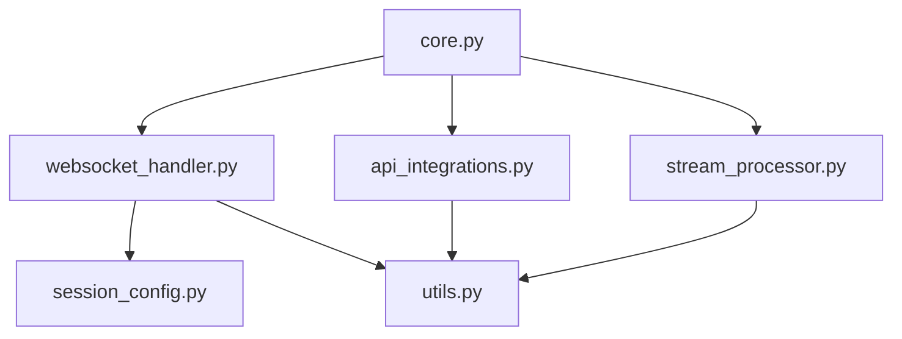

# 實時對話服務模組

這是重構後的 `RealtimeConversationService` 模組，將原本的單一檔案（1135 行）拆分為清晰的模組化結構。

## 📁 模組結構

```
realtime_conversation/
├── __init__.py              # 模組入口點
├── core.py                  # 核心服務類別
├── websocket_handler.py     # WebSocket 連接處理
├── api_integrations.py      # 外部 API 整合
├── session_config.py        # 會話配置與工具定義
├── stream_processor.py      # 音頻流處理
├── utils.py                 # 工具函式
├── tests/                   # 單元測試
│   ├── __init__.py
│   └── test_core.py
└── README.md               # 此文檔
```

## 🎯 各模組職責

### 1. `core.py` - 核心服務類別
- **主要職責**：提供統一的服務接口，整合各子模組
- **功能**：
  - 初始化所有子模組
  - 提供音頻流對話的主要入口
  - 測試模式控制
  - 工具函數執行的對外接口

### 2. `websocket_handler.py` - WebSocket 處理
- **主要職責**：管理與 OpenAI Realtime API 的 WebSocket 連接
- **功能**：
  - WebSocket 連接建立與維護
  - 音頻數據收發
  - OpenAI 事件處理（音頻、文字、Function Calling）
  - 中斷處理與錯誤恢復

### 3. `api_integrations.py` - 外部 API 整合
- **主要職責**：處理所有外部 API 調用
- **功能**：
  - 表情動畫 API 整合
  - 音效播放 API 整合  
  - 背景音樂與音效 API 整合
  - 自拍功能 API 整合
  - 圖片生成 API 整合
  - 鏡位控制 API 整合
  - **頭部大小控制 API 整合** ⭐ 新增
  - 工具函數執行與參數驗證

### 4. `session_config.py` - 會話配置
- **主要職責**：定義 AI 角色與工具配置
- **功能**：
  - AI 角色設定指令（台語English風格）
  - 工具定義（表情、音效、背景音樂、自拍、圖片生成、鏡位控制、**頭部大小控制** ⭐ 新增）
  - 會話參數配置

### 5. `stream_processor.py` - 音頻流處理
- **主要職責**：處理音頻數據流
- **功能**：
  - 測試模式音頻生成
  - 音頻格式轉換輔助
  - 流處理狀態管理

### 6. `utils.py` - 工具函式
- **主要職責**：提供通用工具函式
- **功能**：
  - PCM 到 WAV 格式轉換
  - 隨機自拍圖片選擇
  - 檔案路徑處理

## 🚀 使用方式

### 基本使用
```python
from services.realtime_conversation import RealtimeConversationService

# 初始化服務
service = RealtimeConversationService()

# 使用音頻流對話
async for audio_response in service.stream_conversation(audio_chunks):
    # 處理音頻回應
    yield audio_response
```

### 測試模式
```python
# 啟用測試模式
service.set_test_mode(True)

# 檢查測試模式狀態
if service.is_test_mode():
    print("Currently in test mode")
```

### 直接工具調用
```python
# 執行表情動畫
result = await service.execute_tool_function(
    "emotion_trajectory", 
    '{"duration": 3.0, "keyframes": [{"tag": "happy", "proportion": 0.0}]}'
)
```

## 🔧 模組間依賴關係



## ⚡ 重構優勢

### 1. **可維護性提升**
- 單一職責原則：每個模組只負責特定功能
- 清晰的介面設計：模組間依賴關係明確
- 代碼分離：相關功能組織在一起

### 2. **可擴展性增強**
- 模組化設計：容易添加新功能
- 鬆耦合架構：修改一個模組不影響其他模組
- 標準化介面：一致的函數簽名和錯誤處理

### 3. **可測試性改善**
- 獨立單元測試：每個模組可單獨測試
- Mock 友好：容易模擬外部依賴
- 測試覆蓋率：更精確的測試範圍控制

### 4. **開發效率提升**
- 並行開發：多人可同時開發不同模組
- 更快的定位問題：錯誤範圍縮小到特定模組
- 代碼重用：工具函式可被多個模組使用

## 🧪 測試

### 運行測試
```bash
# 運行所有測試
pytest prototype/backend/services/realtime_conversation/tests/

# 運行特定測試
pytest prototype/backend/services/realtime_conversation/tests/test_core.py

# 運行測試並顯示覆蓋率
pytest --cov=prototype/backend/services/realtime_conversation prototype/backend/services/realtime_conversation/tests/
```

### 測試覆蓋範圍
- ✅ 核心服務初始化
- ✅ 測試模式切換
- ✅ 工具函數執行
- ✅ 錯誤處理與回退機制
- 🔄 WebSocket 連接處理（待完善）
- 🔄 API 整合功能（待完善）

## 🔄 向後相容性

重構後的模組**完全向後相容**：

1. **相同的公開介面**：`RealtimeConversationService` 類別的公開方法保持不變
2. **相同的功能表現**：所有原有功能正常運作
3. **相同的錯誤處理**：錯誤回應格式和處理邏輯不變
4. **相同的配置需求**：環境變數和依賴要求相同

## 📝 開發指南

### 添加新功能
1. 確定功能歸屬的模組
2. 在對應模組中實現功能
3. 更新相關的工具配置（如需要）
4. 添加單元測試
5. 更新文檔

### 修改現有功能
1. 找到對應的模組文件
2. 確保修改不破壞公開介面
3. 更新相關測試
4. 檢查對其他模組的影響

### 調試問題
1. 檢查日誌輸出確定問題模組
2. 使用模組的 getter 方法直接訪問子模組
3. 在特定模組中添加詳細日誌
4. 使用測試模式隔離問題

這個重構保持了所有原有功能的完整性，同時大幅提升了代碼的組織性和可維護性。 