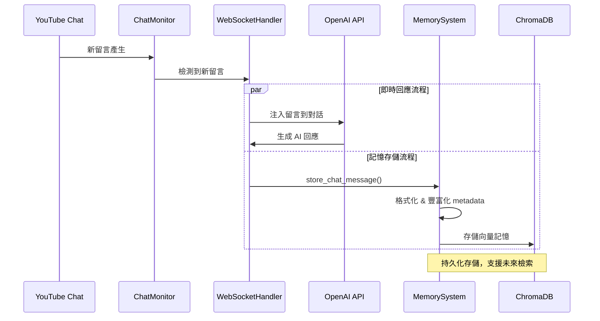

# YouTube 聊天室留言記憶系統

## 📋 概述

聊天室留言記憶系統是太空人直播互動藝術裝置專案的新功能，專門用於自動收集、存儲和管理 YouTube 聊天室中的觀眾留言。系統整合了 YouTube 聊天室監控、向量記憶存儲和即時對話處理，實現對觀眾互動的長期記憶和智能回溯。

## 🏗️ 系統架構

### 核心組件關係

```
┌─────────────────────────────────────────────────────────────┐
│                     聊天室記憶系統                              │
├─────────────────────────────────────────────────────────────┤
│  YouTube Chat Monitor                                       │
│  ↓ 即時抓取留言                                               │
│  WebSocketHandler                                          │
│  ├── _inject_youtube_message_to_openai() ← 注入到 AI 對話     │
│  └── store_chat_message() ← 存儲到記憶系統                    │
│  ↓                                                          │
│  MemorySystem                                              │
│  ├── chat_memory_store (ChromaDB)                          │
│  ├── store_chat_message()                                  │
│  ├── retrieve_chat_memories()                              │
│  └── get_recent_chat_messages()                            │
└─────────────────────────────────────────────────────────────┘
```

### 資料流程

```
YouTube 留言 → 即時監控 → 格式化處理 → 
   ├── 注入 AI 對話（即時回應）
   └── 存儲向量記憶（持久化記憶）
```

## 🔧 技術實現

### 1. 記憶系統擴展

**位置**: `prototype/backend/services/memory_system/memory_system.py`

#### 新增記憶存儲類型
```python
# 在 MemorySystem.__init__ 中新增
self.chat_memory_store = self._init_memory_store("chat_memory", "youtube_chat_messages")
```

#### 聊天室記憶的 Metadata 豐富化
```python
elif memory_type == "chat_message":
    enriched_metadata.update({
        "interaction_type": "youtube_chat",
        "is_audience_message": True,
        "platform": "youtube"
    })
```

### 2. 聊天室留言存儲方法

#### `store_chat_message(message_data: dict)`
**功能**: 將 YouTube 聊天室留言存儲到向量記憶庫
**參數**: 完整的留言資料字典，包含 author, message, timestamp 等

```python
def store_chat_message(self, message_data: dict):
    """
    儲存 YouTube 聊天室留言到記憶庫
    
    Args:
        message_data: 聊天室留言資料，包含 author, message, timestamp 等
    """
    # 構造留言內容
    chat_content = f"[YouTube 觀眾 {author}]: {message_text}"
    
    # 準備豐富的 metadata
    base_metadata = {
        "type": "chat_message",
        "author": author,
        "message": message_text,
        "original_timestamp": timestamp,
        "chat_datetime": datetime_str,
        "message_type": message_data.get("message_type", "textMessage"),
        "is_verified": message_data.get("is_verified", False),
        "is_owner": message_data.get("is_owner", False),
        "is_sponsor": message_data.get("is_sponsor", False),
        "is_moderator": message_data.get("is_moderator", False),
        "author_channel_id": message_data.get("author_channel_id", ""),
        "platform": "youtube",
        "chat_source": "live_stream"
    }
```

### 3. 聊天室記憶檢索方法

#### `retrieve_chat_memories(query: str, k: int = 5, author_filter: str = None)`
**功能**: 基於語義搜尋檢索相關的聊天室留言記憶
**特色**: 支援作者過濾功能

#### `get_recent_chat_messages(limit: int = 20, author_filter: str = None)`
**功能**: 獲取最近的聊天室留言，按時間排序
**特色**: 支援特定作者的留言查詢

### 4. WebSocket 處理器整合

**位置**: `prototype/backend/services/realtime_conversation/websocket_handler.py`

#### 記憶系統初始化
```python
def _get_memory_system(self) -> MemorySystem:
    """獲取記憶系統實例（懶加載）"""
    if self._memory_system is None:
        # 初始化嵌入模型和 LLM
        embeddings = GoogleGenerativeAIEmbeddings(...)
        llm = ChatGoogleGenerativeAI(...)
        
        # 創建記憶系統
        self._memory_system = MemorySystem(
            embeddings=embeddings,
            persona_name="太空直播AI",
            llm=llm
        )
```

#### 留言注入時的記憶存儲
```python
async def _inject_youtube_message_to_openai(self, message_data: dict):
    # 1. 發送到 OpenAI 進行即時回應
    await self._current_ws.send(json.dumps(conversation_item))
    
    # 2. 存儲到記憶系統（新增功能）
    try:
        memory_system = self._get_memory_system()
        if memory_system:
            memory_system.store_chat_message(message_data)
            logger.info(f"💾 已將 YouTube 留言存儲到記憶系統")
    except Exception as memory_error:
        logger.error(f"❌ 存儲留言到記憶系統失敗: {memory_error}")
        # 不影響主要流程，繼續執行
```

## 📊 記憶資料結構

### 聊天室留言的向量記憶格式

```json
{
  "content": "[YouTube 觀眾 使用者名稱]: 留言內容",
  "metadata": {
    "memory_id": "unique_memory_id",
    "memory_type": "chat_message",
    "timestamp": 1691234567.89,
    "datetime": "2025-08-06T14:30:00",
    "source": "youtube_chat_monitor",
    "persona_name": "太空直播AI",
    "interaction_type": "youtube_chat",
    "is_audience_message": true,
    "platform": "youtube",
    
    "type": "chat_message",
    "author": "使用者名稱",
    "message": "留言內容",
    "original_timestamp": "1703123456789",
    "chat_datetime": "2023-12-21 10:30:56",
    "message_type": "textMessage",
    "is_verified": false,
    "is_owner": false,
    "is_sponsor": true,
    "is_moderator": false,
    "author_channel_id": "UC...",
    "chat_source": "live_stream"
  }
}
```

### Metadata 欄位說明

#### 系統級欄位
- `memory_id`: 記憶的唯一識別碼
- `memory_type`: 記憶類型，固定為 "chat_message"
- `timestamp`: Unix 時間戳
- `datetime`: 可讀日期時間格式
- `source`: 記憶來源，固定為 "youtube_chat_monitor"
- `persona_name`: AI 角色名稱
- `interaction_type`: 互動類型，固定為 "youtube_chat"
- `is_audience_message`: 標記為觀眾訊息
- `platform`: 平台名稱，固定為 "youtube"

#### 聊天室特定欄位
- `author`: 留言者名稱
- `message`: 原始留言內容
- `original_timestamp`: YouTube 原始時間戳
- `chat_datetime`: YouTube 聊天室時間格式
- `message_type`: 訊息類型（textMessage, superChat 等）
- `is_verified`: 是否為驗證用戶
- `is_owner`: 是否為頻道擁有者
- `is_sponsor`: 是否為贊助商
- `is_moderator`: 是否為版主
- `author_channel_id`: 留言者的頻道 ID
- `chat_source`: 聊天來源，固定為 "live_stream"

## 🔍 使用方式與 API

### 通過記憶 API 訪問聊天室記憶

```bash
# 檢索聊天室留言記憶
POST /api/memory/get
{
  "memory_type": "chat_message",
  "query": "太空相關的討論",
  "limit": 10,
  "include_metadata": true
}

# 獲取所有聊天室留言
POST /api/memory/get
{
  "memory_type": "chat_message",
  "limit": 50,
  "include_metadata": true
}
```

### 程式化訪問示例

```python
# 初始化記憶系統
memory_system = MemorySystem(embeddings, persona_name="太空直播AI", llm=llm)

# 檢索特定主題的聊天室留言
space_related_chats = memory_system.retrieve_chat_memories(
    query="太空 宇宙 星際",
    k=10
)

# 獲取最近20條聊天室留言
recent_chats = memory_system.get_recent_chat_messages(limit=20)

# 檢索特定用戶的留言
user_chats = memory_system.retrieve_chat_memories(
    query="技術問題",
    author_filter="特定用戶名"
)
```

## 📈 效能考量與最佳化

### 存儲策略
- **過濾機制**: 自動過濾空訊息或過短留言（< 2 字符）
- **向量化**: 使用 Google Embedding API 將留言轉換為向量
- **批次處理**: 未來可考慮批次存儲以減少 I/O 開銷

### 檢索效能
- **向量相似度搜尋**: 基於語義相似度檢索相關留言
- **時間排序**: 支援按時間戳排序獲取最新留言
- **過濾查詢**: 支援按作者、留言類型等條件過濾

### 記憶體管理
- **懶加載**: 記憶系統在首次使用時才初始化
- **錯誤隔離**: 記憶系統錯誤不影響即時對話功能
- **資源清理**: 適當的連接和資源管理

## 🚀 應用場景

### 1. 觀眾互動分析
- 分析觀眾喜好和興趣點
- 識別熱門話題和討論趨勢
- 追蹤特定用戶的參與歷史

### 2. 個性化回應
- 根據歷史互動調整回應風格
- 記住觀眾的偏好和問題
- 建立與常客的連續對話

### 3. 內容優化
- 分析觀眾反饋優化表演內容
- 識別受歡迎的話題和表演
- 追蹤觀眾參與度變化

### 4. 社群管理
- 識別活躍用戶和貢獻者
- 監控聊天室氛圍和情緒
- 支援版主決策和社群治理

## 🔄 完整工作流程



## 🛠️ 開發與測試

### 測試聊天室記憶功能

1. **啟動系統**
```bash
cd prototype/backend
python main.py
```

2. **建立即時對話連接**
```javascript
const ws = new WebSocket('ws://localhost:8000/ws/realtime-conversation');
```

3. **在 YouTube 聊天室發送測試留言**
   - 觀察後端日誌確認留言被檢測到
   - 確認留言被存儲到記憶系統

4. **檢索測試**
```bash
# 檢索聊天室記憶
curl -X POST "http://localhost:8000/api/memory/get" \
     -H "Content-Type: application/json" \
     -d '{
       "memory_type": "chat_message",
       "limit": 10,
       "include_metadata": true
     }'
```

### 關鍵日誌訊息
```
📝 WebSocket 處理器中的記憶系統初始化成功
💬 準備注入格式化留言到 OpenAI: [YouTube 觀眾 用戶名]: 留言內容
✅ 已發送 YouTube 留言到 OpenAI: 用戶名 - 留言內容
💾 已將 YouTube 留言存儲到記憶系統: 用戶名 - 留言內容...
成功儲存聊天室留言到記憶庫: 用戶名 - 留言內容...
```

## 🔮 未來發展方向

### 功能增強
1. **情感分析**: 對留言進行情感分析並存儲情感標籤
2. **話題分類**: 自動分類留言主題（技術、娛樂、提問等）
3. **用戶畫像**: 基於留言歷史建立用戶興趣畫像
4. **智能摘要**: 定期生成聊天室討論摘要

### 整合優化
1. **實時檢索**: 在 AI 回應生成時即時檢索相關歷史留言
2. **記憶觸發**: 基於留言內容自動觸發相關記憶回溯
3. **跨平台支援**: 擴展到其他直播平台的聊天室
4. **多語言支援**: 支援多語言留言的語義檢索

### 分析工具
1. **儀表板**: 建立聊天室互動分析儀表板
2. **報告生成**: 自動生成觀眾互動報告
3. **趨勢分析**: 識別討論趨勢和熱點話題
4. **A/B 測試**: 支援不同回應策略的效果分析

---

## 📝 版本歷史

- **v1.0** (2025-08): 初始版本，基本聊天室留言記憶功能
  - 自動存儲 YouTube 聊天室留言
  - 向量化記憶存儲與檢索
  - WebSocket 處理器整合
  - 豐富的 metadata 支援

## 👨‍💻 開發說明

此聊天室留言記憶系統是太空人直播互動藝術裝置專案的重要組成部分，提供了觀眾互動的長期記憶能力。系統設計注重模組化、可擴展性和效能，為未來的智能互動功能奠定了堅實基礎。