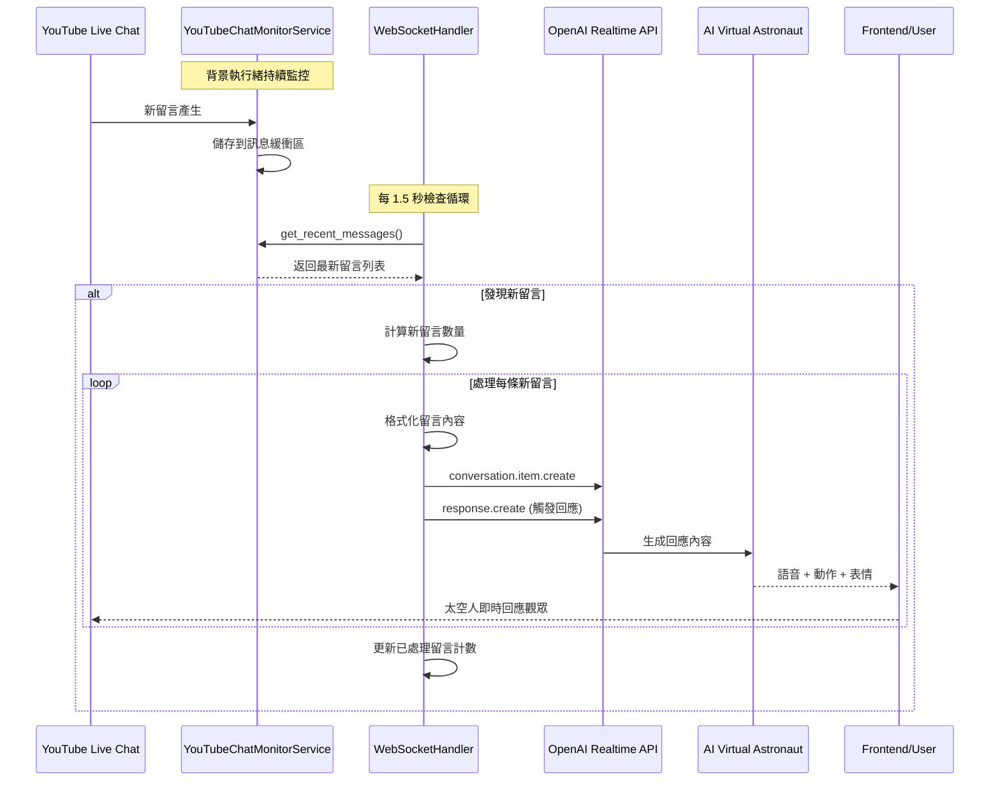

# YouTube 聊天室與即時對話系統整合架構文件

## 📋 概述

本文件詳細說明了太空人直播互動藝術裝置專案中，YouTube 聊天室如何與 OpenAI Realtime API 整合，實現觀眾留言的即時 AI 回應功能。

## 🏗️ 系統架構

### 核心組件

```
┌─────────────────────────────────────────────────────────────┐
│                     太空人直播系統                              │
├─────────────────────────────────────────────────────────────┤
│  Frontend (React + Three.js + WebSocket)                   │
│  ↕️ WebSocket Connection                                     │
│  Backend FastAPI Server                                    │
│  ├── RealtimeConversationService                           │
│  │   ├── WebSocketHandler ←→ OpenAI Realtime API           │
│  │   │   └── YouTubeChatMonitorService                     │
│  │   └── SessionConfig (Persona + Tools)                   │
│  └── PerceptionModule                                      │
│      └── YouTubeChatMonitorService (pytchat)               │
└─────────────────────────────────────────────────────────────┘
```

### 資料流程

```
YouTube Live Chat → pytchat → YouTubeChatMonitorService → WebSocketHandler → OpenAI Realtime API → AI Response → 太空人語音/動作
```

## 🔧 技術實現

### 1. YouTube 聊天室監控服務

**位置**: `prototype/backend/services/perception/youtube_chat_monitor.py`

#### 核心功能
- 使用 `pytchat` 庫即時監控 YouTube 直播聊天室
- 單例模式設計，確保全域只有一個監控實例
- 支援頻道 ID 自動獲取當前直播 video_id
- 訊息緩衝區管理（預設保留最近 100 條訊息）
- 背景執行緒監控，不阻塞主程序

#### 關鍵方法
```python
class YouTubeChatMonitorService:
    def start_monitoring_by_channel(channel_id: str) -> dict
    def get_recent_messages(limit: int = 10) -> List[dict]
    def get_monitoring_status() -> dict
    def stop_monitoring() -> dict
```

#### 訊息資料結構
```python
@dataclass
class ChatMessage:
    id: str                    # 訊息唯一 ID
    author: str               # 留言者名稱
    message: str              # 留言內容
    timestamp: str            # 時間戳記
    datetime: str             # 可讀日期時間
    message_type: str         # 訊息類型
    is_verified: bool         # 是否驗證用戶
    is_owner: bool           # 是否頻道擁有者
    is_sponsor: bool         # 是否贊助商
    is_moderator: bool       # 是否版主
```

### 2. WebSocket 處理器整合

**位置**: `prototype/backend/services/realtime_conversation/websocket_handler.py`

#### 整合實現

##### 初始化階段
```python
class WebSocketHandler:
    def __init__(self):
        # YouTube 聊天室監控服務初始化
        self._youtube_chat_service = YouTubeChatMonitorService()
        self._channel_id = "UCV60MYR7dQJM8TqY5eXb7YA"  # 目標頻道 ID
        self._youtube_monitor_task = None
        self._last_processed_message_count = 0
```

##### 會話開始時的整合
```python
async def stream_conversation(self, websocket):
    # 1. 建立 OpenAI Realtime API WebSocket 連接
    # 2. 發送會話配置（角色人格 + 工具集）
    # 3. 啟動 YouTube 聊天室監控
    await self._start_youtube_chat_monitoring()
    # 4. 啟動背景任務監控新留言
    self._youtube_monitor_task = asyncio.create_task(
        self._monitor_youtube_chat_messages()
    )
```

##### 留言監控循環
```python
async def _monitor_youtube_chat_messages(self):
    """每 1.5 秒檢查一次新留言"""
    while self._current_ws and self._current_ws.state != websockets.protocol.State.CLOSED:
        # 1. 檢查是否有新留言
        recent_messages = self._youtube_chat_service.get_recent_messages(limit=10)
        current_message_count = len(recent_messages)
        
        # 2. 如果有新留言，計算新增數量
        if current_message_count > self._last_processed_message_count:
            new_message_count = current_message_count - self._last_processed_message_count
            new_messages = recent_messages[:new_message_count]
            
            # 3. 逐條處理新留言
            for message in reversed(new_messages):
                await self._inject_youtube_message_to_openai(message)
                
        await asyncio.sleep(1.5)  # 每 1.5 秒檢查一次
```

##### 留言注入機制
```python
async def _inject_youtube_message_to_openai(self, message_data: dict):
    """將 YouTube 留言注入到 OpenAI Realtime API"""
    
    # 1. 訊息格式化
    formatted_message = f"[YouTube 觀眾 {author}]: {message_text}"
    
    # 2. 建立 OpenAI conversation.item.create 事件
    conversation_item = {
        "type": "conversation.item.create",
        "item": {
            "type": "message",
            "role": "user",
            "content": [{"type": "input_text", "text": formatted_message}]
        }
    }
    
    # 3. 發送留言到 OpenAI
    await self._current_ws.send(json.dumps(conversation_item))
    
    # 4. 觸發 AI 回應
    response_create = {"type": "response.create"}
    await self._current_ws.send(json.dumps(response_create))
```

### 3. 日誌記錄系統

**位置**: `prototype/backend/services/realtime_conversation/logging/websocket_logger.py`

#### 新增的日誌功能
```python
def log_event_sent(self, event_type: str, event_data: Dict[str, Any]):
    """記錄發送到 OpenAI 的事件"""
    if event_type == "conversation.item.create":
        # YouTube 留言注入事件專用記錄
        item = event_data.get("item", {})
        log_data = {
            "item_type": item.get("type"),
            "role": item.get("role"),
            "content_preview": str(item.get("content", [{}])[0].get("text", ""))[:100],
            "timestamp": datetime.now().isoformat()
        }
    # ... 其他事件類型處理
```

## 🔄 完整流程圖



## ⚙️ 配置參數

### YouTube 監控配置
```python
# 目標 YouTube 頻道 ID
CHANNEL_ID = "UCV60MYR7dQJM8TqY5eXb7YA"

# 訊息緩衝區大小
MAX_BUFFER_SIZE = 100

# 監控頻率（秒）
MONITOR_INTERVAL = 1.5

# 訊息過濾設定
MIN_MESSAGE_LENGTH = 2  # 最短留言長度
```

### OpenAI Realtime API 配置
```python
# API 模型
MODEL = "gpt-4o-mini-realtime-preview"

# WebSocket URL
OPENAI_REALTIME_URL = "wss://api.openai.com/v1/realtime"

# 會話配置
SESSION_CONFIG = {
    "modalities": ["text", "audio"],
    "voice": "alloy",
    "turn_detection": {"type": "server_vad"}
}
```

## 🛠️ 部署與使用

### 1. 環境設置
```bash
cd prototype/backend
pip install -r requirements.txt
# 確保包含 pytchat==0.5.5
```

### 2. 啟動服務
```bash
python main.py
```

### 3. 建立即時對話連接
```javascript
// 前端連接到即時對話 WebSocket
const ws = new WebSocket('ws://localhost:8000/ws/realtime-conversation');
```

### 4. YouTube 聊天室自動監控
一旦建立即時對話連接，系統會自動：
- 啟動 YouTube 聊天室監控
- 開始背景任務循環檢查新留言
- 即時注入留言到 AI 對話中
- 生成即時回應

## 📊 監控與除錯

### 關鍵日誌訊息
```
🚀 [DEBUG] 即時對話會話開始，啟動 YouTube 聊天室監控
🎯 [DEBUG] 開始監控 YouTube 聊天留言，準備即時注入到對話中
🆕 [DEBUG] 發現 X 條新留言！準備注入到 OpenAI
💬 [DEBUG] 處理新留言: [作者] - [內容]
📤 [DEBUG] 準備發送 conversation.item.create 事件
✅ [DEBUG] 已發送 YouTube 留言到 OpenAI
🎯 [DEBUG] 準備發送 response.create 觸發 AI 回應
🚀 [DEBUG] 已觸發 AI 回應 YouTube 聊天留言
```

### 效能監控
- 記憶體使用量：訊息緩衝區限制為 100 條
- 網路請求頻率：每 1.5 秒檢查一次新留言
- WebSocket 連接狀態：持續監控連接狀態
- 錯誤重試機制：自動處理暫時性網路錯誤

## 🔐 安全性考量

### 訊息過濾
- 過濾空白或過短訊息（< 2 字符）
- 防止惡意內容注入
- 限制訊息長度和頻率

### API 安全
- OpenAI API 金鑰安全管理
- WebSocket 連接驗證
- 錯誤訊息不暴露敏感資訊

## 🚀 未來優化方向

### 功能增強
1. **智慧訊息過濾**：過濾垃圾訊息、重複內容
2. **情感分析**：根據留言情感調整回應風格
3. **多語言支援**：自動檢測和回應不同語言留言
4. **VIP 用戶識別**：優先回應贊助商、版主留言

### 效能優化
1. **批次處理**：將多條留言合併處理減少 API 調用
2. **快取機制**：暫存常見問題回應
3. **負載均衡**：支援多個 YouTube 頻道同時監控
4. **資料庫儲存**：持久化留言歷史記錄

### 監控強化
1. **即時監控面板**：視覺化監控留言流量和回應率
2. **異常告警**：API 錯誤、連接中斷自動通知
3. **效能分析**：留言處理延遲、回應品質統計

---

## 📝 版本歷史

- **v1.0** (2025-08): 初始版本，基本 YouTube 聊天室整合
- **v1.1** (2025-08): 修復 WebSocket 狀態檢查和日誌記錄

## 👨‍💻 開發團隊

此整合系統由太空人直播互動藝術裝置專案團隊開發，整合了現代 WebSocket 技術、AI 對話系統和即時流媒體監控功能。