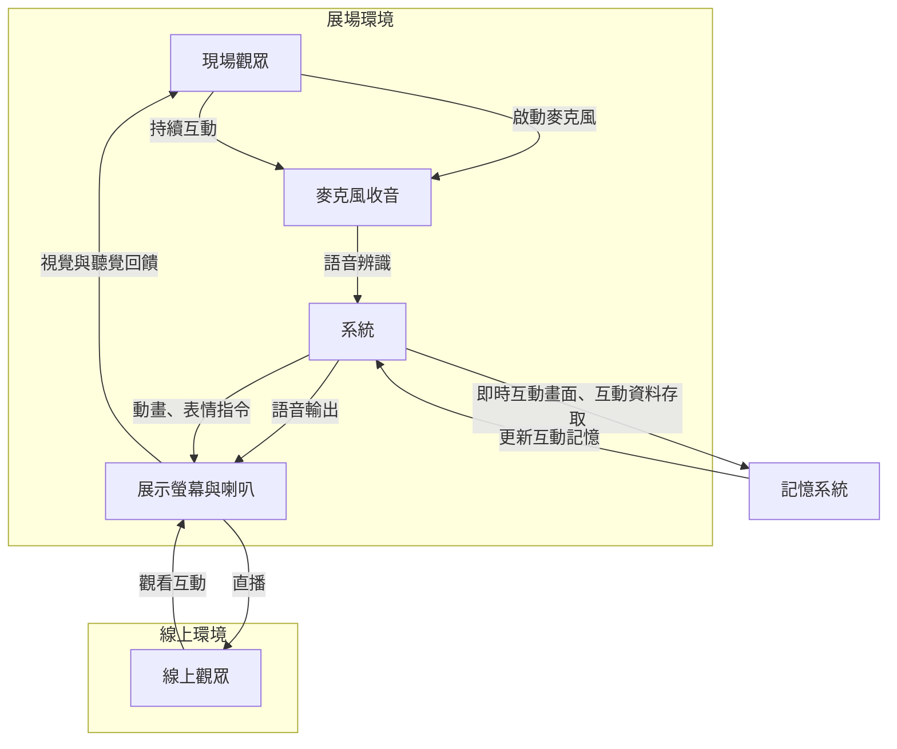

# 虛擬太空人互動養成計畫（太空直播計劃）

## 作品敘述
透過近期新聞事件「太空人被困於太空站」為靈感，打造一個互動式虛擬太空人裝置。作品設定為一名被困於太空艙中的虛擬太空人，僅能與展場觀眾互動。觀眾可透過語音與太空人對話，太空人會展現情緒反應並記住過往互動，探索人與虛擬角色間的情感連結與存在主義議題。

## 團隊/創作者介紹
- **陳俊宇**：視覺藝術設計，負責角色外型設計與視覺素材
- **毛怪**：3D模型製作，負責角色建模與動畫製作
- **威辰**：技術開發，負責前後端整合與AI模型串接
- **大D**：技術開發，負責互動系統與展場設置

## 使用者互動流程圖

## 作品草圖
虛擬太空人互動裝置以3D模型呈現，具有豐富的表情與動作系統。太空人漂浮於太空艙中，周圍是星空背景。觀眾可透過按下按鈕啟動麥克風進行語音對話，系統會即時處理並讓太空人做出回應，包括語音、表情和動作的即時反饋。同時，線上觀眾也可以透過直播系統觀看現場互動，並在獨立的聊天室系統中進行討論。

## 預算估價單

### 人員費用（佔總預算30%）：9萬新台幣
- **陳俊宇**：2.25萬新台幣（角色外型設計與視覺素材）
- **毛怪**：2.25萬新台幣（3D模型與動畫製作）
- **威辰**：2.25萬新台幣（前後端整合與AI模型串接）
- **大D**：2.25萬新台幣（互動系統與展場設置）

### 技術開發與材料費用（佔總預算70%）：21萬新台幣
- **程式開發費用**：7萬新台幣
  - 前後端開發：4萬新台幣
  - AI模型整合：3萬新台幣
- **動畫美術開發費用**：3萬新台幣
- **軟體工程顧問費用**：5萬新台幣
- **一年伺服器與API費用**：4.8萬新台幣
  - 雲端伺服器（AWS/GCP）：每月0.2萬新台幣 × 12個月 = 2.4萬新台幣
    - 基於每日流量不超過500人次計算
  - API使用費（Gemini Real-Time API、語音服務）：每月0.3萬新台幣 × 12個月 = 3.6萬新台幣
    - 基於每日流量不超過5000人次計算
- **展場設備與材料費用**：1.2萬新台幣
  - 高品質麥克風系統
  - 專業音響設備
  - 展示螢幕

### 總預算：30萬新台幣

